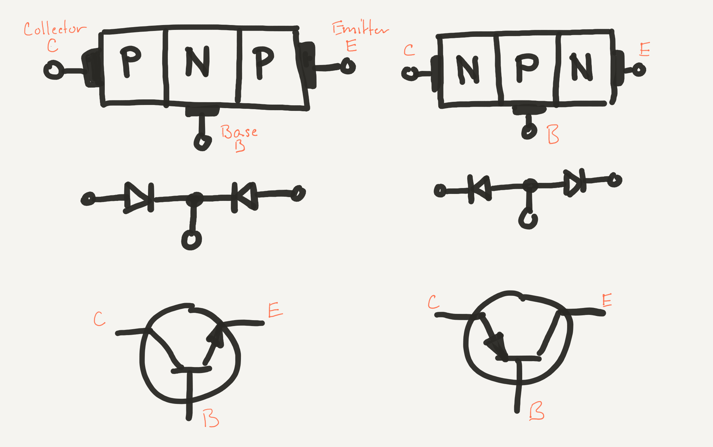

## Bipolar Junction Transistors

Transistors are P-N Junctions with an additional P-Type or N-Type semiconductor sandwiched on the opposite end to make a two pole, P-N-P junction. Their long-form name is _bipolar junction transistors_, but are often referred to as "BJTs" or just transistors. [The origin of the term "transistor" is somewhat ambiguous](https://en.wikipedia.org/wiki/History_of_the_transistor#Origin_of_the_term).

Putting two diodes end to end like this seems a little non-intuitive, as there's no way the electricity can flow through without a reverse breakdown:

{:standalone}

However, things become a little clearer when we add a lead to the center, where current can be sent:

{:standalone}

In this configuration, 

### PNP and NPN

### Forward Voltage

[Still have to overcome the 

### Operation

* **Current Amplifier** - Also known as _active region_: `I``C` `= I``B` `* β`
* **Switched On** - Also known as _saturation_, transistor is fully "on:" `I``C` `= I(saturation`
* **Switched Off** - Also known as _cut off_, transistor is fully "off:" `I``C` `= 0`

### Base, Collector, Emitter

{:standalone}

 * **`V``c`** - Voltage at the Collector
 * **`i``B`** - Current at Base
 * **`V``BE`** - Voltage from Base to Emitter

 
[Note: `VCC` comes from Common Voltage at all Collectors in an IC.]

### Beta (β)

Relationship between Base current and current flowing from Collector to Emitter.

Also known as `HFE`.

`I``C` `= I``B` `* β`

### NPN and PNP

Mnemonics:

* NPN = "Not pointing in."
* PNP = "Points in proudly."

### Power Ratings

## [Next - Transistor Lab](../Transistor_Lab)