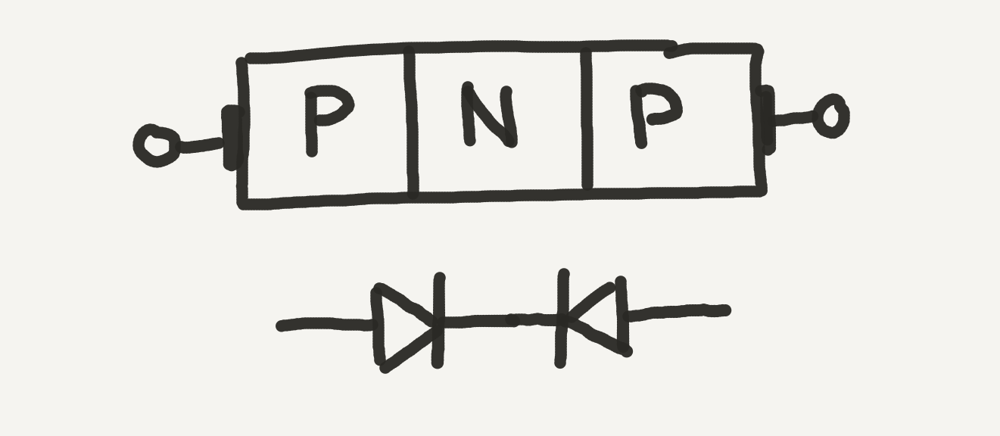

> NOTE: This section is still being developed.

## Bipolar Junction Transistors

There is probably no singular component in electronics that is more important, or more prevalent in electronics than the transistor.

Putting two diodes end to end like this seems a little non-intuitive, as there's no way the electricity can flow through without a reverse breakdown:

However, things become a little clearer when we add a lead to the center, where current can be sent:

<!-- TODO: In this configuration,  -->

### PNP and NPN

<!-- TODO: ### Forward Voltage -->

<!-- TODO: [Still have to overcome the  -->

### Operation

The idea of a transistor was first patented in 1926, but it wasn't until two decades later, in 1947, that the first actual transistor was created. Today, transistors are etched into chips by the billions.

## Operation

Transistors have two primary functions; **they work both as an electronic switch, and as a signal amplifier**.

### Base, Collector, Emitter

### As a Logical Switch

Most often, we use transistors to digitally switch (logical `ON`/`OFF`) higher current or voltage loads with a smaller controlling current. For instance, if we wanted to control a `12V` DC motor using a `3.3V` digital output on a Meadow board, we could use a transistor circuit that acts a sort of digital "switch" to allow `12V` from an external source to flow through the motor.

[diagram]

### As an Amplifier

However, transistors can be used for more than just switching, in fact, they can also be used in an analog way to "amplify" a control signal, by providing a gradient of control over a larger load using a smaller controlling signal. So for instance, not only can you switch `ON` a DC motor, but you could potentially set it to `60%` power.

[diagram]

This versatility makes transistors one of the most powerful and commonly used components in our circuit toolbox. In fact, most circuits are comprised of some combination of transistors, resistors, and to a lesser degree, capacitors (which we'll dive into later).

## BJTs and MOSFETs

While Wikipedia lists [52 different types of transistors](https://en.wikipedia.org/wiki/Category:Transistor_types?sa=X&ved=0ahUKEwiMvbG4l8zhAhWBsJ4KHdwtBvUQ1i8IJzAh), there are really only two types of transistors that are commonly used in modern digital circuits, and even one of those are being used less and less.

* **BJT** = Bipolar Junction Transistor
* **MOSFET** = Metal-Oxide Semiconductor Field-Effect Transistors

Both are "transistors," however, BJTs are usually what people have historically thought of as transistors. They're basically the original transistor design and have been used for 70+ years. 

BJTs are fine, but for modern circuits, we use MOSFETs for nearly everything. They're inherently more power efficient, because as we will learn, they operate on voltage, rather than current.

Additionally, when working with larger current loads, you'll almost always want to use a MOSFET.

<!--
### GaNFET

There's another 
-->

### Circuit Symbols

[MOSFET and BJT]

## Anatomy; Base, Collector, Emitter/Gate, Source, Drain

Whether BJT, MOSFET, or nearly any other type, transistors almost always have three legs and though they're called different things on a BJT or a MOSFET, they basically do the same thing:

| Lead Function | MOSFET Name | BJT Name    |
|---------------|-------------|-------------|
| **Control**   | _Gate_      | _Base_      |
| ? | _Source_    | _Collector_ |
| ? | _Drain_     | _Emitter_   |

The _gate_ or _base_ is the lead that controls current flow between the _source_ and _drain_ (on a MOSFET), or the _collector_ and _emitter_ on a BJT.

* **`V``c`** - Voltage at the Collector
* **`i``B`** - Current at Base
* **`V``BE`** - Voltage from Base to Emitter

[Note: `VCC` comes from Common Voltage at all Collectors in an IC.]

### Beta (β)

Relationship between Base current and current flowing from Collector to Emitter.

Also known as `HFE`.

`I``C` `= I``B` `* β`

### NPN and PNP

Mnemonics:

* NPN = "Not pointing in."
* PNP = "Points in proudly."

### Power Ratings

<!-- ## [Next - Transistor Lab](../Transistor_Lab) -->
