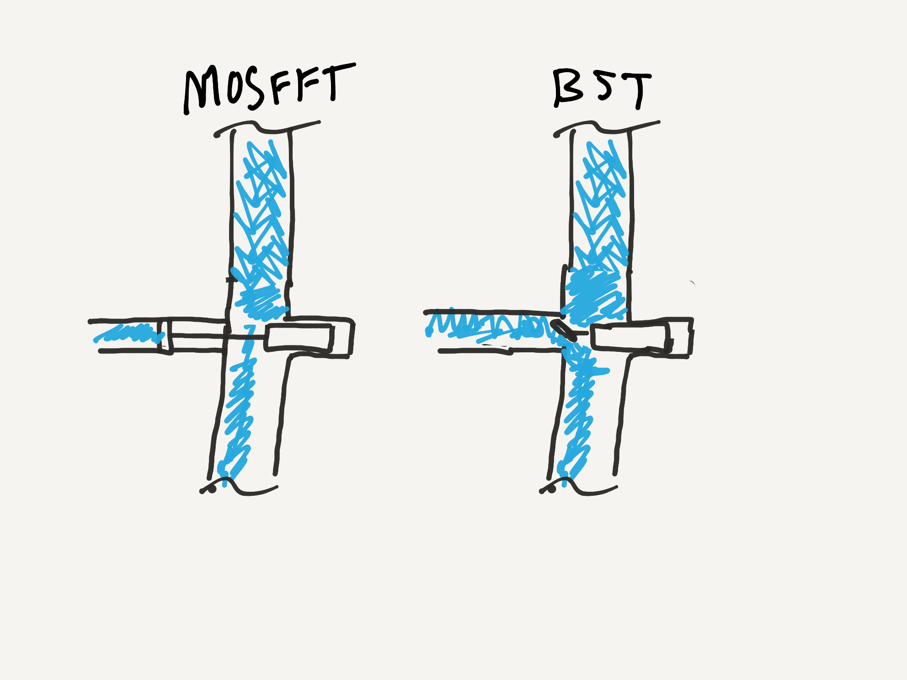
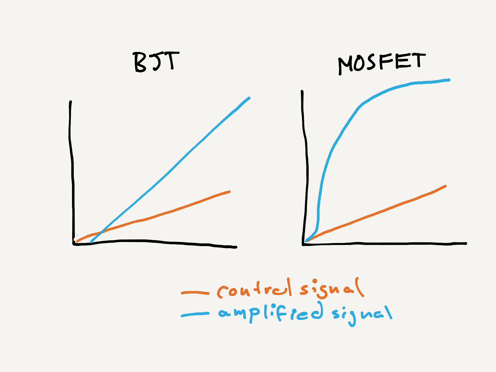

**Note** - This chapter is in beta and not quite done yet.

## Amplifiers, switches, and the fundamental building blocks of modern electronics.

There is probably no singular component in electronics that is more important, or more prevalent in electronics than the transistor.

The idea was first patented in 1926, but it wasn't until two decades later, in 1947, that the first actual transistor was created. Today, transistors are etched into CPUs and other processors by the billions are the fundamental building block of nearly every piece of electronics we use.

### N-P-N + P-N-P Junctions

In the last section we examined how P-N junctions created a one-way flow of electricity by generating a charge gap that either gets stronger or weaker depending on the polarity of electrical force applied to it.

But what happens when you make an N-P-N or a P-N-P junction like two diodes smashed together?

This seems a little non-intuitive, as there's no way the electricity can flow through without applying so much voltage that a reverse breakdown occurs and current flows. However, things become more interesting when we add a lead to the center, where current can be sent:

Effectively, that applying current there serves as a gate between the two ends, enabling current to flow from one end to the other.

Fundamentally, transistors are essentially just that.

## N-Channel MOSFET

Jumping ahead a bit and taking at look at probably the most commonly used transistor in existence, the N-Channel MOSFET, we can see how this would work from a concrete perspective. As positive voltage is applied to the _Gate_ in the middle, it attracts the minority negative charges in the P-Type section, causing a _channel_ between the _source_ and _drain_ where the charges can cross and electricity flows:

[**Note** - Switch sides of Source and Drain, add an _insulation_ label to brown bit.]

## MOSFETs vs. BJTs

While Wikipedia lists [52 different types of transistors](https://en.wikipedia.org/wiki/Category:Transistor_types?sa=X&ved=0ahUKEwiMvbG4l8zhAhWBsJ4KHdwtBvUQ1i8IJzAh), there are really only two types of transistors that are commonly used in modern digital circuits, _MOSFETs_, and _BJTs_.

* **MOSFET** = Metal-Oxide Semiconductor Field-Effect Transistor
* **BJT** = Bipolar Junction Transistor

Both are "transistors," however, BJTs are usually what people have historically thought of as transistors and have been used for over 70 years.

### MOSFETs = new hotness, BJTs = old and busted.

If this tutorial were written just 10 years ago, it would likely have focused on BJTs, however, in modern digital circuits, MOSFETs have replaced BJTs for nearly everything. This is because of two reasons. 

#### MOSFETs are _voltage_ devices.

First, MOSFETs operate on voltage, meaning that they act like a pressure switch, as voltage is applied, it controls the valve:

BJTs on the other hand, operate on _current_, meaning that while voltage is applied to the gate to control curret flow, it actually uses the current through the gate!

This means that MOSFETs are much more power efficent.

#### MOSFETS handle large current loads better.

Due to the way they work, they're also far better at handling larger current loads while wasting less energy as heat. As such; when working with larger current loads, you'll almost always want to use a MOSFET.

## Operation

One of the interesting behaviors of transistors is that they can act both as an electronic switch, and as a signal amplifier.   

### As a Logical Switch

Most often, we use transistors to digitally switch (logical `ON`/`OFF`) higher current or voltage loads with a smaller controlling current or voltage. For instance, if we wanted to control a `6V` DC motor using a `3.3V` digital output on a Meadow board, we could use a transistor circuit that acts a sort of digital "switch" to allow `6V` from an external source to flow through the motor:

### As an Amplifier

If you apply an intermediary amount of voltage, you can control how much current is let through. This pattern of usage is called _signal amplification_ because you're typically using a smaller signal (the controlling voltage to the gate) to control a large signal (the current between source and drain). So for instance, not only can you switch `ON` a DC motor, but you could potentially set it to `60%` power.

In this regard, BJTs are actually better for traditional analog circuit amplifiers because their control signal to switching behavior is linear, whereas MOSFETs have a logarithmic behavior, making it more difficult to have fine-grain control over the amplification.

### Versatile Component

The versatility and utility of transistors make them one of the most powerful and commonly used components in our circuit toolbox. In fact, most circuits are comprised of some combination of transistors, resistors, and capacitors (which we'll dive into later).

Let's dive into the physics of how MOSFETs work, which will help us understand how to use them.

# [Next - Physics of N-Channel MOSFETs](../N-Channel_MOSFET)

<!-- TODO: ### Forward Voltage -->

<!-- TODO: [Still have to overcome the  -->

<!--

### Base, Collector, Emitter

[diagram]

-->

<!--
### GaNFET

There's another 
-->
<!--
## Transistor Uses

[name some of the useful things we do with transistors; controlling motors, relays, fundamental building blocks of more complex circuits, etc.]

## Anatomy; Base, Collector, Emitter/Gate, Source, Drain

Whether BJT, MOSFET, or nearly any other type, transistors almost always have three legs and though they're called different things on a BJT or a MOSFET, they basically do the same thing:

| Lead Function | MOSFET Name | BJT Name    |
|---------------|-------------|-------------|
| **Control**   | _Gate_      | _Base_      |
| **Lead 1**    | _Source_    | _Collector_ |
| **Lead 2**    | _Drain_     | _Emitter_   |

The _gate_ or _base_ is the lead that controls current flow between the _source_ and _drain_ (on a MOSFET), or the _collector_ and _emitter_ on a BJT.

* **`V``c`** - Voltage at the Collector
* **`i``B`** - Current at Base
* **`V``BE`** - Voltage from Base to Emitter

[Note: `VCC` comes from Common Voltage at all Collectors in an IC.]

### Beta (β)

Relationship between Base current and current flowing from Collector to Emitter.

Also known as `HFE`.

`I``C` `= I``B` `* β`

### Power Ratings
-0>

<!-- ## [Next - Transistor Lab](../Transistor_Lab) -->
