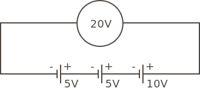

### Batteries in Series

{:standalone}

[voltages are additive, because the electromagnetic force (voltage) from one flows into the next, and that battery adds its own voltage]

[batteries of varying voltages can be strung together like this with no issue]


```
V = B1 + Bn
```

Therefore, if two batteries, a 1.5V and a 9V are put together:

```
Total Voltage = 1.5V + 9V = 10.5V
```

However, in practice this is not often done, as batteries have different capacities [and would run down at different rates, and [they have voltage drop curves as they discharge]].

Batteries are often arranged in serial to get the desired voltage necxessary to power a circuit. For instance, a 4 battery pack is common because it delivers ~6V of power.

[image of battery pack]

### Batteries in Series with Opposing Polarity

{:standalone}


### Batteries in Parallel

{:standalone}

[voltage must be the same]

Total voltage is the same as a single battery, but they last x number of batteries.

### Battery Capacity

[mAh is additive, but assuming a fixed load that, it will deplete x ## of batteries in serial, vs. parallel]


### [Next - Battery Resistance](../Battery_Resistance)

<br/>