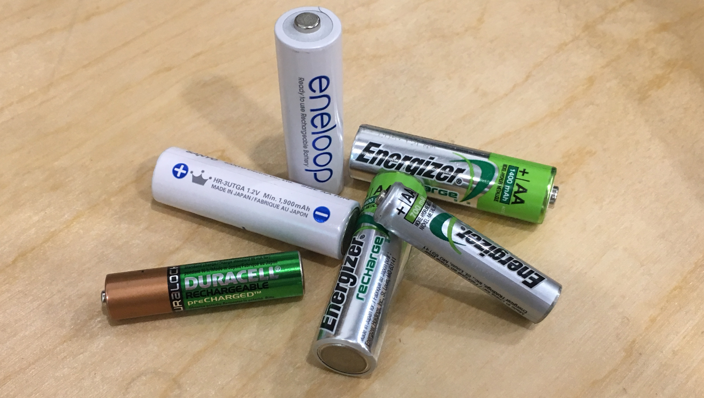
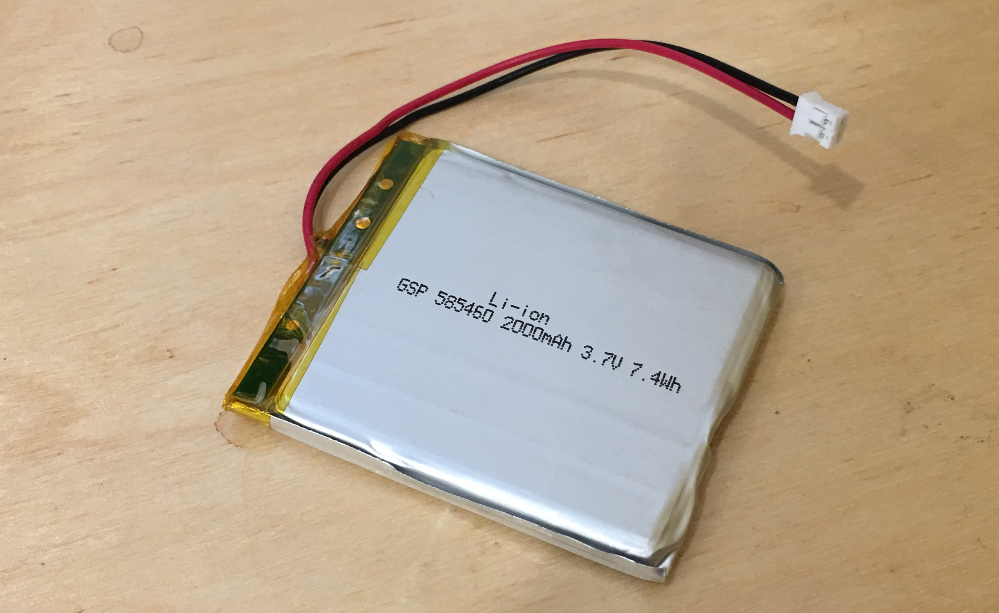

Batteries come in two types; single use batteries that cannot be recharged, and multi-use batteries that are rechargeable.

### Non-Rechargeable Batteries

Also known as _primary batteries_, once the charge is depleted, they cannot be easily recharged. While hundreds of different primary battery designs have been created over the years, there are really only three in use today; alkaline, lithium, and carbon-zinc, and even carbon-zinc is rarely used.

##### Alkaline

[Alkaline batteries](https://en.wikipedia.org/wiki/Alkaline_battery) are the most common consumer non-rechargeable battery and most cylindrical batteries in the AA, AAA, C, etc., size are alkaline. Alkaline batteries have both a good charge density and shelf life. 

{:standalone}

##### Lithium

[Lithium batteries](https://en.wikipedia.org/wiki/Lithium_battery) are most often the coin cell batteries used in watches, key fobs, etc. However, 9V lithium batteries are often found for use in smoke detectors. Recently, non-rechargeable lithium batteries have also been made in AA and AAA sizes and are meant to power high drain devices such as digital cameras. Lithium batteries have a high charge density and long shelf life, but are also more expensive than alkalines.

{:standalone}

##### Carbon-Zinc

Once the mainstay of consumer batteries, [carbon-zinc (or zinc-carbon)](https://en.wikipedia.org/wiki/Zinc%E2%80%93carbon_battery) are rarely used anymore because of their low charge density and short shelf life.

#### Non-Rechargeable Battery Comparison

| Type   | Shelf Life    | Cost   | Charge Density |
|-------|------|----|-----|-----|
| Alkaline | 5-10 Years | Medium | Medium (4-5x of Carbon Zinc) |
| Lithium | 10-15 years | Expensive | Highest (3x of alkaline) |
| Zinc Carbon | 3-5 years | Cheap | Lowest |

### Rechargeable Batteries

[Also known as _secondary batteries_, rechargeables can be recharged by 

reverse the chemical process by applying voltage in the reverse direction]

[come in a wide array of chemistries]

#### Common Rechargeable Batteries

##### Nickel Cadmium (NiCd)

##### Nickel-Metal Hydride (NiMH)

{:standalone}

##### Lead-Acid

##### Lithium Ion

{:standalone}

##### Lithium Polymer

{:standalone}

### [Next - Battery Circuits](../Battery_Circuits)

 