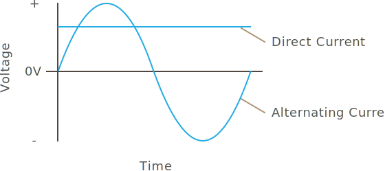

# Introduction

This is a practical, hands-on tutorial on electronic circuits that focuses on modern circuit development for connected things. It starts with fundamentals and builds a solid foundation for doing more complex circuits, with a focus on common circuit designs and microcontroller integrations. For most of the tutorial, only basic proficiency in algebra is necessary.

### [Lab Requirements](Prologue/Requirements)

The tutorial is full of practical, real world labs which build a number of different circuits and designs, which require a few tools and components to build. On the [Lab Requirements](Prologue/Requirements) page, you can find a list of items needed to complete the labs. Especially with the tools, there are a number of options to choose from, which will depend on how much you intend to use them, and your budget. Each lab builds on the tools and components in previous labs, so I've listed them in the order that you'll need them. Before purchasing of the tools and components on that page, make sure to read the labs in which the tools used, because I discuss various options as well as their costs.

### [Part 1 - Physics of Electricity](Part1/Atoms)

Part 1 explores the fundamental physics that give electricity its behavior. As a bonus, after reading this, you'll know how magnets work!

### [Part 2 - Quantifying Electricity; Amps, Volts, and Watts](Part2/Amount_and_Force)

Part 2 builds on the physical fundamentals and explores the ability of electricity to do work and introduces amperage, voltage, and wattage.

### [Part 3 - Current Types; AC & DC](Part3/Current_Types)

Part 3 introduces the two fundamental current types, direct current (DC), and alternating current. It explores the difference between the two, and what they're used for.

### [Part 4 - Resistance & Ohm's Law](Part4/Resistance)

Part 4 expands the relationship between amperage and voltage, and adds another piece to the fundamental laws of electricity; resistance. In doing so, it explores one of the most important laws in electricity, Ohm's law, and explains how to use it.

### [Part 5 - DC Circuit Basics](Part5/DC_Circuits)

Part 5 introduces two more laws that govern the behavior of electricity and explores how voltage behaves. Along the way, we'll build our first real, practical prototype circuits and learn how to do some basic soldering.

### [Part 6 - Semiconductors](Part6/Semiconductors)