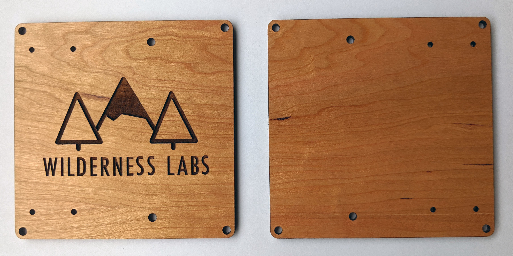
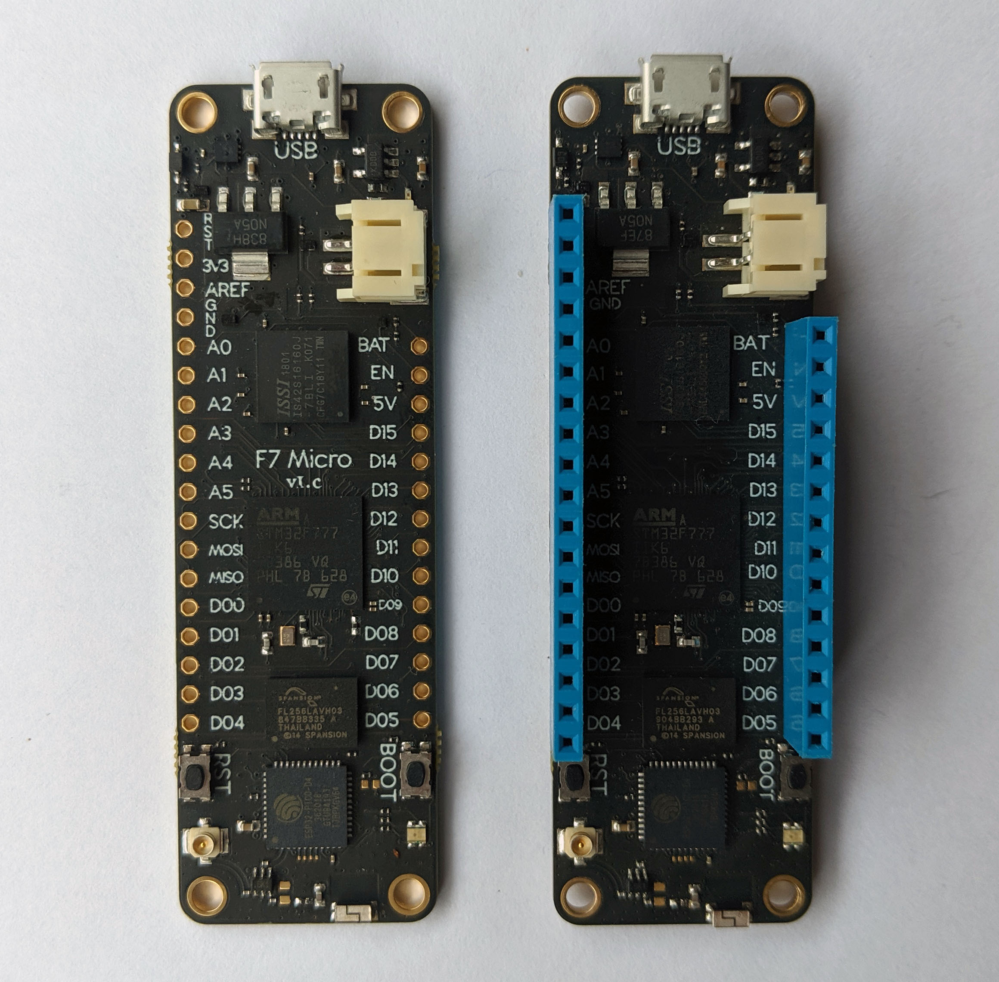
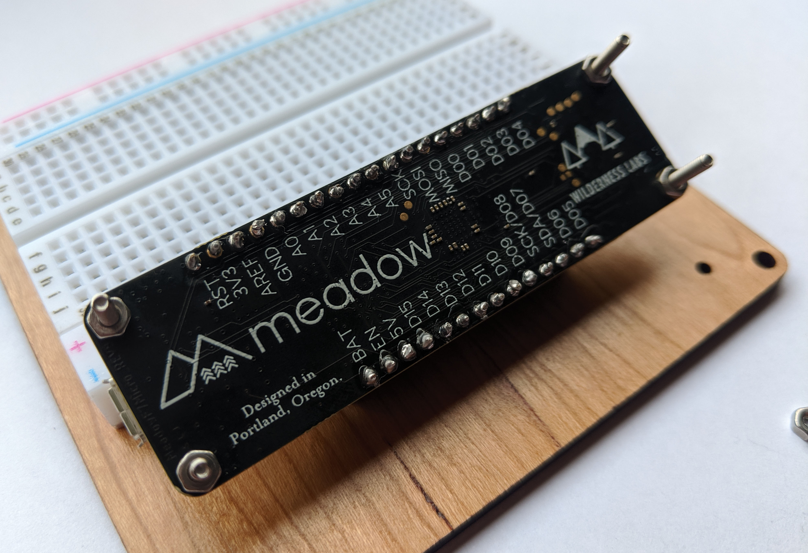
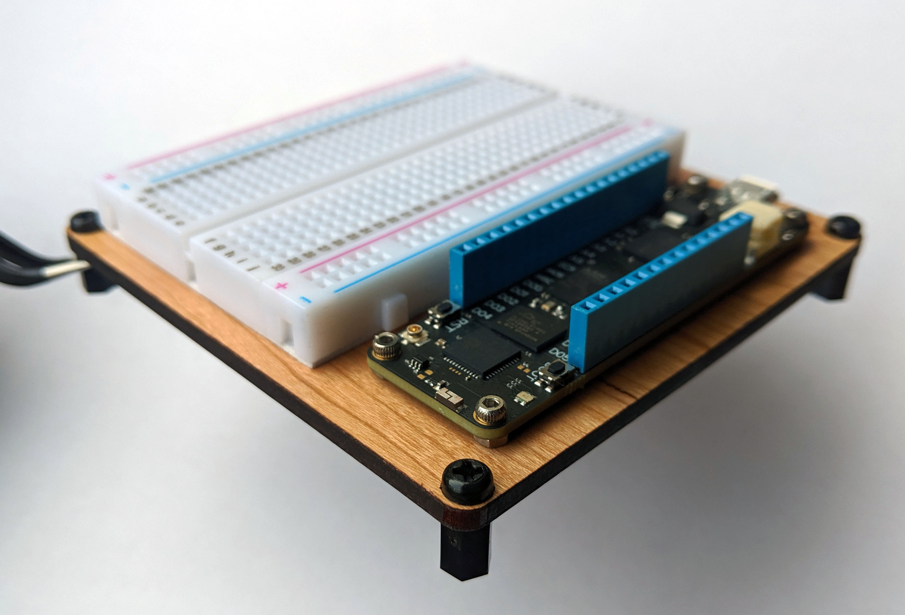

This guide will walk you through the steps to assemble your Meadow development board to get you started.

### Parts

Your kit should include:
 - 1 Meadow board
 - 1 Wooden Wilderness Labs protoboard
 - 2 Blue female header pins
 - 4 Screws
 - 8 Nuts

 

### Step 1 - Remove protective cover on the wooden base protoboard

The Wilderness Labs prototype boards come with a protective skin cover to protect the surface from dents and scratches.

Peel the skin cover from the corners and remove the little bits in the logo and inside the letters. Your board should now look like this:

### Step 2 - Solder Meadow header pins

Now solder the blue female header pins to the Meadow board. 

### Step 3 - Place breadboard and Meadow to the base board

Meadow has battery connector on the right side of the device. For this reason, you have to place the breadboard on the left and Meadow on the ride side of the protoboard. Make sure the breadboard is in the right orientation, and the four holes on the wooden board are on the right side.

Remove the plastic sticker cover under the breadboard and stick it to the protoboard as firm and straight as possible.

Put each screw in the corners on the Meadow board with one nut so when placing it on the base it will sit flat and the soldered header pins wont get in contact with the base.

Now you can finally fix Meadow through the protoboard and use the remaining 4 nuts to firmly hold them together.

Additionally, you could get metal or nylon fasteners so you screw them in the corners of the base board so it can sit flat on any surface.

Congratulations, your Meadow developer kit assembled and now you're ready to test the Meadow board on the next section. 

## [Next - Deploy Meadow OS](/Meadow/Getting_Started/Deploying_Meadow/)
