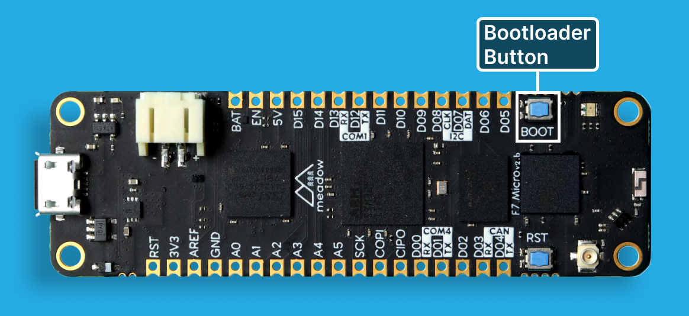
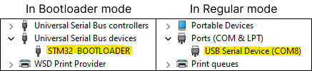
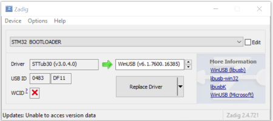
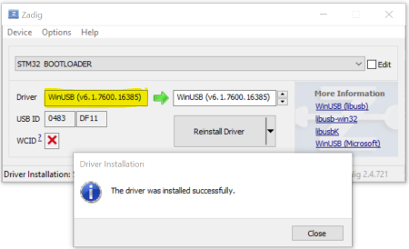

When you receive your Meadow board, it will need to have the latest Meadow.OS uploaded, or _flashed_, to it.

<Tabs groupId="os">
  <TabItem value="windows" label="Windows" default>

[//]: # (Whenever editing these OS sections, make sure any common instructions are edited in the other OS/IDE sections as well to keep them in sync with each other.)

### Step 1 - Create a Wilderness Labs Account

In order to download the latest version of Meadow.OS, you will need to [register for a **Wilderness Labs Account**](https://identity.wildernesslabs.co/signin/register).

### Step 2 - Install .NET SDK

Download and install version 8 [.NET SDK](https://dotnet.microsoft.com/en-us/download/dotnet).

### Step 3 - Install Meadow.CLI

The way we flash Meadow boards (among other things) is via our command-line-interface tool called [Meadow.CLI](../../Meadow_Tools/Meadow_CLI/). Make sure you have it installed to continue.

### Step 4 - Install dfu-util
From a console with admin rights, execute following command:

```console
meadow dfu install
```

### Step 5 - Put the device into DFU Bootloader mode

To flash your board with the latest OS, Meadow must be in _DFU bootloader_ mode. To enter this mode, the `BOOT` button needs to be held down while the board boots up. This can be accomplished one of two ways.

* **If the board is disconnected:** hold the `BOOT` button down and connect the board to your computer via a Micro USB Cable.

* **If the board is connected:** hold the `BOOT` button down, and then press and release the `RST` (Reset) button. Then release the `BOOT` button.



### Step 6 - Install Meadow USB drivers

#### Checking Meadow USB drivers

Before flashing a Meadow board, open the Device Manager and check:

- When the board is in **Bootloader mode** it should show up as a `STM32 BOOTLOADER` device under `Universal Serial Bus Devices` section.
- When the board is connected normally it should show up as a `USB Serial Device (COMX)` under the `Ports (COM & LPT)` section

  

If the board is in this state you can head over to the next step.

#### Updating Meadow USB drivers

If Meadow shows as **Meadow F7 Micro (COMX)** in regular mode, right-click on it and select **Uninstall Device**, and make sure to select *Attempt to remove the driver for this device* like so:


Now to flash Meadow OS, *dfu-util* is recommended. However, the default Windows USB driver for ST devices is not compatible with *dfu-util*, so it needs to be replaced. For more in-depth information on this, check out [Scott Hanselman's post](https://www.hanselman.com/blog/how-to-fix-dfuutil-stm-winusb-zadig-bootloaders-and-other-firmware-flashing-issues-on-windows). Follow these steps:

1. Download and run [Zadig](https://zadig.akeo.ie/)
1. Connect the Meadow device holding the BOOT button pressed to power it on in **Bootloader mode**.
1. In Zadig, click *Options* > *List All Devices*
1. Select **STM32 BOOTLOADER** in the dropdown
1. Click *Replace Driver*

  

1. After the installation is complete, driver should be *WinUSB*

  

Your board is now ready to flash it with latest Meadow.OS version.

### Step 7 - Log in to your Wilderness Labs account

Use the following command to log into your Wilderness Labs Account:

```console
meadow login
```

This will open a web browser where you'll need to enter your account credentials. If successful, you'll receive a confirmation on the CLI.

### Step 8 - Download Meadow.OS

Now we can download the latest Meadow.OS binary files with the command:

```console
meadow firmware download
```

### Step 9 - Flash Meadow.OS

Once connected the Meadow device via the USB cable and having put the device into DFU Bootloader mode, execute the following command in your console:

```console
meadow firmware write
```

When the flashing process has completed with no errors, disconnect and reconnect the Meadow board to give it a full restart.

Your board is now ready to have a Meadow application deployed to it!

  </TabItem>
  <TabItem value="macos" label="macOS">

[//]: # (Whenever editing these OS sections, make sure any common instructions are edited in the other OS/IDE sections as well to keep them in sync with each other.)

### Step 1 - Create a Wilderness Labs Account

In order to download the latest version of Meadow.OS, you will need to [register for a **Wilderness Labs Account**](https://identity.wildernesslabs.co/signin/register).

### Step 2 - Install .NET SDK

Download and install version 8 [.NET SDK](https://dotnet.microsoft.com/en-us/download/dotnet) for your Mac's processor architecture.

### Step 3 - Install or update Meadow CLI

To install [Meadow CLI](/Meadow/Meadow_Tools/Meadow_CLI/) as a .NET tool, execute the following command in your terminal:

```console
dotnet tool install WildernessLabs.Meadow.CLI --global
```

To update Meadow CLI, if already installed, execute the following command in your terminal:

```console
dotnet tool update WildernessLabs.Meadow.CLI --global
```

### Step 4 - Install dfu-util

To install `dfu-util`, we'll be using **Homebrew**. If you don't have it yet, [install Homebrew](https://brew.sh/) first.

Execute the following command in your terminal:

```console
brew install dfu-util
```

### Step 5 - Download Meadow OS and network binaries

Execute the following command in your terminal:

```console
meadow firmware download
```

**NOTE: If the `meadow` command returns an error: command not found:**

If your terminal cannot find the `meadow` command, it means the .NET SDK didn't add the global tool installation location to your shell's `PATH` variable. Run the following command to add that location to your `PATH` variable so your terminal knows where to find the `meadow` command. Then run the OS download command from above one more time.

```console
export PATH="$PATH:$HOME/.dotnet/tools"
```

### Step 6 - Put the device into DFU Bootloader mode

To update the OS, Meadow must be in _DFU bootloader_ mode. To enter this mode, the `BOOT` button needs to be held down while the board boots up. This can be accomplished one of two ways.

**If the board is disconnected:** hold the `BOOT` button down and connect the board to your computer via a Micro USB Cable.

**If the board is connected:** hold the `BOOT` button down, and then press and release the `RST` (Reset) button. Then release the `BOOT` button.


> NOTE: On macOS Sonoma and newer, you may need to allow USB device access for both regular Meadow mode and bootloader mode. If you release the `BOOT` button before allowing the USB access in bootloader mode, your device may not be available for writing the firmware. Repeat the above process after alowing for USB access to get into bootloader mode again.

### Step 7 - Flash Meadow.OS and Coprocessor Firmware

Now you have two options, please try the option 1 first:

#### Option 1 (from bootloader mode)

Once connected the Meadow device via the USB cable and having put the device into DFU Bootloader mode, execute the following command in your terminal:

```console
meadow firmware write
```

#### Option 2 (from normal mode)

This following will only work if you have a newer version of Meadow OS installed. It is recommended to try option 1 first.
Reset the device (push the RST button or disconnect and reconnect) and identify the serial port name that the Meadow is connecting on.

Execute the following Meadow CLI command in your terminal to determine the port your Meadow device is using.

```console
meadow list ports
```

On macOS, you should see a port like `/dev/tty.usbmodem336F336D30361`.
Once you've identified the port name, run the following command in your console, replacing `{port}` with the serial port name to send all future `meadow` commands to that device.

```console
meadow config route {port}
```

**NOTE: If the process hangs on _Opening port '{PORT}'..._, hit the RST button on the device.**

Unplug and replug Meadow to give it a full restart. Your board is now ready to have a Meadow application deployed to it!

  </TabItem>
  <TabItem value="linux" label="Linux">

[//]: # (Whenever editing these OS sections, make sure any common instructions are edited in the other OS/IDE sections as well to keep them in sync with each other.)

Please note: Linux may require `sudo` to access USB devices.

### Step 1 - Create a Wilderness Labs Account

In order to download the latest version of Meadow.OS, you will need to [register for a **Wilderness Labs Account**](https://identity.wildernesslabs.co/signin/register).

### Step 2 - Install .NET SDK

Download and install version 8 [.NET SDK](https://dotnet.microsoft.com/en-us/download/dotnet).

### Step 3 - Install or update Meadow CLI

To install Meadow CLI, execute the following command in your terminal:

```console
dotnet tool install WildernessLabs.Meadow.CLI --global
```

To update Meadow CLI, if already installed, execute the following command in your terminal:

```console
dotnet tool update WildernessLabs.Meadow.CLI --global
```

### Step 4 - Install dfu-util

Execute the following command in your terminal:

```console
sudo apt-get install dfu-util
```

### Step 5 - Install libusb

Execute the following command in your terminal:

```console
sudo apt-get install libusb-1.0-0-dev
```

### Step 6 - Download Meadow OS and network binaries

Execute the following command in your terminal:

```console
meadow firmware download
```

### Step 7 - Put the device into DFU Bootloader mode

To update the OS, Meadow must be in _DFU bootloader_ mode. To enter this mode, the `BOOT` button needs to be held down while the board boots up. This can be accomplished one of two ways.

**If the board is disconnected:** hold the `BOOT` button down and connect the board to your computer via a Micro USB Cable.

**If the board is connected:** hold the `BOOT` button down, and then press and release the `RST` (Reset) button. Then release the `BOOT` button.


### Step 8 - Enable access to the device

To be able to access the device a udev rule needs to be added.

* Go to the folder `/etc/udev/rules.d`
* Create the file `50-meadow.rules`
* Add the following to the file:

```console
SUBSYSTEM=="usb", ATTR{idProduct}=="df11", ATTR{idVendor}=="0483", MODE="0666", GROUP="user", TAG+="uaccess"
```

To verify the Product ID and Vendor ID execute the following command in your terminal:

```console
lsusb
```

You should be able to find a entry similar to the following:

```console
Bus 001 Device 009: ID 0483:df11 STMicroelectronics STM Device in DFU Mode
```

The format for the IDs is `idVendor:idProduct`. Please note that you need to disconnect and reconnect the Meadow to make the rules take affect.

### Step 9 - Flash Meadow.OS and Coprocessor Firmware

Now you have two options, please try the option 1 first:

#### Option 1 (from bootloader mode)

Once connected the Meadow device via the USB cable and having put the device into DFU Bootloader mode, execute the following command in your terminal:

```console
meadow firmware write
```

#### Option 2 (from normal mode)

This following will only work if you have a newer version of Meadow OS installed. It is recommended to try option 1 first.
Reset the device (push the RST button or disconnect and reconnect) and identify the serial port name that the Meadow is connecting on.

To get access to the port your user needs to be added to the group `dialout`.
This is done with the command:

```console
sudo adduser {your_user} dialout
```

Replace `{your_user}` with the user name. You need to **logout and login** again to make the changes affect.

To find the Port where the Meadow is connected execute the following command in your terminal:

```console
ls -l /dev
```

look for

```console
ttyAMC0
```

or similar. The port might change between reboots of the Meadow so make sure to check it after a reboot. If you can't detect which port the meadow belongs to run the command once with the Meadow disconnected and once with the Meadow connected to spot the difference.

Once you've identified the port name, run the following command in your console replacing [PORT] with the serial port name:

```console
meadow config route [PORT]
```

**NOTE: If the process hangs on _Opening port '[PORT]'..._, hit the RST button on the device.**

Unplug and replug Meadow to give it a full restart.
Your board is now ready to have a Meadow application deployed to it!

  </TabItem>
</Tabs>
