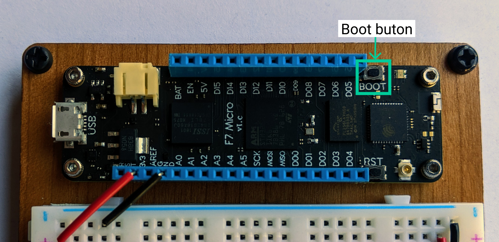

When you receive your Meadow board, it will need to have the latest Meadow.OS uploaded, or _flashed_, to it. To do this, you'll need to:

 1. Download the latest [Meadow.OS](https://www.wildernesslabs.co/downloads?f=/Meadow_Beta/MeadowOS.zip) files.
 2. Put the device into Device Firmware Upgrade (DFU) mode.
 3. Upload the files to the device. 

The following video walks you through all that using a Mac:
<p><iframe width="640" height="360" src="https://www.youtube.com/embed/PXAC0cpgPmc" frameborder="3" allowfullscreen></iframe></p>

Alternatively, you can follow this step by step guide for both macOS and Windows: 

## Step 1: Install dfu-util

We'll use the _dfu-util_ app to flash the firmware files to Meadow. 

### Windows

You can download dfu-util from [Sourceforge](http://dfu-util.sourceforge.net/releases/dfu-util-0.9-win64.zip).

Extract the zip to a convenient location that you can access using the Terminal/Command Prompt.

### macOS

For macOS, you'll first need to install [Brew](https://brew.sh/), if you don't already have it. Once brew is installed, you can use it install dfu-util:

 1. Open the terminal.
 2. Execute the following command:

   ```bash
   brew install dfu-util
   ```

### Linux (Debian/Ubuntu)

You can install dfu-util using the **apt** package manager.

 1. Open the terminal.
 2. Execute:

   ```bash
   sudo apt-get install dfu-util
   ```

## Step 2: Put the device into DFU Bootloader mode.

To update the OS, Meadow must be in _DFU bootloader_ mode. To enter this mode, the `BOOT` button needs to be held down while the board boots up. This can be accomplished one of two ways.

**If the board is disconnected:** hold the `BOOT` button down and connect the board to your computer via a Micro USB Cable.

{:standalone}

**If the board is connected:** hold the `BOOT` button down, and then press and release the `RST` (Reset) button. Then release the `BOOT` button. 


## Step 3: Upload Meadow.OS

The instructions are essentially the same on all supported platforms (Windows, macOS, Linux).

On **Windows**, you'll need to make the `dfu-util.exe` executable accessible. You can either:

 1. Add it's location to the PATH.

   **OR**
 * Copy `dfu-util.exe` and `libusb.dll` to your working folder.

   **OR**
 * Use a full qualified path when launching dfu-util. (e.g. `c:\Meadow\dfu-util-0.9-win64\dfu-util.exe`)

To flash Meadow to the board:

 1. Unzip the Meadow.OS.zip package. It should contain `Meadow.OS_Kernel.bin` and `Meadow.OS_Runtime.bin` files.
 2. Open the Command Prompt (Windows) or Terminal (macOS/Linux).
 3. Navigate to the folder the contains the Meadow bin files.
 4. Enter `dfu-util --list` to see a list of dfu enabled devices:

  {:standalone}

  **Note:** Meadow will show four (4) DFU devices when in bootloader mode. All four devices will have the same serial number.
  
  **Help for Windows error: "Cannot open DFU device 0483:df11"** This error can occur when Windows uses
  a default driver for the USB device that doesn't support the commands needed for DFU. Use
  [Zadig](https://zadig.akeo.ie/) to replace the default driver with a WinUSB driver. Refer to
  [Scott Hanselman's blog]( https://www.hanselman.com/blog/HowToFixDfuutilSTMWinUSBZadigBootloadersAndOtherFirmwareFlashingIssuesOnWindows.aspx)
  for more details.


 5. Select and copy the serial number of your Meadow board.
 6. Execute the following command, replacing `[DEVICE_SERIAL]` with the serial number you found in
 the previous step. Each command should complete with `File downloaded successfully`

   ```bash
   dfu-util -a 0 -S [DEVICE_SERIAL] -D Meadow.OS_Kernel.bin -s 0x08000000 &&
   dfu-util -a 0 -S [DEVICE_SERIAL] -D Meadow.OS_Runtime.bin -s 0x08040000
   ```
   
When the flash is complete, press the reset (**RST**) button to exit DFU bootloader mode and boot into Meadow.OS.

Your board is now ready to have a Meadow application deployed to it!

#### Notes:

 * If you only have one dfu enabled device connected to your PC, you can omit `-S [DEVICE_SERIAL]`.
 * Linux may require `sudo` to access USB devices.

## [Next - Hello, Meadow](/Meadow/Getting_Started/Hello_World/)
