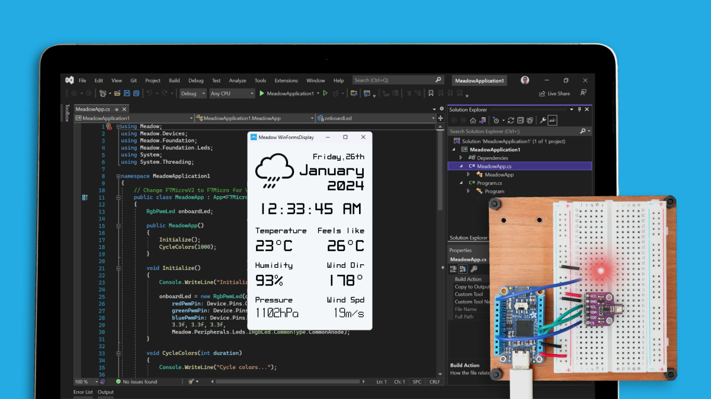
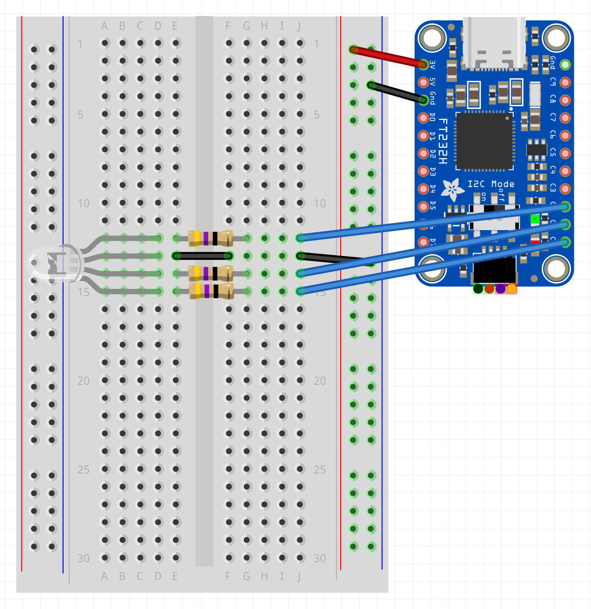

<Tabs groupId="ide">
  <TabItem value="visualstudio2022" label="Visual Studio 2022" default>

### Step 1 - Install .NET Runtime

Download and install the latest version of the [.NET runtime](https://dotnet.microsoft.com/en-us/download).

### Step 2 - Install Visual Studio

Download and Install [Visual Studio](https://visualstudio.microsoft.com/) for either Windows or macOS to prepare your development machine. Community edition will work fine.

### Step 3 - Add Meadow Visual Studio Extension

Open Visual Studio’s Extensions Manager and install the [VS 2022 Tools for Meadow](https://marketplace.visualstudio.com/items?itemName=WildernessLabs.vsmeadow2022) Extension.

### Step 4 - Create your first Meadow application

In **Visual Studio**, open the **Create a new project** window. When you search for **Meadow**, you will see a list of project templates, click on **Meadow.Windows + FT232H App (Wilderness Labs)**:


This project creates a Meadow.Windows app that has a Windows Forms (WinForms) window showing a Hello World text using [MicroLayout](../../../Meadow.Foundation/Libraries_and_Frameworks/MicroLayout/index.md) and a RGB LED connected to a FT232H IO Expander, will blink and change colors simultaneously.



### Step 5 - Run a Meadow Application

Right-click the new project and select **Set as Startup project**


And as for the FT232H with the RGB LED, you should see something like this:


### Step 6 - Check out additional samples

You can check more samples in our [Meadow.Desktop.Samples](https://github.com/WildernessLabs/Meadow.Desktop.Samples) GitHub repo.


  </TabItem>
  <TabItem value="visualstudiocode" label="Visual Studio Code">

### Step 1 - Install .NET Runtime

Download and install the latest version of the [.NET runtime](https://dotnet.microsoft.com/en-us/download).

### Step 2 - Install Visual Studio Code

Download and Install [Visual Studio Code](https://visualstudio.microsoft.com/) to prepare your development machine.

### Step 3 - Install Meadow Project Templates

Open a Terminal and enter the following command to install a list of Meadow project templates:

```console
dotnet new install WildernessLabs.Meadow.Template
```

When installed, you’ll see a list of templates available

```console
The following template packages will be installed:
   WildernessLabs.Meadow.Template

Success: WildernessLabs.Meadow.Template::1.8.0.1 installed the following templates:
Template Name                  Short Name         Language        Tags
-----------------------------  -----------------  --------------  --------------
Meadow Core-Compute App        CoreComputeModule  [C#],F#,VB.NET  Meadow/Console
Meadow F7 Feather App          F7Feather          [C#],F#,VB.NET  Meadow/Console
Meadow Library                 Library            [C#],F#,VB.NET  Meadow/Library
Meadow Project Lab App         ProjectLab         [C#]            Meadow/Console
Meadow.Linux Jetson Nano App   JetsonNano         [C#]            Meadow/Console
Meadow.Linux Raspberry Pi App  RaspberryPi        [C#]            Meadow/Console
Meadow.Linux reTerminal App    reTerminal         [C#]            Meadow/Console
Meadow.Windows + FT232H App    WinFormsHardware   [C#]            Meadow/Console
Meadow.Windows App             WinForms           [C#]            Meadow/Console
```

### Step 4 - Create your first Meadow application

Lets verify everything is set up by deploying your first Meadow application. 

Open VSCode in a new Terminal within enter the following command to create a new Meadow.Windows project:

```console
dotnet new WinFormsHardware --name WinFormsHardwareDemo
```

This Meadow.Windows application controls an RGB LED connected to a FT232H IO Expander that you can connect to your machine via USB-C, and opens a 320x240 pixel WinForms window saying `Hello, World` using MicroLayout.


### Step 5 - Run a Meadow Application

With no code changes, let's run this app on your machine. 

In VSCode, open a terminal inside the project folder, build the project with the command:

```console
dotnet build
```

And finally to run the Meadow application, use the command:

```console
dotnet run
```

At that point, you should see the application’s output in the console and the RGB LED cycling through different colors:


And a WinForm window should show up in the center of the screen saying `Hello, World`, like below:


### Step 6 - Check out additional samples

You can check more samples in our [Meadow.Desktop.Samples](https://github.com/WildernessLabs/Meadow.Desktop.Samples) GitHub repo.


  </TabItem>
</Tabs>