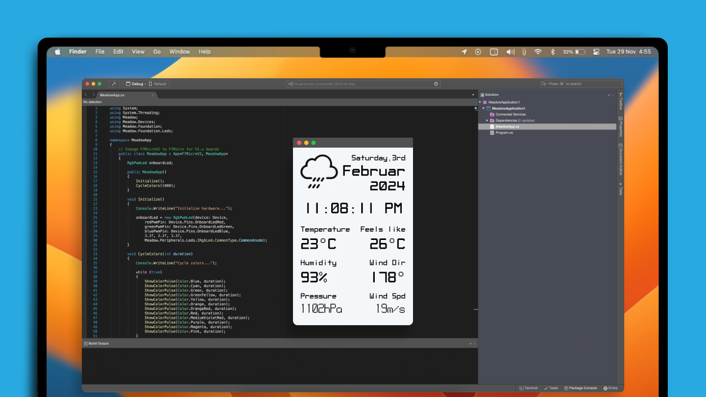
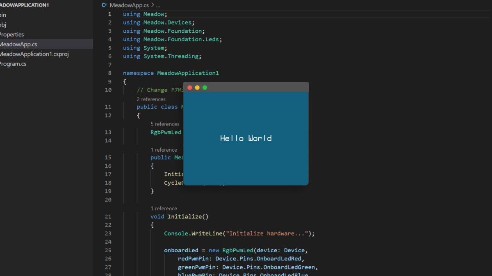
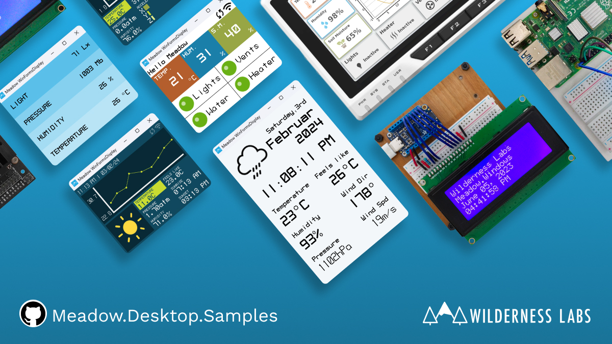

<Tabs groupId="ide">
  <TabItem value="visualstudiocode" label="Visual Studio Code">

### Step 1 - Install .NET Runtime

Download and install the latest version of the [.NET runtime](https://dotnet.microsoft.com/en-us/download).

### Step 2 - Install Visual Studio Code

Download and Install [Visual Studio Code](https://visualstudio.microsoft.com/) to prepare your development machine.

### Step 3 - Install Meadow Project Templates

Open a console window and enter the following command to install a list of Meadow project templates:

```console
dotnet new install WildernessLabs.Meadow.Template
```

When installed, you’ll see a list of templates available:

```console
The following template packages will be installed:
   WildernessLabs.Meadow.Template

Success: WildernessLabs.Meadow.Template installed the following templates:
Template Name                  Short Name         Language        Tags
-----------------------------  -----------------  --------------  --------------
Meadow Core-Compute App        CoreComputeModule  [C#],F#,VB.NET  Meadow/Console
Meadow F7 Feather App          F7Feather          [C#],F#,VB.NET  Meadow/Console
Meadow Library                 Library            [C#],F#,VB.NET  Meadow/Library
Meadow Project Lab App         ProjectLab         [C#]            Meadow/Console
Meadow.Desktop App             Desktop            [C#]            Meadow/Console
Meadow.Linux Jetson Nano App   JetsonNano         [C#]            Meadow/Console
Meadow.Linux Raspberry Pi App  RaspberryPi        [C#]            Meadow/Console
Meadow.Linux reTerminal App    reTerminal         [C#]            Meadow/Console
```

### Step 4 - Create your first Meadow application

Lets verify everything is set up by deploying your first Meadow application. 

Open VSCode in a new Terminal within enter the following command to create a new Meadow.Desktop project:

```console
dotnet new Desktop --name macOSDemo --Framework net8.0
```

This Meadow.Desktop application opens a 320x240 pixel GTK window saying `Hello, World` using MicroLayout.

### Step 5 - Run a Meadow Application

With no code changes, let's run this app on your machine. 

In VSCode, open a terminal inside the project folder, build the project with the command:

```console
dotnet build
```

And finally to run the Meadow application, use the command:

```console
dotnet run
```

A GTK window should show up in the center of the screen saying `Hello, World`, like below:



### Step 6 - Check out additional samples

You can check more samples in our [Meadow.Desktop.Samples](https://github.com/WildernessLabs/Meadow.Desktop.Samples) GitHub repo.



  </TabItem>
</Tabs>