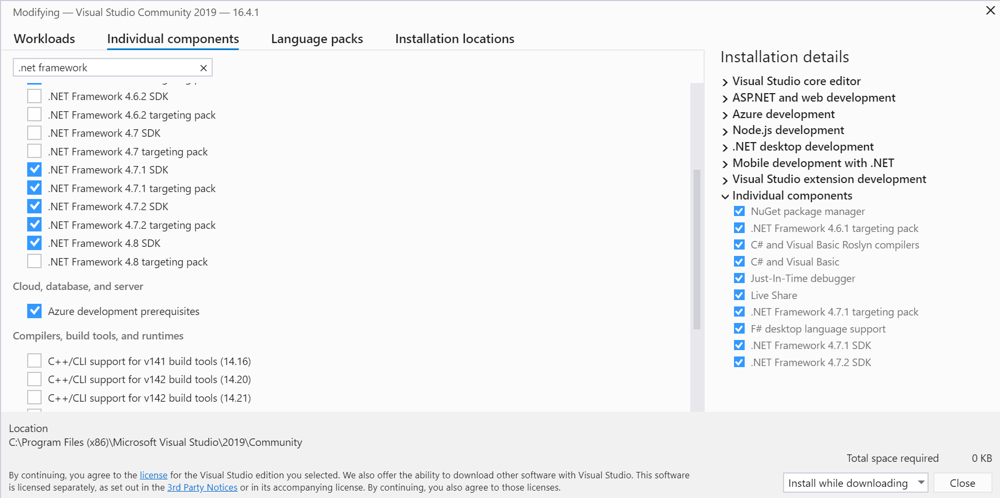
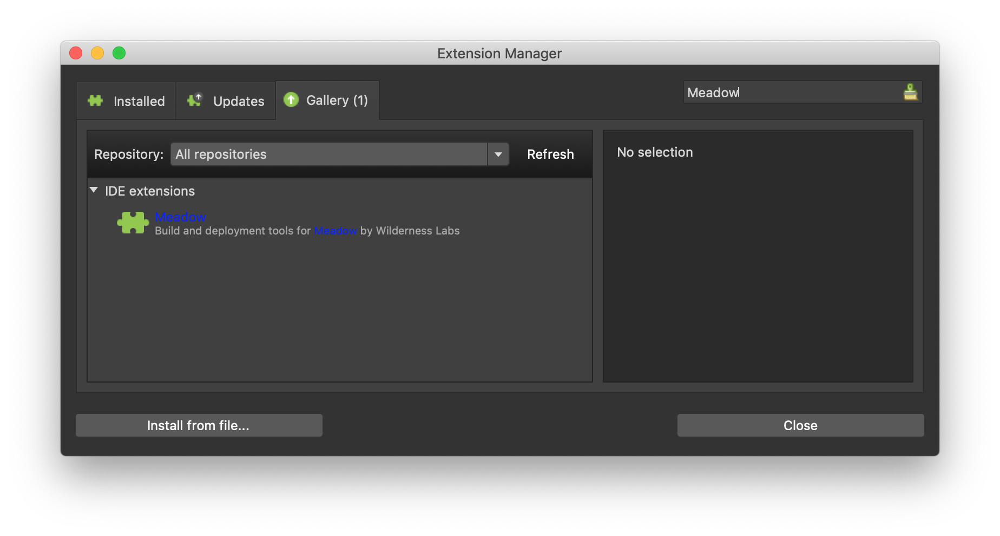

The video below shows you how to create and deploy your first Meadow app on a Mac:

<iframe width="640" height="360" src="https://www.youtube.com/embed/wkekz5I7ycE" frameborder="3" allowfullscreen></iframe>

Alternatively, you can follow this step by step guide for both macOS and Windows: 

## Step 1: Install Visual Studio Meadow Extensions

You'll need Visual Studio 2019 for either Windows or Mac; [available here](https://visualstudio.microsoft.com/downloads/). You can use any edition including Enterprise, Professional, or the free Community edition.  

### Windows

You'll need to ensure the **.NET Framework 4.7.2 SDK and targeting pack** are installed. To verify, run the Visual Studio Installer and click More > Modify. Under **Individual Components**, check **.NET Framework 4.7.2 SDK** and **.NET Framework 4.7.2 targeting pack** and install.

{:standalone}

You'll also need to install the VS Tools for Meadow Extension by [downloading it](https://marketplace.visualstudio.com/items?itemName=WildernessLabs.vsmeadow01) or through the Extension Manager

 1. In Visual Studio, go to **Extensions** > **Manage Extensions**.
 2. Click **Online** and search for `Meadow`.
 3. Install **VS Tools for Meadow**, shut down all instances of Visual Studio, and restart.

### macOS

Install the latest version of Visual Studio for Mac.

You'll also need to install the Meadow IDE Extension for Visual Studio for Mac.

 1. On the menu go to **Visual Studio** -> **Extensions**.
 2. Click the **Gallery** tab.
 3. Search for `Meadow`.
 4. Select the **Meadow** IDE extension.
 5. Click **Install...**

{:standalone}

## Step 2: Create a new Meadow Project

### Windows

 1. Open Visual Studio 2019.
 2. Click **Create a new project**.
 3. Search for `Meadow` (make sure to clear all filters).
 4. Select **Meadow Application** and press **Next**.
 5. Name your project `HelloMeadow` and choose project location.
 6. Press **Create**.
 7. Right-click `HelloMeadow` project in Solution Explorer > Click `Manage Nuget Packages` > Update Meadow.Foundation package to latest version.

### macOS

 1. Open Visual Studio.
 2. Create a new Project: **File** -> **New Solution..**.
 3. In the **Meadow** section, select *Meadow Application* and press **Next**.
 4. Name your project `HelloMeadow` and choose project location.
 5. Press **Create**.
 6. Update Meadow.Foundation package to latest version.

## Step 3: Deploy your Application

The Meadow application template is a simple application that will pulse the onboard LED. As long as the [Meadow.OS is deployed to your Meadow board](/Meadow/Getting_Started/Deploying_Meadow), you can use the same techniques to deploy a Meadow application as you would any other .Net application:

### macOS

 1. Connect your Meadow device to your development machine
 2. Press the **Play** button in Visual Studio to compile and deploy your application
 3. Wait 30-60 seconds for your application to start

### Windows

 1. Connect your Meadow device to your development machine
 2. Go to **View** > **Other Windows** > **Meadow** (or Ctrl+Shift+M) to open _Meadow Device Explorer_ and select your device. *Hint: open Device Manager and expand Ports (COM & LPT), the correct Meadow device COM port is **USB Serial Device**.*
 3. Right-click project in Solution Explorer and choose **Deploy**.
 4. Wait 30-60 seconds for your application to start

<!--
After a brief boot up wait, your device should start blinking the onboard LED in a variety of colors:

[image]

-->

## Understanding the `Hello, World` App

The Meadow app template has two files; `Program.cs` and `MeadowApp.cs`, let's take a quick look at them:



## Next

Now that you understand the basics of a Meadow application, we recommend learning about the following topics:

 * [Hardware I/O](/Meadow/Meadow_Basics/IO/)
 * [Meadow.Foundation](/Meadow/Meadow.Foundation/)
