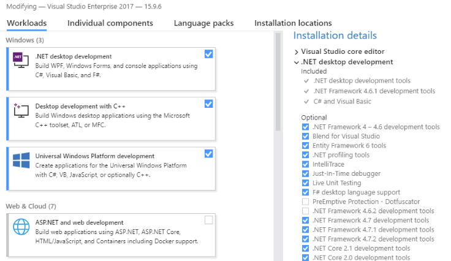

Once [Meadow.OS has been deployed to your board](/Meadow/Getting_Started/Deploying_Meadow), you can create and deploy Meadow apps to it.

The video below shows you how to create and deploy your first Meadow app on a Mac:
<p><iframe width="640" height="360" src="https://www.youtube.com/embed/wkekz5I7ycE" frameborder="3" allowfullscreen></iframe></p>

Alternatively, you can follow this step by step guide for both macOS and Windows: 

## Step 1: Install Visual Studio Meadow Extensions

You'll need Visual Studio 2019 for either Windows or Mac; [available here](https://visualstudio.microsoft.com/downloads/). You can use any edition including Enterprise, Professional, or the free Community edition.  

## Windows

You'll need to ensure the **.NET Framework 4.7.2 development tools** are installed. To verify, run the Visual Studio Installer and click **Modify**. Under **Installation details**, expand **.NET desktop development** and ensure that **.NET Framework 4.7.2 development tools** is checked.

{:standalone}

You'll also need to install the VS Tools for Meadow Extension by [downloading it](https://marketplace.visualstudio.com/items?itemName=WildernessLabs.vsmeadow01) or through the Extension Manager

 1. In Visual Studio, go to **Extensions** > **Manage Extensions**.
 2. Click **Online** and search for `Meadow`.
 3. Install **VS Tools for Meadow**, shut down all instances of Visual Studio, and restart.

### macOS

Install the latest version of Visual Studio for Mac.

You'll also need to install the Meadow IDE Extension for Visual Studio for Mac.

 1. On the menu go to **Visual Studio** -> **Extensions**.
 2. Click the **Gallery** tab.
 3. Search for `Meadow`.
 4. Select the **Meadow** IDE extension.
 5. Click **Install...** 

{:standalone}

## Step 2: Create a new Meadow Project

### Windows

 1. Open Visual Studio 2019.
 2. Click **Create a new project**.
 3. Search for `Meadow` (make sure to clear all filters).
 4. Select **Meadow Console** and press **Next**.
 5. Name your project `HelloMeadow` and choose project location.
 6. Press **Create**.

### macOS

 1. Open Visual Studio.
 2. Create a new Project: **File** -> **New Solution..**.
 3. In the **Meadow** section, select *Meadow Application* and press **Next**.
 4. Name your project `HelloMeadow` and choose project location.
 5. Press **Create**.

## Step 3: Deploy your Application

The Meadow application template is a simple application that will blink the onboard LED. As long as the [Meadow.OS is deployed to your Meadow board](/Meadow/Getting_Started/Deploying_Meadow), you can use the same techniques to deploy a Meadow application as you would any other .Net application:

### macOS

 1. Connect your Meadow device to your development machine
 2. Press the **Play** button in Visual Studio to compile and deploy your application
 3. Wait 30-60 seconds for your application to start

### Windows

 1. Connect your Meadow device to your development machine
 2. Go to **View** > **Other Windows** > **Meadow** (or Ctrl+Shift+M) to open _Meadow Device Explorer_ and select your device.
 3. Right-click project in Solution Explorer and choose **Deploy**.
 4. Wait 30-60 seconds for your application to start

<!--
After a brief boot up wait, your device should start blinking the onboard LED in a variety of colors:

[image]

-->

## Understanding the `Hello, World` App

The Meadow app template has two files; `Program.cs` and `App.cs`, let's take a quick look at them:

### Program.cs

If you've created a .Net console app before, the `Program` class should look familiar; it's very simple and only includes a `static void Main()` method that instantiates our Meadow app:

```csharp
using Meadow;

namespace BasicTestyMeadow
{
    class Program
    {
        static IApp app;
        public static void Main(string[] args)
        {
            // instantiate and run new meadow app
            app = new HelloMeadow();
        }
    }
}
```

This pattern allows us to have an App instance, in which all things Meadow are done.

### App.cs

Let's take a brief look at the app class:

```csharp
using System;
using System.Threading;
using Meadow;
using Meadow.Devices;
using Meadow.Hardware;

namespace HelloWorld
{
    public class HelloMeadow : App<F7Micro, HelloMeadow>
    {
        IDigitalOutputPort redLed;
        IDigitalOutputPort blueLed;
        IDigitalOutputPort greenLed;

        public App()
        {
            ConfigurePorts();
            BlinkLeds();
        }

        public void ConfigurePorts()
        {
            redLed = Device.CreateDigitalOutputPort(Device.Pins.OnboardLedRed);
            blueLed = Device.CreateDigitalOutputPort(Device.Pins.OnboardLedBlue);
            greenLed = Device.CreateDigitalOutputPort(Device.Pins.OnboardLedGreen);
        }

        public void BlinkLeds()
        {
            var state = false;

            while (true) {
                state = !state;

                Console.WriteLine($"State: {state}");

                redLed.State = state;
                Thread.Sleep(500);
                blueLed.State = state;
                Thread.Sleep(500);
                greenLed.State = state;
                Thread.Sleep(500);
            }
        }
    }
}

```

### Meadow Namespaces

Let's break this down into pieces, first; the Meadow namespaces:

```csharp
using Meadow;
using Meadow.Devices;
using Meadow.Hardware;
using Meadow.Foundation;
```

These are the typical minimum set of namespaces in a Meadow app class and provide the following functionality:

 * `Meadow` - The root namespace contains Meadow application and OS classes, enabling you to interact with the Meadow.OS.
 * `Meadow.Devices` - Contains device-specific definitions for different Meadow boards, such as the F7 Micro Dev board, or the F7 Micro embeddable board.
 * `Meadow.Hardware` - This namespace contains hardware classes that enable you to interact directly with hardware IO.
 * `Meadow.Foundation` - [Meadow.Foundation](/Meadow/Meadow.Foundation) is a set of open-source peripheral drivers and hardware control libraries that make hardware development with Meadow, plug-and-play.

### App Class Definition

Notice that the `HellowMeadow` application class inherits from `App`, and has two generic arguments, in this case `F7Micro`, and `HelloMeadow`:

```csharp
public class HelloMeadow : App<F7Micro, HelloMeadow>
```

All Meadow applications should inherit from the [App](/docs/api/Meadow/Meadow.App-2.html) base class. Under the hood, `App` registers itself with the Meadow.OS. It also provides hooks for getting notified during system events, such as the board being put to sleep.

`App` requires two parameters; first, the current device definition, and second, the type definition of your custom `IApp` class. These are passed to provide a strongly-typed reference to the current device, as well as the current instance of the application from anywhere in the app.

The device class defines properties and capabilities of the current device such as the pins, via the `Device` property on the `App` base class, and allows you to access them using autocomplete, via the specific device type:

```csharp
var redLed = Device.CreateDigitalOutputPort(Device.Pins.OnboardLedRed);
```

### Controlling the Onboard LED via Ports

<!-- TODO: convert to Meadow.Foundation and explain that. -->

Direct access to hardware Input/Output (IO) is generally available via _ports_ and _buses_. In this case, we create a `IDigitalOutputPort` for each color component (red, green, and blue) of the onboard LED:

```csharp

IDigitalOutputPort redLed;
IDigitalOutputPort blueLed;
IDigitalOutputPort greenLed;

...

redLed = Device.CreateDigitalOutputPort(Device.Pins.OnboardLedRed);
blueLed = Device.CreateDigitalOutputPort(Device.Pins.OnboardLedBlue);
greenLed = Device.CreateDigitalOutputPort(Device.Pins.OnboardLedGreen);
```

Ports are created from the device itself, and the `Pins` property provides named pins that map to the pins available on the particular device specified above in the `App` definition.


#### Digital Output

To vary the color of the light emitted via the onboard LED, we can _write_ to the internal pins that are connected to the LED, via the `State` property, causing them to have a voltage of `HIGH`/`ON`, or `LOW`/`OFF`:


```csharp
public void BlinkLeds()
{
    var state = false;

    while (true) {
        state = !state;

        Console.WriteLine($"State: {state}");

        redLed.State = state;
        Thread.Sleep(500);
        blueLed.State = state;
        Thread.Sleep(500);
        greenLed.State = state;
        Thread.Sleep(500);
    }
}
```

## Next

Now that you understand the basic of a Meadow application, we recommend learning about the following topics:

 * [Hardware I/O](/Meadow/Meadow_Basics/IO/)
 * [Meadow.Foundation](/Meadow/Meadow.Foundation/)
