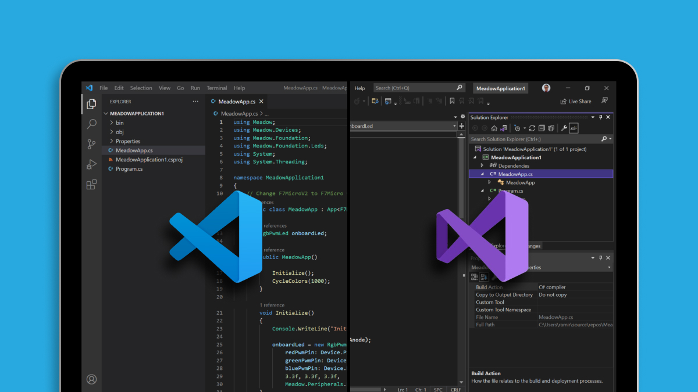
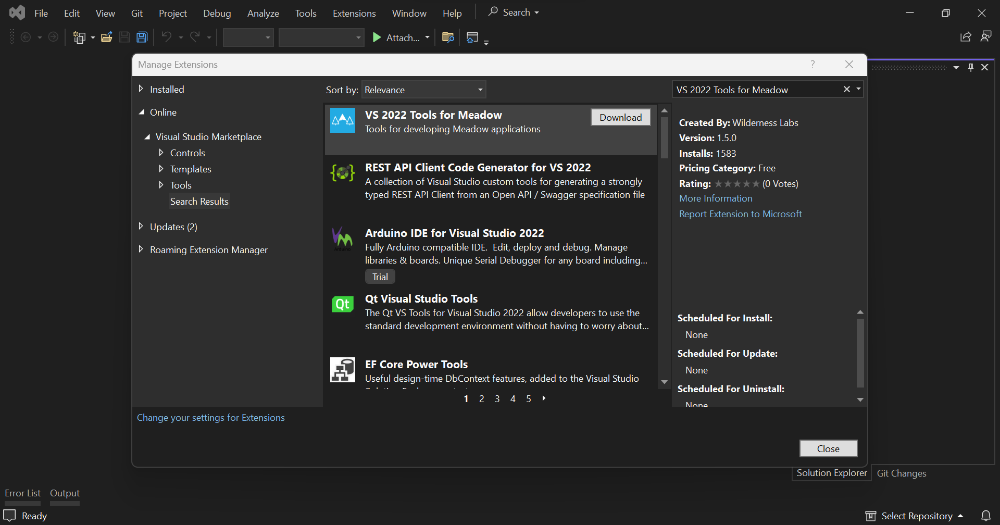
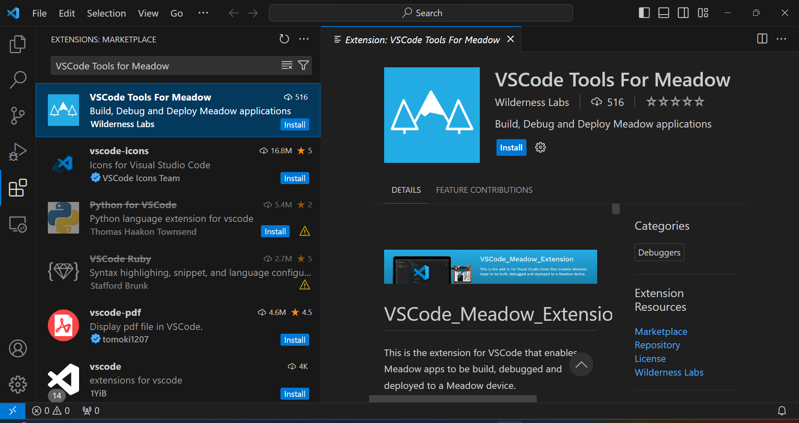

<Tabs groupId="ide">
  <TabItem value="visualstudio2022" label="Visual Studio 2022" default>

### Pre-requisites

The Meadow developer Extension for Visual Studio enables projects to be built, debugged, and deployed to any of our Meadow-powered devices.

If you haven't already, download and install [Visual Studio 2022](https://visualstudio.microsoft.com/) for either Windows or macOS to prepare your development machine. Community edition will work fine.

:::caution
**IMPORTANT**: Make sure to include the **.NET Multi-platform App UI development** component when installing Visual Studio.
:::

### Installation

You'll need to [download and install the VS 2022 Tools for Meadow extension](https://marketplace.visualstudio.com/items?itemName=WildernessLabs.vsmeadow2022), or install it through the Extension Manager

1. In Visual Studio, go to **Extensions** > **Manage Extensions**
1. Click **Online** and search for `VS 2022 Tools for Meadow`. It should be the first extension in the list.

  

1. Install **VS 2022 Tools for Meadow**, then close all instances of Visual Studio so the extension gets installed.

### References

* [VS_Win_Meadow_Extension GitHub Repo](https://github.com/WildernessLabs/VS_Win_Meadow_Extension)

  </TabItem>
  <TabItem value="visualstudiocode" label="Visual Studio Code">
  

### Pre-requisites

If you haven't, download and install [Visual Studio Code](https://visualstudio.microsoft.com/) to prepare your development machine.

### Installation

1. In Visual Studio Code go to the Extensions tab (macOS: Cmd+Shift+X. Others: Ctrl+Shift+X)
1. In the search bar type `VSCode Tools for Meadow`. It should be the first extension in the list.

  

1. Click the **Install** button on the VSCode Tools for Meadow extension page.

The extension should now be installed.

### References

* [VSCode_Meadow_Extension GitHub Repo](https://github.com/WildernessLabs/VSCode_Meadow_Extension)

  </TabItem>
</Tabs>
