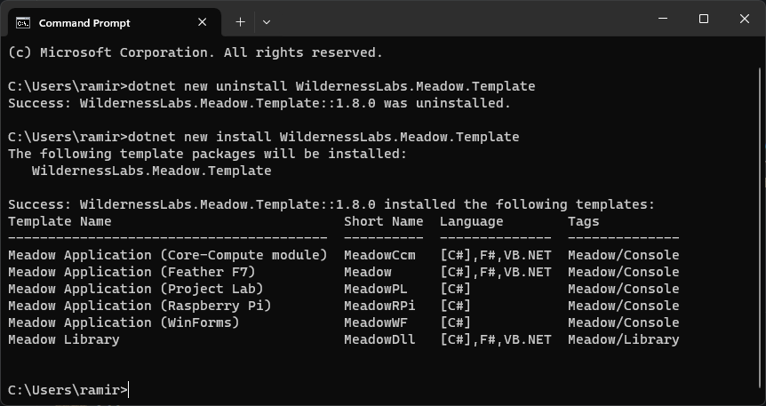

import Tabs from '@theme/Tabs';
import TabItem from '@theme/TabItem'

<Tabs>
  <TabItem value="apple" label="Visual Studio 2022" default>

### Step 1 - Install .NET Runtime

Download and install the latest version of the [.NET runtime](https://dotnet.microsoft.com/en-us/download).

### Step 2 - Install Visual Studio

Download and Install [Visual Studio](https://visualstudio.microsoft.com/) for either Windows or macOS to prepare your development machine. Community edition will work fine.

### Step 3 - Add Meadow Visual Studio Extension

Open Visual Studio’s Extensions Manager and install the [VS 2022 Tools for Meadow](https://marketplace.visualstudio.com/items?itemName=WildernessLabs.vsmeadow2022) Extension.

### Step 4 - Deploy latest version of Meadow.OS

Use the [Meadow.CLI](https://developer.wildernesslabs.co/Meadow/Meadow_Basics/Meadow_CLI/) to deploy [Meadow.OS](https://developer.wildernesslabs.co/Meadow/Getting_Started/Deploying_Meadow/) to your board to ensure it’s running with the latest version available.

### Step 5 - Create your first Meadow application

In **Visual Studio**, open the **Create a new project** window. When you search for **Meadow**, you will see a list of project templates, click on **Meadow Application**:

Name the project whatever you like or leave the default name and let Visual Studio load up the new Meadow app. Once the new project is loaded, right-click on the toolbar area and select the Meadow Device List item.

This is your device selector to deploy applications to your Meadow devices.

### Step 6 - Deploy your application

Connect your board if disconnected, and in the **Meadow devices** drop down it should list its corresponding COM port. Once selected, click on the play **Debug button** to start transferring the application to your board.

**Note**: When deploying a project for the first time, the transfer will take several minutes, since it's transferring all the necessary libraries to run the application. Once the app is running for the first time, deployment will be faster as it will transfer only the files that you’ve changed.

Once all the files are transferred to your device, the app will start in debug mode and you should see Meadow’s onboard RGB LED lighting up in different colors.

  </TabItem>
  <TabItem value="orange" label="Visual Studio Code">

### Step 1 - Install .NET Runtime

Download and install the latest version of the [.NET runtime](https://dotnet.microsoft.com/en-us/download).

### Step 2 - Install Visual Studio Code

Download and Install [Visual Studio Code](https://visualstudio.microsoft.com/) to prepare your development machine.

### Step 3 - Add Meadow VSCode Extension

Open VSCode’s Extensions Manager and install [VSCode Tools for Meadow](https://marketplace.visualstudio.com/items?itemName=WildernessLabs.meadow) Extension.

### Step 4 - Deploy latest version of Meadow.OS

Use the [Meadow.CLI](https://developer.wildernesslabs.co/Meadow/Meadow_Basics/Meadow_CLI/) to deploy [Meadow.OS](https://developer.wildernesslabs.co/Meadow/Getting_Started/Deploying_Meadow/) to your board to ensure it’s running with the latest version available.

### Step 5 - Install Meadow Project Templates

Open a Terminal and enter the following command to install a list of Meadow project templates:

`dotnet new install WildernessLabs.Meadow.Template`

When installed, you’ll see a list of Templates available

### Step 6 - Create your first Meadow application

Lets verify everything is set up by deploying your first Meadow application. 

Open VSCode and in a new Terminal within, enter the following command to create a new Meadow F7 Feather project:

`dotnet new Meadow -n Blinky`

What this Meadow application does is creates an `RgbPwmLed` object on the onboard RGB LED and cycles through different colors.

### Step 7 - Deploy your application

With no code changes, let's deploy this app to your new board. 

In the bottom toolbar, click on the COM port button that will open a drop down menu at the top, where you’ll select the corresponding port your board is using.

**Note**: When deploying a project for the first time, the transfer will take several minutes, since it's transferring all the necessary libraries to run the application. Once the app is running for the first time, deployment will be faster as it will transfer only the files that you’ve changed.

Once all the files are transferred to your device, the app will start in debug mode and you should see Meadow’s onboard RGB LED lighting up in different colors.

  </TabItem>
</Tabs>