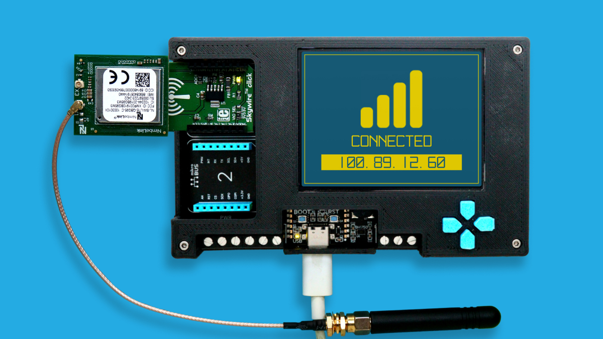
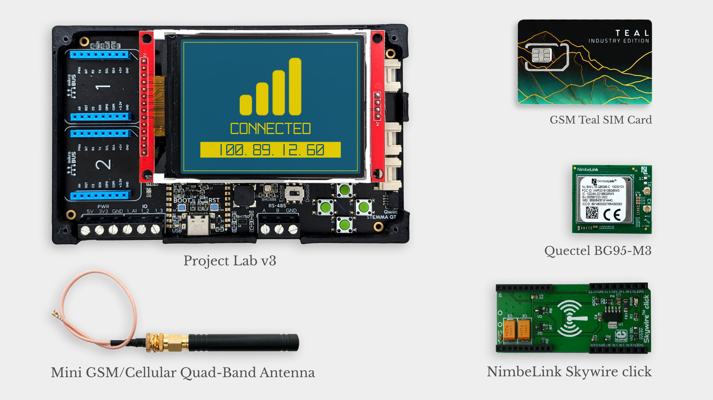
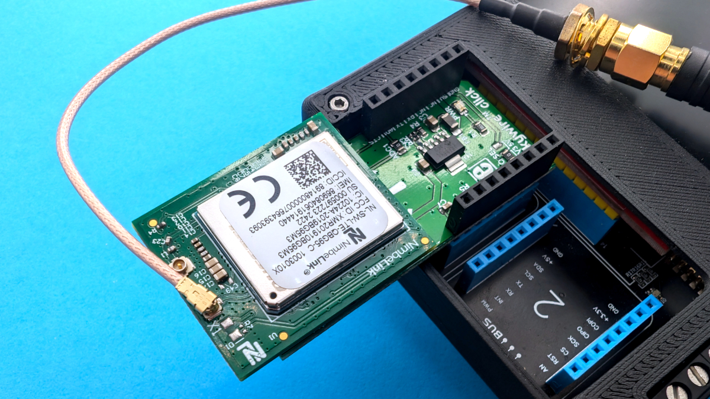
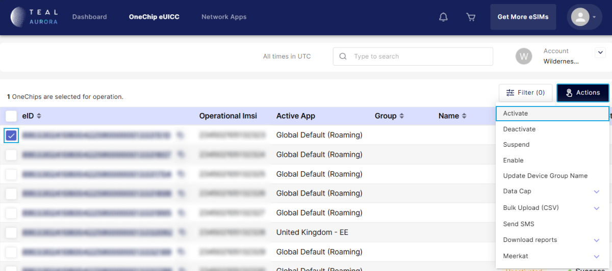

This guide shows you how to set up your [Meadow Project Lab + Cellular bundle](https://store.wildernesslabs.co/collections/frontpage/products/project-lab-board) board from unboxing all the way to deploying your fist Meadow app from either Visual Studio 2022 or Visual Studio Code.

## Adding the cellular module on a Project Lab

Your cellular bundle comes with these parts:



- Connect the Skywire click adapter on the MicroBus 1 connector on the project lab.
- Insert the Teal SIM card in the SIM Card slot under the BG95-M3 cellular module. 
- Place the cellular module on the Skywire click adapter.
- Finally, connect the Mini GSM Antenna on the Antenna connector marked with X1.

Once everything connected, it should look like this:



## Activating your Teal SIM Card

First, you'll need to fill out their [Account Creation Form](https://forms.monday.com/forms/5610d871c689ea18cde677ca13f1922f?r=use1), which would submit a request to Teal to create an account for you. Once the account is created, they will provide you a link to the Teal Portal along with the login credentials.

Once you have the credentials, login to your account and you will land on the **Dashboard** tab, showing basic metrics such as Data Consumption, Device Network Status, eSIM Operation Status, etc. 

Click on the **OneChip eUICC** tab where you will see your SIM Card(s). Select your card(s) on the far left end of the row and click the **Actions** drop down menu, and select **Activate**.



After a few seconds or a minute, reset the site and you should see the card(s) **Network Status** changed to **Activated**.

## Setting up Meadow.OS, Tooling and Deployment on the Project Lab

<Tabs groupId="ide">
  <TabItem value="visualstudio2022" label="Visual Studio 2022" default>

### Step 1 - Install .NET Runtime

Download and install the latest version of the [.NET runtime](https://dotnet.microsoft.com/en-us/download).

### Step 2 - Deploy latest version of Meadow.OS

Follow this quick guide to <a href="../../Deploying_Meadow%2EOS/" target="_blanc">Deploy Meadow.OS</a> to your board to ensure it’s running with the latest version available.

### Step 3 - Install Visual Studio

Download and Install [Visual Studio 2022](https://visualstudio.microsoft.com/) for either Windows or macOS to prepare your development machine. Community edition will work fine.

### Step 4 - Add Meadow Visual Studio Extension

Follow this guide to install the <a href="../../../Meadow_Tools/VSWin/" target="_blanc">VS Tools for Meadow</a> Extension for Visual Studio 2022, to deploy applications to your Meadow devices.

### Step 5 - Install Meadow Project Templates

Open a console window and enter the following command to install a list of Meadow project templates:

```console
dotnet new install WildernessLabs.Meadow.Template
```

When installed, you’ll see a list of templates available:

```console
The following template packages will be installed:
   WildernessLabs.Meadow.Template

Success: WildernessLabs.Meadow.Template installed the following templates:
Template Name            Short Name          Language        Tags
-----------------------  ------------------  --------------  -------------------
Meadow Core-Compute App  meadow-ccm          [C#],F#,VB.NET  Meadow/Console
Meadow Desktop App       meadow-desktop      [C#]            Meadow/Console
Meadow F7 Feather App    meadow-feather      [C#],F#,VB.NET  Meadow/Console
Meadow Jetson Nano App   meadow-jetson-nano  [C#]            Meadow/Console
Meadow Library           meadow-library      [C#],F#,VB.NET  Meadow/Library
Meadow Project Lab App   meadow-project-lab  [C#]            Meadow/Console
Meadow Raspberry Pi App  meadow-rpi          [C#]            Meadow/Console
Meadow reTerminal App    meadow-reterminal   [C#]            Meadow/Console
Meadow StartKit App      meadow-startkit     [C#]            Meadow/App/StartKit
```

### Step 6 - Validate your Project Lab + Cellular 

In **Visual Studio**, open the **Create a new project** window. When you search for **Meadow**, you will see a list of project templates, click on **Meadow Project Lab App (Wilderness Labs)**:


### Step 7 - Deploy your application

Connect your board if disconnected, and in the **Meadow devices** drop down it should list its corresponding COM port. Once selected, click on the play **Debug button** to start transferring the application to your board.


:::caution
When deploying a project for the first time, the transfer will take several minutes, since it's transferring all the necessary libraries to run the application. Once the app is running for the first time, deployment will be faster as it will transfer only the files that have been changed.
:::

Once all the files are transferred to your device, the app will start in debug mode and you should see Project Lab's screen turn on and show sensor readings every few seconds and pushing the buttons updates the states shown on the screen.

### Step 8 - Check out additional samples

You can check more samples in our [Meadow.Samples](https://github.com/WildernessLabs/Meadow.Samples/tree/main) GitHub repo.


  </TabItem>
  <TabItem value="visualstudiocode" label="Visual Studio Code">

### Step 1 - Install .NET Runtime

Download and install the latest version of the [.NET runtime](https://dotnet.microsoft.com/en-us/download).

### Step 2 - Deploy latest version of Meadow.OS

Follow this quick guide to <a href="../../Deploying_Meadow%2EOS/" target="_blanc">Deploy Meadow.OS</a> to your board to ensure it’s running with the latest version available.

### Step 3 - Install Visual Studio Code

Download and Install [Visual Studio Code](https://visualstudio.microsoft.com/) to prepare your development machine.

### Step 4 - Add Meadow VSCode Extension

Open VSCode’s Extensions Manager and install [VSCode Tools for Meadow](https://marketplace.visualstudio.com/items?itemName=WildernessLabs.meadow) Extension.

### Step 5 - Install Meadow Project Templates

Open a console window and enter the following command to install a list of Meadow project templates:

```console
dotnet new install WildernessLabs.Meadow.Template
```

When installed, you’ll see a list of templates available:

```console
The following template packages will be installed:
   WildernessLabs.Meadow.Template

Success: WildernessLabs.Meadow.Template installed the following templates:
Template Name            Short Name          Language        Tags
-----------------------  ------------------  --------------  -------------------
Meadow Core-Compute App  meadow-ccm          [C#],F#,VB.NET  Meadow/Console
Meadow Desktop App       meadow-desktop      [C#]            Meadow/Console
Meadow F7 Feather App    meadow-feather      [C#],F#,VB.NET  Meadow/Console
Meadow Jetson Nano App   meadow-jetson-nano  [C#]            Meadow/Console
Meadow Library           meadow-library      [C#],F#,VB.NET  Meadow/Library
Meadow Project Lab App   meadow-project-lab  [C#]            Meadow/Console
Meadow Raspberry Pi App  meadow-rpi          [C#]            Meadow/Console
Meadow reTerminal App    meadow-reterminal   [C#]            Meadow/Console
Meadow StartKit App      meadow-startkit     [C#]            Meadow/App/StartKit
```

### Step 6 - Create your first Meadow application

Lets verify everything is set up by deploying your first Meadow application. 

Open VSCode and in a new Terminal within, enter the following command to create a new Project Lab project:

```console
dotnet new meadow-project-lab --name ProjectLabDemo
```

This project creates a Project Lab demo app that will activate all its onboard sensors (environmental, light and motion sensors, button states) and show its readings periodically on its 320x240 SPI display.

### Step 7 - Deploy your application

With no code changes, let's deploy this app to your new Project Lab.

In the Activity Bar on the side of the window, select the **Run and Debug** icon.

Within the **Run and Debug** side bar, select the configuration drop-down and select the port corresponding to your connected Meadow device.


:::caution
When deploying a project for the first time, the transfer will take several minutes, since it's transferring all the necessary libraries to run the application. Once the app is running for the first time, deployment will be faster as it will transfer only the files that have been changed.
:::

Once all the files are transferred to your device, the app will start in debug mode and you should see your Project Lab loading up a screen with all the sensor values refreshing every few seconds. You can also press the push buttons and see their status change right away.

### Step 8 - Check out additional samples

You can check more samples in our [Meadow.Samples](https://github.com/WildernessLabs/Meadow.Samples/tree/main) GitHub repo.


  </TabItem>
  <TabItem value="meadowcli" label="Meadow CLI">

### Step 1 - Install .NET Runtime

Download and install the latest version of the [.NET runtime](https://dotnet.microsoft.com/en-us/download).

### Step 2 - Install Meadow CLI

Download and Install [Meadow CLI](https://www.nuget.org/packages/WildernessLabs.Meadow.CLI//) if it's not installed already.

### Step 3 - Deploy latest version of Meadow.OS

Use the [Meadow.CLI](../../../Meadow_Tools/Meadow_CLI/) to deploy [Meadow.OS](../../Deploying_Meadow%2EOS/) to your board to ensure it’s running with the latest version available.

### Step 4 - Install Meadow Project Templates

Open a console window and enter the following command to install a list of Meadow project templates:

```console
dotnet new install WildernessLabs.Meadow.Template
```

When installed, you’ll see a list of templates available:

```console
The following template packages will be installed:
   WildernessLabs.Meadow.Template

Success: WildernessLabs.Meadow.Template installed the following templates:
Template Name            Short Name          Language        Tags
-----------------------  ------------------  --------------  -------------------
Meadow Core-Compute App  meadow-ccm          [C#],F#,VB.NET  Meadow/Console
Meadow Desktop App       meadow-desktop      [C#]            Meadow/Console
Meadow F7 Feather App    meadow-feather      [C#],F#,VB.NET  Meadow/Console
Meadow Jetson Nano App   meadow-jetson-nano  [C#]            Meadow/Console
Meadow Library           meadow-library      [C#],F#,VB.NET  Meadow/Library
Meadow Project Lab App   meadow-project-lab  [C#]            Meadow/Console
Meadow Raspberry Pi App  meadow-rpi          [C#]            Meadow/Console
Meadow reTerminal App    meadow-reterminal   [C#]            Meadow/Console
Meadow StartKit App      meadow-startkit     [C#]            Meadow/App/StartKit
```

### Step 5 - Create your first Meadow application

Lets verify everything is set up by deploying your first Meadow application. 

Open VSCode and in a new Terminal within, enter the following command to create a new Project Lab project:

```console
dotnet new meadow-project-lab --name ProjectLabDemo
```

This project creates a Project Lab demo app that will activate all its onboard sensors (environmental, light and motion sensors, button states) and show its readings periodically on its 320x240 SPI display.

### Step 6 - Deploy your application

With no code changes, let's deploy this app to your new board.

Again in your console window, use the `meadow app run` command to build, trim, deploy and start your Meadow application.

:::caution
When deploying a project for the first time, the transfer will take several minutes, since it's transferring all the necessary libraries to run the application. Once the app is running for the first time, deployment will be faster as it will transfer only the files that have been changed.
:::

Once all the files are transferred to your device, the app will start in debug mode and you should see your Project Lab loading up a screen with all the sensor values refreshing every few seconds. You can also press the push buttons and see their status change right away.

### Step 7 - Check out additional samples

You can check more samples in our [Meadow.Samples](https://github.com/WildernessLabs/Meadow.Samples/tree/main) GitHub repo.


  </TabItem>
</Tabs>