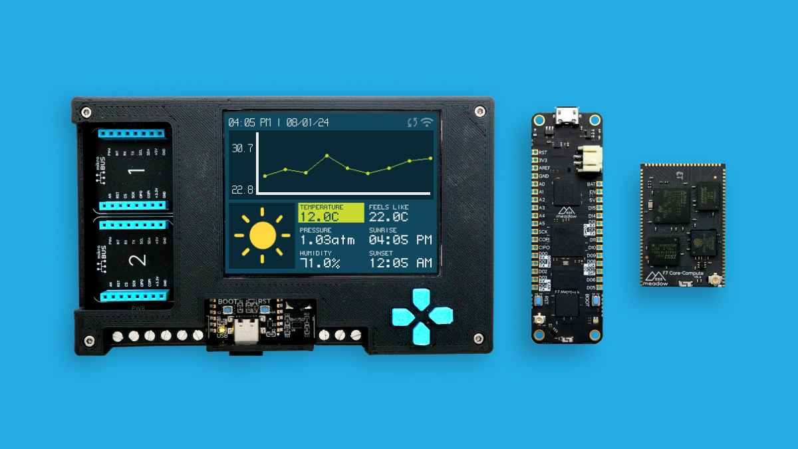

## Board-Specific Instructions

* F7 Feather
    * [Assemble F7 Feather DevKit](Assemble_F7Feather_DevKit/)
    * [Hello, F7](F7_Feather/)
* Core-Compute Module (CCM) Dev Kit
    * [Hello, CCM](Core_Compute_Module_DevKit/)
* Project Lab
    * [Hello, Project Lab](Project_Lab/)

## Shared Steps

* [Install Meadow.CLI](../../Meadow_Tools/Meadow_CLI/)
* [Install IDE Extensions](../IDE_Extensions/)
* [Deploy Meadow.OS](../Deploying_Meadow%2EOS/)