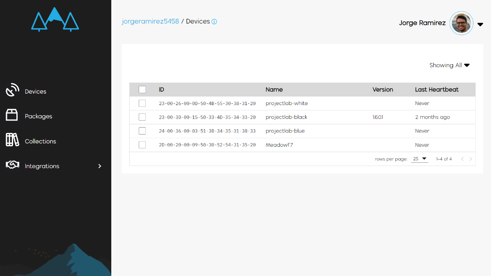
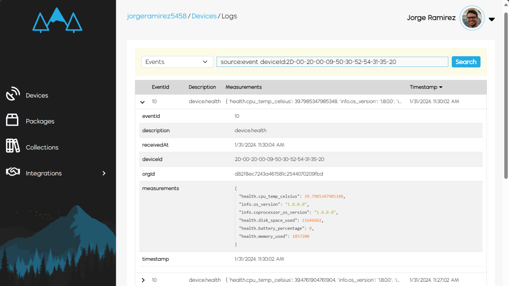

### Step 1 - Create a Wilderness Labs account

To access all [Meadow.Cloud](https://www.meadowcloud.co) features, you first need to [sign up](https://identity.wildernesslabs.co/signin/register) to create an account if you dont have one.

### Step 2 - Provision a Device

Before a device can enjoy things like [Over-the-Air updates](../../Meadow.Cloud/OtA_Updates/index.md) and [Health Monitoring](../../Meadow.Cloud/Health_Monitoring/index.md), it needs to get provisioned with Meadow.Cloud. This is a straightforward process with a few command-line steps:

1. You'll need to [install the Meadow.CLI](../../Getting_Started/Meadow%2ECLI/) to interact with Meadow.Cloud commands.

1. Use the Meadow.CLI to authenticate with Meadow.Cloud:

    ```console
    meadow cloud login
    ```

    This opens a browser with the Wilderness Labs Login page. After authenticating, you can go back to the terminal and it should confirmed you've successfully logged in.

1. Connect your Meadow device to your development machine if you havent and enter the following command to make sure we'll provision the device you just connected:

    ```console
    meadow port select
    ```

1. Now lets provision the device for Meadow.Cloud. Use the following command below. Adding a device name with the `--name` parameter is optional, but will make it easier to identify your device later.

    ```console
    meadow cloud device provision --name FeatherF7
    ```

1. After confirming that the Meadow device has been provisioned, you can go to [https://www.meadowcloud.co](https://www.meadowcloud.co) to verify your device has been successfully provisioned.

    

### Step 3 - Enable Meadow.Cloud integration in a Meadow App

Lets verify that you have provisioned your device and interacts properly to Meadow.Cloud. In order to do that, let's set your device to enable [Health Metrics](../../Meadow%2ECloud/Health_Monitoring/index.md). With Meadow, this is a first class feature and simple to set up. Once enabled, you can see the status of your device at a glance. Additionally, you can drill down to see raw data as well as basic charts to view the data over time.

1. Open an existing Meadow app project, or follow the [Hello, F7 Feather](../MCUs/F7_Feather/index.md) to make one from scratch.

1. The board will to join a WiFi network at startup, so you'll need to update a few network settings in the `meadow.config.yaml` file:

    ```yaml
    # Control how the ESP coprocessor will start and operate.
    Coprocessor:

        # ESP32 automatically attempt to connect to an access point at startup
        # If set to true, wifi.yaml credentials must be stored in the device.
        AutomaticallyStartNetwork: true

        # Should the ESP32 automatically reconnect to the configured access point?
        AutomaticallyReconnect: true

        # Maximum number of retry attempts for connections etc. 
        # before an error code is returned.
        MaximumRetryCount: 7

    # Network configuration.
    Network:

        # Default Interface
        DefaultInterface: Wifi
    ```

    Enter your WiFi's SSID and Password credentials in the `wifi.config.yaml` file:
    ```yaml
    # WiFi network credentials
    Credentials:

        # WiFi SSID
        Ssid: WIFI_SSID
    
        # WiFi Password
        Password: WIFI_PASSWORD
    ```

    Finally, setting up health monitoring requires the following update in `app.config.yaml`:

    ```yaml
    # Meadow.Cloud Health Metrics.
    HealthMetrics:

        # Enable Health Metrics
        Enabled: true

        # How often to send metrics to Meadow.Cloud (in minutes)
        Interval: 3
    ```

1. Now run the app and eventually logs into Meadow.Cloud, and it'll start sending device health metrics to your account. The app's output should look similar to this:

    ```console
    ...
    starting health metrics timer
    Attempting to login to https://www.meadowcloud.co/api/devices/login with {"id":"2D-00-20-00-09-50-30-52-54-31-35-20"}...
    authentication successful. extracting token
    decrypting auth payload
    auth token successfully received
    making cloud log httprequest with json: {"eventId":10,"description":"device.health","measurements":{"health.cpu_temp_celsius":42.6996336996337,"health.memory_used":574024,"health.disk_space_used":11646602,"info.os_version":"1.8.0.0","health.battery_percentage":0,"info.coprocessor_os_version":"1.8.0.0"},"timestamp":"2024-01-31T18:54:03.123871+00:00"}
    cloud send success
    health metrics sent
    making cloud log httprequest with json: {"eventId":10,"description":"device.health","measurements":{"health.cpu_temp_celsius":39.7985347985348,"health.memory_used":911184,"health.disk_space_used":11646602,"info.os_version":"1.8.0.0","health.battery_percentage":0,"info.coprocessor_os_version":"1.8.0.0"},"timestamp":"2024-01-31T18:57:02.149871+00:00"}
    cloud send success
    ...
    ```

### Step 4 - Verify logs in Meadow.Cloud

Lets take a check the new device health logs coming in:

1. In the [Meadow.Cloud](https://www.meadowcloud.co) site, hover your cursor your device in the Devices section, and click on Logs.

1. Click on the type of log drop-down menu and select `events`, and a list should appear with your device's health status, showing you disk space used, cpu temperature, memory used and battery percentage if present.

    