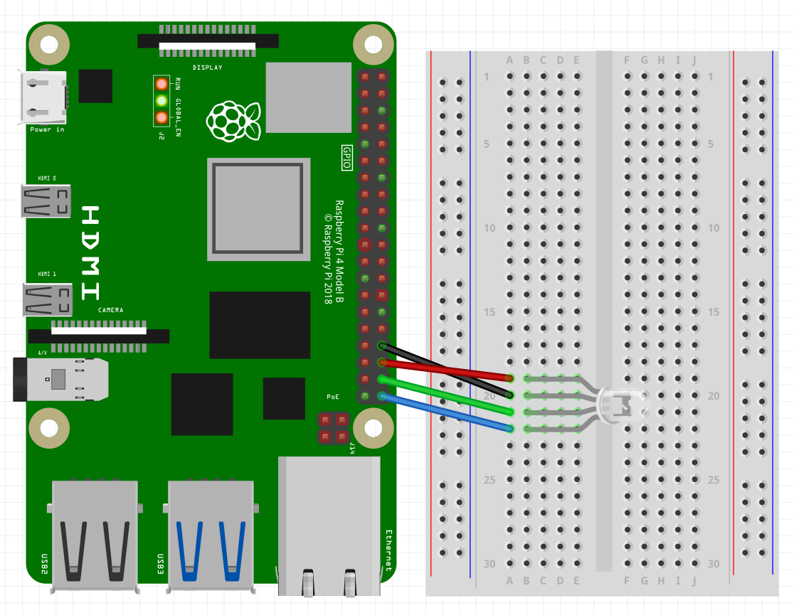

<Tabs>
  <TabItem value="visualstudio" label="Visual Studio 2022" default>

  </TabItem>
  <TabItem value="vscode" label="Visual Studio Code">

### Step 1 - Install .NET Runtime

Follow this [blog post](https://www.petecodes.co.uk/install-and-use-microsoft-dot-net-8-with-the-raspberry-pi/) to download and install .NET on a [Raspberry Pi](https://www.raspberrypi.com/).

### Step 2 - Install Visual Studio Code

Download and Install [Visual Studio Code](https://visualstudio.microsoft.com/) to prepare your development machine.

### Step 3 - Install Meadow Project Templates

Open a Terminal and enter the following command to install a list of Meadow project templates:

`dotnet new install WildernessLabs.Meadow.Template`

When installed, you’ll see a list of Templates available

### Step 4 - Create your first Meadow application

Lets verify everything is set up by deploying your first Meadow application. 

Open VSCode and in a new Terminal within, enter the following command to create a new Meadow.Linux project that will run on your Raspberry Pi:

`dotnet new MeadowRPi -n BlinkyRPi`

This Meadow.Linux application instantiates an `RgbLed` object of an RGB LED connected to a Raspberry Pi (see diagram below) and cycles through different colors.

The MeadowApp.cs file shows how the RGB LED is instantiated in the `Initialize` method, and in the `Run` method it’ll start the cycling color animation.

### Step 5 - Run your application

Lets run this application as is on your Raspberry Pi. In a terminal inside the project folder, build the project with the command:

`dotnet build`

And finally to run the Meadow application, use the command:

`dotnet run`

At that point, you should see the application’s output in the console and the RGB LED cycling through different colors:

  </TabItem>
</Tabs>