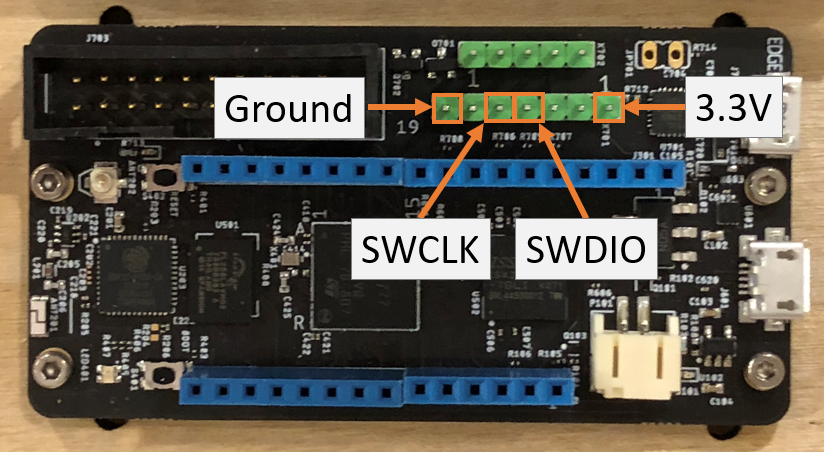

# Connect your Meadow F7 debug board to the ST-Link V2

Currently, Meadow is using a process called *semi-hosting* to load applications into memory. With semi-hosting, the app files are stored on a host computer's file system.

We'll use the ST-Link V2 USB adapter to transfer the app binaries to Meadow.

## Requirements
- USB ST-Link V2
- Meadow debug board with JTag headers
- Four (4) jumper wires

## Connections 
You'll connect four (4) pins on the ST-Link to Meadow
1. 3.3V
1. Ground (GND)
1. Digital IO (SWDIO)
1. Clock (SWCLK)

You can see the pinout on the Meadow debug header below:
{:standalone}

The pins should be labelled on the ST-Link V2. Not all ST-Links have the same pinout so **check your specific ST-Link** for the pinout. It should be labelled.

{:standalone}

You're now ready to connect your ST-Link to your host PC.

## [Next - Configure your Dev Environment](/Meadow/Getting_Started/Setup/Windows/)
