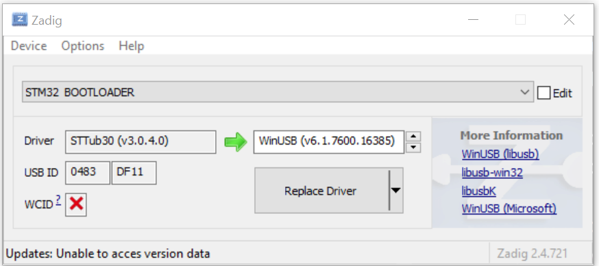
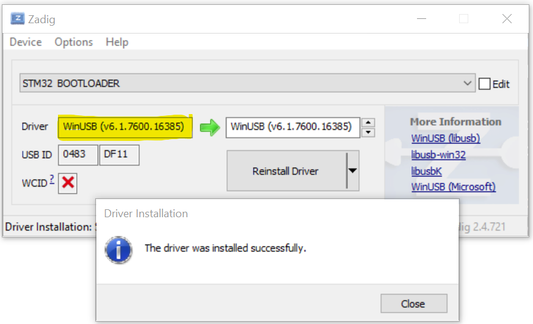

In order to flash Meadow OS, *dfu-util* is recommended. However, the default Windows USB driver for ST devices is not compatible with *dfu-util*, so it needs to be replaced. For more in-depth information on this, check out [Scott Hanselman's post](https://www.hanselman.com/blog/how-to-fix-dfuutil-stm-winusb-zadig-bootloaders-and-other-firmware-flashing-issues-on-windows). 

1. Download and run [Zadig](https://zadig.akeo.ie/)
1. Connect a Meadow device in bootloader mode
1. In Zadig, click *Options* > *List All Devices*
1. Select *STM32 BOOTLOADER* in the dropdown
1. Click *Replace Driver*
{:standalone}

1. After the installation is complete, driver should be *WinUSB*
{:standalone}