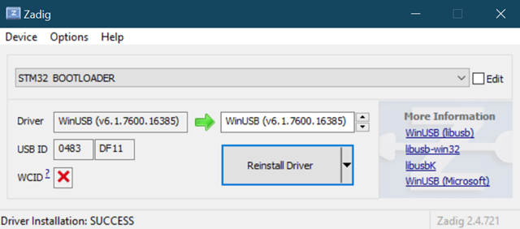

This guide shows you the recommended order to update your Meadow stack.

* [Updating Meadow.CLI](#updating-meadowcli)
* [Updating Meadow.OS](#updating-meadowos)
    * [Checking Meadow device drivers before flashing Meadow.OS (Windows only)](#checking-meadow-device-drivers-before-flashing-meadowos-windows-only)
    * [Download and Flash Latest Meadow.OS binaries](#download-and-flash-latest-meadowos-binaries)
* [Updating Visual Studio (for Windows) Extension](#updating-visual-studio-for-windows-extension)
* [Updating NuGet Packages](#updating-nuget-packages)
* [Problems Updating?](#problems-updating)

## Updating Meadow.CLI

If the release notes mention its a full stack update (which includes tooling), or explicitly mentioning a change to the Meadow.CLI, you can easily update by entering the following command:

```
dotnet tool update WildernessLabs.Meadow.CLI --global
```

## Updating Meadow.OS

### Checking Meadow device drivers before flashing Meadow.OS (Windows only)

To ensure that your board is in the proper state to flash it, when connecting it in **bootloader mode** (connecting the board while holding the BOOT button), it should show up as **STM32 BOOTLOADER** under the **Universal Serial Bus devices**, and when connecting it normally it should show up as a **USB Serial Device (COMX)** under the **Ports (COM & LPT)** section section in the **Device Manager**.


If your board appears as **Meadow F7 Micro (COMX)** in regular mode, right-click on it and select **Uninstall Device**, and make sure to select **Attempt to remove the driver for this device**.


Once its done, connect your board in **bootloader** mode again, and run the [Zadig](https://zadig.akeo.ie/) Tool. Click on **Options->List All Devices**, and you should see **STM32 BOOTLOADER** in the dropdown menu. Click the install driver button, and wait until you get the **Driver Installation: SUCCESS message**.



At this point, your Meadow device should be good to go for a proper flash of **Meadow.OS**.

### Download and Flash Latest Meadow.OS binaries

Download the latest Meadow.OS binaries, by using the command:

```
firmware download
```

To flash your Meadow board with the latest binaries, disconnect and reconnect your board holding the BOOT button to power it on in **Bootloader mode**. Now run the following command:

```
firmware write
```

Note: This process takes about 2-3 minutes, as it needs to erase the Flash memory of the STM32, then transfer the Meadow.OS.Runtime file along with the binaries for the ESP coprocessor. At times, this process might show exceptions and errors, failing to complete successfully. When that happens, disconnect and reconnect the board in bootloader mode, and try again.

When the board flashing process is completed, the console shouldnt show no errors, and you can ensure you're running the latest version when using the command

```
meadow device info
```

It will give you an output like this:

```
C:\Users\ramir>meadow device info
Getting device info...
Meadow by Wilderness Labs
Board Information
    Model: F7Micro
    Hardware version: F7CoreComputeV2
    Device name: MeadowF7

Hardware Information
    Processor type: STM32F777IIK6
    ID: 24-00-36-00-03-51-38-34-35-31-38-33
    Serial number: 336E31633438
    Coprocessor type: ESP32
    MAC Address -
        WiFi: 4C:75:25:D7:13:34


Firmware Versions
    OS: 1.6.0.1
    Runtime: 1.6.0.1
    Coprocessor: 1.6.0.0
    Protocol: 7

Done.
```

In the `Firmware Version` section, make sure the first two version parts (major and minor version) match for each. The third and forth version parts (patch and build) may differ.

## Updating Visual Studio (for Windows) Extension

In case your Visual Studio (for Windows) Extensions are set to update automatically, you might have picked up our latest version!

## Updating NuGet Packages

If your NuGet packages are using the wildcard version, that looks like this:

```
<PackageReference Include="Meadow.F7" Version="*" />
```

It means that the package will get the latest version available, so you dont manually need to update anything there's an explicity version set.

## Problems Updating?

If you’re still running into problems trying to update your boards, head over to our #Support channel on our [public Slack](http://slackinvite.wildernesslabs.co/), and we’ll try to help you get up and running. You can also check our [Troubleshooting](http://developer.wildernesslabs.co/Meadow/Meadow_Basics/Troubleshooting/) section and see if any of the possible solutions there could unblock you.
