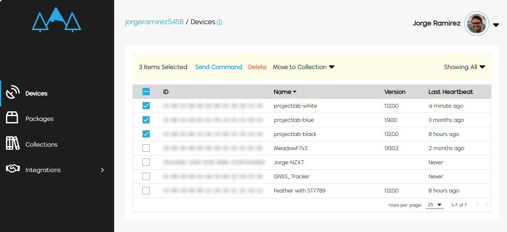
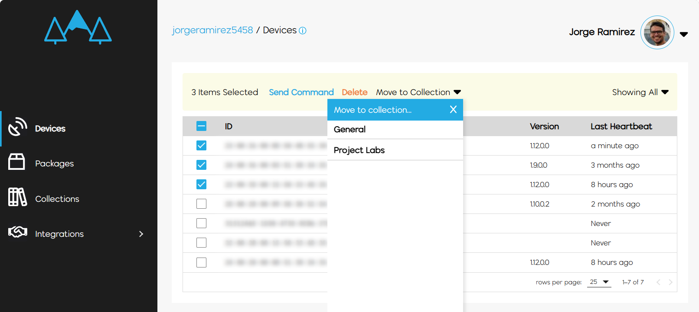
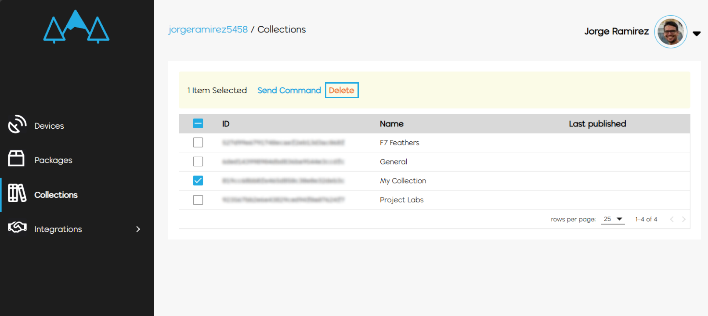

Meadow.Cloud's method of orchestrating device management across different groups is called **Collections**. When you first create a **Wilderness Labs account**, a `General` Collection is created automatically, and any devices you provision are added to it by default.

## Why use Collections?

When you publish a package to send an Over-the-Air Update, you can specify which group of devices you intend to send the update to. If you have Feather boards, Core-Compute Modules, Project Labs, etc., all under the same Collection, sending an update will send the same package to all these different form factors. If your app is exclusively designed to run on a Project Lab, your Feather boards will try to run the app and throw a wrong hardware exception.

## Creating a Collection

Creating a new Collection is a straightforward process. Head over to the Collections section and click on the **+ New Collection** button, enter a name and your new Collection is added to the table along with a generated ID. You can use this ID to pass as parameter for the device provision command on the Meadow.CLI to add devices specifically to this Collection:

```console
meadow device provision --name "F7 Feather" --collectionId <COLLECTION_ID>
```

## Moving a provisioned device to another collection

If you want to move a device or devices to another collection, head over to your **Devices** section and make sure the Collection filter on the top right is selected to **Showing All**. Select which devices you'd like move to another collection and you'll see a contextual menu appear on the top of the table.



Click the **Move to Collection** drop down button that will list all your collections, and choose the collection you'd like to move the selected devices.



Now your devices have moved to another Collection and you can confirm when you change the filter or go to the **Collections** section and click on the **View Devices** button.

## Deleting a Collection

To delete a Collection, you first need to either delete or move those devices to another Collection. Once the Collection is empty, select it to show the contextual menu on top and Click the **Delete** button.



### Check out other Meadow.Cloud Features

Now that you've learned about Collections, check out the other Meadow.Cloud features.

* [Over-the-Air (OtA) Updates](../OtA_Updates/)
* [Health Monitoring](../Health_Monitoring/)
* [Logs + Events](../Logs_Events/)
* [Command + Control](../Command_Control/)
* [GitHub Actions Publisher](../CI_CD/)
* [Integrations](../Integrations/)