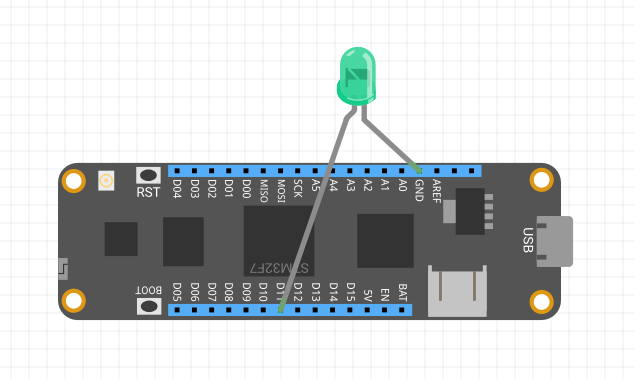

## Hello, World!

1. [Configure your Meadow development environment](/Meadow/Getting_Started/Setup).
1. Create a new .NET console application.
1. `Install-Package Meadow.Foundation` (Detailed NuGet instructions: [Mac](https://docs.microsoft.com/en-us/visualstudio/mac/nuget-walkthrough), [Windows](https://docs.microsoft.com/en-us/nuget/tools/package-manager-ui)).
1. Plug the longer leg (anode) of a blue LED into pin `13` and the other leg into `GND`:

1. Add the following code to the `program.cs` file in your application, then deploy and run:

```csharp
using System;
using System.Threading;
using Meadow;
using Meadow.Devices;
using Meadow.Foundation.Leds;

namespace HelloPulsy
{
    class Program
    {
        static IApp app;
        public static void Main(string[] args)
        {
            if (args.Length > 0 && args[0] == "--exitOnDebug") return;

            // instantiate and run new meadow app
            app = new MeadowApp();
        }
    }

    public class MeadowApp : App<F7Micro, MeadowApp>
    {
        public MeadowApp()
        {
            var pwmLed = new PwmLed(Device, Device.Pins.D13, TypicalForwardVoltage.Blue);

            // pulse the LED
            pwmLed.StartPulse();

            // keep the app running
            Thread.Sleep(Timeout.Infinite);
        }
    }
}
```

That's it, and you're up and running using Meadow.Foundation!


Next up, check out how to work with sensors; which comprise a huge portion of the Meadow.Foundation [peripheral library](/Meadow/Meadow.Foundation/Peripherals).

## [Next - Working with Sensors](/Meadow/Meadow.Foundation/Working_w_Sensors)
