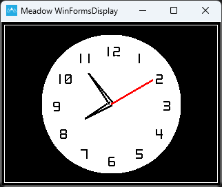

<!--
Doc Notes:
 * Need photos of the output of all the examples in here

-->

The Meadow.Foundation MicroGraphics library, formerly known as GraphicsLibrary, is an ultra-lightweight, 2D drawing framework that can draw to off screen (in-memory) display buffers and then present them on pixel display devices.

MicroGraphics includes the ability to draw many different primitives such as lines, shapes, text (using bitmap fonts), as well as bitmap images. Note - It can also be used to display JPEGs by using the open-source `SimpleJpegDecoder` nuget package.

Additionally, it implements `ITextDisplay`, so it enables any graphic display to be a canvas for use with the `TextDisplayMenu` library, easily enabling menus to be created and displayed on graphics displays.

To use the graphics display you:

 1. Initialize it with a display.
 2. Draw your graphics to the canvas (in-memory display buffer).
 3. Call `Show()` to copy the canvas content to the display.

# Initializing the MicroGraphics Library

In Meadow.Foundation, every graphics display driver manages its own buffer, since each display has different requirements in terms of display size, color depth and byte order.

For this reason, an initialized display driver must be passed to the MicroGraphics instance during construction. For example, the following code creates a graphics library canvas from the ST7789 display that can be found in the Hack Kit:

```csharp
St7789 st7789;
MicroGraphics canvas;

// this display needs mode3
var config = new SpiClockConfiguration(new Meadow.Units.Frequency(12000, Meadow.Units.Frequency.UnitType.Kilohertz), 
    SpiClockConfiguration.Mode.Mode3);

// new up the display on the SPI bus
display = new St7789
(
    device: MeadowApp.Device,
    spiBus: MeadowApp.Device.CreateSpiBus(MeadowApp.Device.Pins.SCK, MeadowApp.Device.Pins.MOSI, MeadowApp.Device.Pins.MISO, config),
    chipSelectPin: null,
    dcPin: MeadowApp.Device.Pins.D01,
    resetPin: MeadowApp.Device.Pins.D00,
    width: 240, height: 240, 
    displayColorMode: St7789.DisplayColorMode.Format16bppRgb565
);

// create our graphics canvas that we'll draw onto 
canvas = new MicroGraphics(display);

// finally, clear any artifacts from the screen from boot up
canvas.Clear(true);
```

## Setting Display Rotation

Note that you can also set the rotation of display, which allows you to match the physical orientation of the display in your project:

```csharp
canvas.Rotation = RotationType._270Degrees;
```

# Canvas and Painter's Model

The MicroGraphics Library utilizes the _painter’s model_. That means that as you draw onto the drawing surface, each subsequent drawing operation is applied on top of the previous. For this reason, it's useful to think of an instantiated MicroGraphics class as _canvas_ that you'll draw to.

Unlike layers in programs like Photoshop, once you have drawn something, you can’t undraw it, or remove layers. If you want to build an application like that, you either need to store a list of your draw operations and then re-draw each of the ones that you want to apply.

## Clearing the Canvas

Drawing happens in-memory on the graphics canvas and is then sent to the display. After initializing the display, it's a good idea to call `Clear()` on the canvas to make sure the screen doesn't have any leftover artifacts from initialization:

```csharp
canvas.Clear(updateDisplay: true);
```

Passing `true` for the `updateDisplay` parameter copies the cleared canvas to the display immediately. If you pass `false` (or don't pass anything at all), the canvas in memory will be cleared but the screen itself will not be cleared immediately until `Show()` is called.

## Copying the Canvas to the Display

And after you've finished the drawing operations on the canvas, it can be pushed to the display via the `Show()` method:

```csharp
canvas.Show();
```

## Coordinate System

MicroGraphics uses a standard X/Y cartesian coordinate system for drawing and placing elements, with the origin (`0`,`0`) in the top left of the canvas. Increasing the X and Y coordinate moves right and down, respectively.

<!-- TODO: need an illustration -->

Each integer point represents an actual pixel, there is no pixel density scaling.

## Drawing Primitives

There are a number of drawing methods available for drawing of various primitive including:

* Pixel
* Line
* Triangle
* Circle
* Rectangle
* RoundedRectangle
* Path

For example, the following code renders a clock face using a number of the primitives mentioned above:

```csharp
void DrawClock()
{
    graphics.Clear(true);

    hour = 8;
    minute = 54;
    DrawWatchFace();
    while (true)
    {
        tick++;
        Thread.Sleep(1000);
        UpdateClock(second: tick % 60);
    }
}
void DrawWatchFace()
{
    graphics.Clear();
    int hour = 12;
    int xCenter = displayWidth / 2;
    int yCenter = displayHeight / 2;
    int x, y;

    graphics.DrawRectangle(0, 0, displayWidth, displayHeight, Color.White);
    graphics.DrawRectangle(5, 5, displayWidth - 10, displayHeight - 10, Color.White);

    graphics.CurrentFont = new Font12x20();
    graphics.DrawCircle(xCenter, yCenter, 100, WatchBackgroundColor, true);
    for (int i = 0; i < 60; i++)
    {
        x = (int)(xCenter + 80 * Math.Sin(i * Math.PI / 30));
        y = (int)(yCenter - 80 * Math.Cos(i * Math.PI / 30));

        if (i % 5 == 0)
        {
            graphics.DrawText(hour > 9? x-10 : x-5, y-5, hour.ToString(), Color.Black);
            if (hour == 12) { hour = 1; } else { hour++; }
        }
    }

    graphics.Show();
}
void UpdateClock(int second = 0)
{
    int xCenter = displayWidth / 2;
    int yCenter = displayHeight / 2;
    int x, y, xT, yT;

    if (second == 0)
    {
        minute++;
        if (minute == 60)
        {
            minute = 0;
            hour++;
            if (hour == 12)
            {
                hour = 0;
            }
        }
    }

    graphics.Stroke = 3;

    //remove previous hour
    int previousHour = (hour - 1) < -1 ? 11 : (hour - 1);
    x = (int)(xCenter + 43 * Math.Sin(previousHour * Math.PI / 6));
    y = (int)(yCenter - 43 * Math.Cos(previousHour * Math.PI / 6));
    xT = (int)(xCenter + 3 * Math.Sin((previousHour - 3) * Math.PI / 6));
    yT = (int)(yCenter - 3 * Math.Cos((previousHour - 3) * Math.PI / 6));
    graphics.DrawLine(xT, yT, x, y, WatchBackgroundColor);
    xT = (int)(xCenter + 3 * Math.Sin((previousHour + 3) * Math.PI / 6));
    yT = (int)(yCenter - 3 * Math.Cos((previousHour + 3) * Math.PI / 6));
    graphics.DrawLine(xT, yT, x, y, WatchBackgroundColor);
    //current hour
    x = (int)(xCenter + 43 * Math.Sin(hour * Math.PI / 6));
    y = (int)(yCenter - 43 * Math.Cos(hour * Math.PI / 6));
    xT = (int)(xCenter + 3 * Math.Sin((hour - 3) * Math.PI / 6));
    yT = (int)(yCenter - 3 * Math.Cos((hour - 3) * Math.PI / 6));
    graphics.DrawLine(xT, yT, x, y, Color.Black);
    xT = (int)(xCenter + 3 * Math.Sin((hour + 3) * Math.PI / 6));
    yT = (int)(yCenter - 3 * Math.Cos((hour + 3) * Math.PI / 6));
    graphics.DrawLine(xT, yT, x, y, Color.Black);
    //remove previous minute
    int previousMinute = minute - 1 < -1 ? 59 : (minute - 1);
    x = (int)(xCenter + 55 * Math.Sin(previousMinute * Math.PI / 30));
    y = (int)(yCenter - 55 * Math.Cos(previousMinute * Math.PI / 30));
    xT = (int)(xCenter + 3 * Math.Sin((previousMinute - 15) * Math.PI / 6));
    yT = (int)(yCenter - 3 * Math.Cos((previousMinute - 15) * Math.PI / 6));
    graphics.DrawLine(xT, yT, x, y, WatchBackgroundColor);
    xT = (int)(xCenter + 3 * Math.Sin((previousMinute + 15) * Math.PI / 6));
    yT = (int)(yCenter - 3 * Math.Cos((previousMinute + 15) * Math.PI / 6));
    graphics.DrawLine(xT, yT, x, y, WatchBackgroundColor);
    //current minute
    x = (int)(xCenter + 55 * Math.Sin(minute * Math.PI / 30));
    y = (int)(yCenter - 55 * Math.Cos(minute * Math.PI / 30));
    xT = (int)(xCenter + 3 * Math.Sin((minute - 15) * Math.PI / 6));
    yT = (int)(yCenter - 3 * Math.Cos((minute - 15) * Math.PI / 6));
    graphics.DrawLine(xT, yT, x, y, Color.Black);
    xT = (int)(xCenter + 3 * Math.Sin((minute + 15) * Math.PI / 6));
    yT = (int)(yCenter - 3 * Math.Cos((minute + 15) * Math.PI / 6));
    graphics.DrawLine(xT, yT, x, y, Color.Black);
    //remove previous second
    int previousSecond = second - 1 < -1 ? 59 : (second - 1);
    x = (int)(xCenter + 70 * Math.Sin(previousSecond * Math.PI / 30));
    y = (int)(yCenter - 70 * Math.Cos(previousSecond * Math.PI / 30));
    graphics.DrawLine(xCenter, yCenter, x, y, WatchBackgroundColor);
    //current second
    x = (int)(xCenter + 70 * Math.Sin(second * Math.PI / 30));
    y = (int)(yCenter - 70 * Math.Cos(second * Math.PI / 30));
    graphics.DrawLine(xCenter, yCenter, x, y, Color.Red);
    graphics.Show();
}
```

Executing this code would result in something similar to the following:



## Drawing Images

MicroGraphics includes the ability to draw bitmap images via the `DrawBitmap()` method.

<!-- need sample -->

### Make Images Available to Code

In order to use images with MicroGraphics, you need to make them available to your app. The common way to do this is to embed image assets as resources in your .NET project.

1. Add the image to your project structure. For Visual Studio 2022, you can also right-click a solution folder and select **Add** > **Existing Item...** and find your image file to copy it into the project.
1. Make the image an embedded resource copied to output directory.
    * In Visual Studio 2022...
        1. Select the image in Solution Explorer.
        1. Within the **Properties** panel, change the **Build Action** to **Embedded resource**.
        1. Also within the **Properties** panel, change the **Copy to Output Directory** setting to **Copy if newer**.
    * In Visual Studio Code...
        1. Open the parent .csproj file.
        1. Find or add an `<ItemGroup>` where you will organize your embedded resources.
        1. Add an `<EmbeddedResource ...>` element to the item group, setting the appropriate `Include` attribute and add a containing `<CopyToOutputDirectory ...>` element.

            ```csharp
            <EmbeddedResource Include="images\logo.bmp">
              <CopyToOutputDirectory>PreserveNewest</CopyToOutputDirectory>
            </EmbeddedResource>
            ```

### JPEG Decoding

We recommend using the [`SimpleJpegDecoder` library](https://github.com/adrianstevens/SimpleJpegDecoder) to convert JPEG images into bitmaps for use with the MicroGraphics Library. For example, the following code illustrates how to load a JPEG image from a resource, store it in a `BufferRgb888` object, and display it on screen:

```csharp
var jpgData = LoadResource("meadow.jpg");
var decoder = new JpegDecoder();
var jpg = decoder.DecodeJpeg(jpgData);

var jpgImage = new BufferRgb888(decoder.Width, decoder.Height, jpg);

...

display.DrawBuffer(x, y, jpgImage);

display.Show();
```

## Drawing Text

For performance and typical IoT display size reasons, MicroGraphics supports drawing text using bitmap fonts which define glyphs by their pixels, rather than their curves (as is done in fonts such as TrueType or OpenType). Meadow.Foundation includes a number of bitmap fonts.

```csharp
graphics.CurrentFont = new Font12x20();
graphics.DrawText(x: 5, y: 5, "hello, Meadow!", Color.Black);
```

### Text alignment

By default, text is left aligned with the x, y coordinates specifying the top left location of the rendered text. The vertical alignment of the text can be set at draw-time by setting the `alignment` parameter of `DrawText`. Horizontal Alignment can be set to `Left`, `Center`, or `Right`.

* `Left` will render text with x, y coordinates specifying the top-left location of the rendered text
* `Center` will render text with x, y coordinates specifying the top-middle location of the rendered text
* `Right` will render text with x, y coordinates specifying the top-right location of the rendered text

```csharp
graphics.DrawText(x: 120, y: 0, $"Hello Meadow", alignment: TextAlignment.Center);
```

### Scale Factor

To increase the size of a bitmap font, a 'ScaleFactor` can be optionally passed:

```csharp
graphics.DrawText(
    x: 10, y: 10, text: text, color: Color.Black, 
    scaleFactor: ScaleFactor.X2);
```

### Paths

MicroGraphics has added basic path support modelled after SkiaSharp. A path is created by instantiating a `GraphicsPath` object and drawn using the `DrawPath` method.

`GraphicsPath` uses the concepts of **verbs** to control the path. It currently supports:

* `Move` which sets the current position
* `Line` which draws a line from the current position to a new position
* `Close` which closes the current path by adding a line from the last position to the first position

```csharp
var pathSin = new GraphicsPath();

for (int i = 0; i < 48; i++)
{
    if(i == 0)
    {
        pathSin.MoveTo(0, 120 + (int)(Math.Sin(i * 10 * Math.PI / 180) * 100));
        continue;
    }

    pathSin.LineTo(i * 5, 120 + (int)(Math.Sin(i * 10 * Math.PI / 180) * 100));
}

graphics.Clear();

graphics.DrawPath(pathSin, Color.LawnGreen);

graphics.Show();
```

### Implementing a Render Lock

When drawing to the canvas within a loop, it's a good practice to implement a render lock so that if a draw operation is already in progress, a render request isn't called in parallel to prevent the operations stacking up:

```csharp
public class DisplayController
{
    // rendering state and lock
    protected bool isRendering = false;
    protected object renderLock = new object();

    ...
    
protected void Render()
{
    lock (renderLock) {   // if we're already rendering, bail out.
        if (isRendering) 
        {
            Console.WriteLine("Already in a rendering loop, bailing out.");
            return;
        }
        isRendering = true;
    }

    graphics.Clear(true);

    // drawing code goes here
    ...
    
    graphics.Show();
    isRendering = false;
}
```

## Sample Applications

You can check these MicroGraphics Samples on Hackster that you can try out yourself.

<table>
  <tbody>
    <tr>
      <td style={{ width: "50%" }}>
        
      </td>
      <td style={{ width: "50%", fontSize: 20 }}>
        <p style={{ fontSize: 22 }}>
          <a
            style={{ fontSize: 25 }}
            href="https://www.hackster.io/wilderness-labs/working-with-graphics-on-a-st7789-display-using-meadow-e2295a"
          >
            Working with Graphics on a ST7789 Display Using Meadow
          </a>
          <br />
          Learn how to connect an SPI LCD display to your Meadow board to draw
          shapes, text and images with the Meadow.Foundation Graphics Library.
        </p>
      </td>
    </tr>
    <tr>
      <td style={{ width: "50%" }}>
        
      </td>
      <td style={{ width: "50%" }}>
        <p style={{ fontSize: 22 }}>
          <a
            style={{ fontSize: 25 }}
            href="https://www.hackster.io/wilderness-labs/make-your-own-tetris-game-with-meadow-bc5643"
          >
            Make Your Own Tetris Game with Meadow
          </a>
          <br />
          Learn how easy is to make a Tetris game with a joystick and an LED
          matrix.
        </p>
      </td>
    </tr>
    <tr>
      <td style={{ width: "50%" }}>
        
      </td>
      <td style={{ width: "50%" }}>
        <p style={{ fontSize: 22 }}>
          <a
            style={{ fontSize: 25 }}
            href="https://www.hackster.io/wilderness-labs/train-your-morse-code-spelling-skills-with-meadow-3f2d9e"
          >
            Train your Morse Code spelling skills with Meadow
          </a>
          <br />
          Learn how to spell the random alphabet letters and numbers in morse
          code with a push button using Meadow.
        </p>
      </td>
    </tr>
  </tbody>
</table>
