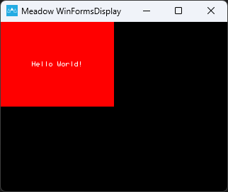
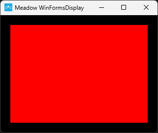
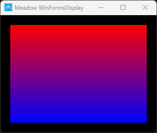
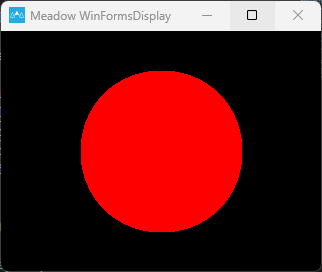
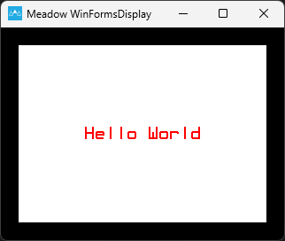
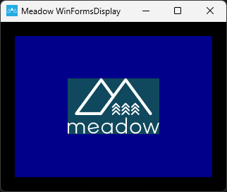
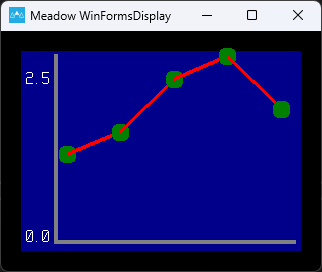
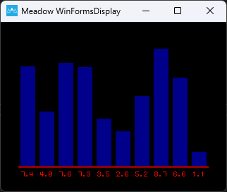
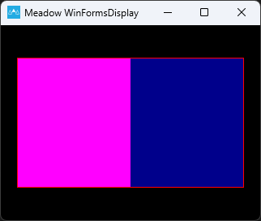
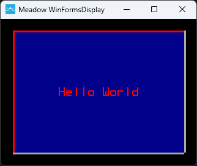

If you're working on an IoT project with a display, then you're almost certainly wanting to show information to a user. Drawing that information using drawing primitives can be both cumbersome and non-portable. We at Wilderness Labs have released our MicroLayout library to help .NET developers easily create lightweight HMIs for their projects.

MicroLayout uses a "screen with controls" paradigm for layout out your user interface. A `DisplayScreen` encapsulates and abstracts the physical display using MicroGraphics. To that `DisplayScreen`, you can add any number of Controls to the `DisplayScreen.Controls` collection. MicroLayout currently supports seven controls: `Box`, `Circle`, `Label`, `Picture`, `LineChart`, `ProgressBar` and `Button` which you can then use to design your user interface using pixel-based coordinates and sizes.

For example, if you want to create a box with a label on it, you simply Create a `Box` and a `Label` control and then add them to the `DisplayScreen` in back-to-front order.

```csharp
displayScreen = new DisplayScreen(display)
{
    BackgroundColor = backgroundColor
};

displayScreen.Controls.Add(
    new Box(0, 0, displayScreen.Width / 2, displayScreen.Height / 2)
    {
        ForeColor = Color.Red
    },
    new Label(0, 0, displayScreen.Width / 2, displayScreen.Height / 2)
    {
        Text = "Hello World!",
        TextColor = Color.White,
        VerticalAlignment = VerticalAlignment.Center,
        HorizontalAlignment = HorizontalAlignment.Center
    }
);
```
It should look like this on a 320x240 screen.



## Controls

### `Box`

Draws a colored rectangle:

```csharp
displayScreen.Controls.Add(new Box(
    left: 20, 
    top: 20, 
    width: displayScreen.Width - 40, 
    height: displayScreen.Height - 40)
{
    ForeColor = Color.Red
});
```

The code sample above draws a red rectangle:



### `GradientBox`

Draws a gradient colored rectangle:

```csharp
displayScreen.Controls.Add(new GradientBox(
    left: 20,
    top: 20,
    width: displayScreen.Width - 40,
    height: displayScreen.Height - 40)
{
    StartColor = Color.Red,
    EndColor = Color.Blue,
    IsHorizontal = true,
});
```

The code sample above draws a red-to-blue gradient rectangle:



### `Circle`

Draws a colored circle:

```csharp
displayScreen.Controls.Add(new Circle(
    centerX: displayScreen.Width / 2,
    centerY: displayScreen.Height / 2,
    radius: displayScreen.Height / 3)
{
    ForeColor = Color.Red,
    IsFilled = true
});
```

The code sample above draws a red circle:



### `Label`

Draws a line of text.

```csharp
displayScreen.Controls.Add(new Label(
    left: 20,
    top: 20,
    width: displayScreen.Width - 40,
    height: displayScreen.Height - 40)
{
    Text = "Hello World",
    TextColor = Color.Red,
    BackColor = Color.White,
    Font = new Font12x20(),
    HorizontalAlignment = HorizontalAlignment.Center,
    VerticalAlignment = VerticalAlignment.Center,
});
```

The code sample draws a label in the center, red color text and white background:



### `Picture`

Draws bitmap images. Add .bmp files in your project and make sure you select `EmbeddedContent` in the `BuildAction` property.

```csharp
var image = Image.LoadFromResource("<PROJECT NAMESPACE>.<FILENAME>.bmp");

displayScreen.Controls.Add(new Picture(
    left: 20,
    top: 20,
    width: displayScreen.Width - 40,
    height: displayScreen.Height - 40,
    image: image)
{
    BackColor = Color.DarkBlue
});
```

The code sample draws a bitmap image in the center at its actual image dimensions and has a dark blue background for the entire `width` and `height` specified.



### `LineChart`

Draws a line chart based on a series of points. For every sequence of readings it needs its own `LineChartSeries` which are added to the `LineChart` collection `Series`.

```csharp
var data = new List<double>
{
    1.2,
    1.5,
    2.2,
    2.5,
    1.8
};

var series = new LineChartSeries()
{
    LineColor = Color.Red,
    PointColor = Color.Green,
    LineStroke = 4,
    PointSize = 6,
    ShowLines = true,
    ShowPoints = true,
};

for (int i = 0; i < data.Count; i++)
{
    series.Points.Add(i*2, data[i]);
}

var chart = new LineChart(
    left: 20,
    top: 20,
    width: displayScreen.Width - 40,
    height: displayScreen.Height - 40)
{
    BackgroundColor = Color.DarkBlue,
    ShowYAxisLabels = true
};
chart.Series.Add(series);

displayScreen.Controls.Add(chart);
```

The code sample above plots a line chart based on the list of double of 5 values. With `LineChartSeries` you can specify the style of the curve, and in `LineChart` you can specofy the style of the chart itself (axis colors, background, etc.).



### `VerticalBarChart`

Draws a vertical bar chart based on an array of float values.

```csharp
var random = new Random();
var series = new float[10];

for (var i = 0; i < series.Length; i++)
{
    series[i] = random.NextSingle() * 10;
}

var chart = new VerticalBarChart(
    20,
    20,
    displayScreen.Width - 40,
    displayScreen.Height - 40,
    series)
{
    AxisLabelColor = Color.Red,
    AxisColor = Color.DarkRed,
    AxisStroke = 3,
    BarSpacing = 3,
    SeriesColor = Color.DarkBlue,
    AxisFont = new Font6x8(),
};

displayScreen.Controls.Add(chart);
```

The code sample above plots ten vertical bar charts with random values from 0-10. You can specify the style of the chart itself for things like axis colors, stroke, axis font, etc.



### `ProgressBar`

Draws a colored progress bar. To fill the progress bar, you would set value from 0..100 to the `Value` property.

```csharp
var progressBar = new ProgressBar(
    left: 20,
    top: 40,
    width: displayScreen.Width - 40,
    height: displayScreen.Height - 80)
{
    BackColor = Color.DarkBlue,
    ValueColor = Color.Magenta,
    BorderColor = Color.Red,
};
displayScreen.Controls.Add(progressBar);

for (int i = 0; i < 10; i++)
{
    progressBar.Value = i * 10;
    await Task.Delay(1000);
}
```

The code sample above draws a magenta `ProgressBar` with a dark blue background and a red border:



### `Button`

Draws an onscreen button. This control would only work on touch screen capable displays.

```csharp
var button = new Button(
    left: 20,
    top: 20,
    width: displayScreen.Width - 40,
    height: displayScreen.Height - 40)
{
    Text = "Hello World",
    TextColor = Color.Red,
    ForeColor = Color.DarkBlue,
    ShadowColor = Color.DarkGray,
    HighlightColor = Color.Red,
    PressedColor = Color.Green,
    Font = new Font12x20()
};
displayScreen.Controls.Add(button);

button.Clicked += (s, e) =>
{
    Resolver.Log.Info("Clicked");
};
```

The sample code draws a dark blue box with red text:



## Interactive Menu Example

You can move, resize or recolor the controls at run time to easily create effects and animations. For example, I've created a very simple Menu sample for the [ProjectLab v3](https://store.wildernesslabs.co/collections/frontpage/products/project-lab-board) that uses `Label`s for the menu items and a `Box` that sits behind the labels as a "highlight".

```csharp
// we compose the screen from the back forward, so put the box on first
_highlightBox = new Box(0, -1, screen.Width, ItemHeight + 2)
{
    ForeColor = SelectionColor,
    Filled = true,
};
screen.Controls.Add(_highlightBox);

for (var i = 0; i < items.Length; i++)
{
    _labels[i] = new Label(
        left: x,
        top: i * height,
        width: screen.Width,
        height: height)
    {
        Text = items[i],
        Font = MenuFont,
        BackColor = Color.Transparent,
        VerticalAlignment = VerticalAlignment.Center,
    };

    screen.Controls.Add(_labels[i]);

    y += height;
}
```

Clicking on the up or down button moves the `DisplayBox` and changes the `TextColor` of selected menu item to provide contrast.

```csharp
public void Draw(int oldRow, int newRow)
{
    _labels[oldRow].TextColor = UnselectedTextColor;
    _labels[newRow].TextColor = SelectedTextColor;

    _highlightBox.Top = _labels[newRow].Top - 1;
}
```

The project running should look like this:


The full source for the Menu sample is available in the [Project Lab Samples](https://github.com/WildernessLabs/Meadow.ProjectLab.Samples) repository.

If you would like to try out MicroLayout or would like to contribute, the full source code is available in the [Meadow.Foundation](https://github.com/WildernessLabs/Meadow.Foundation) repository. If you have any questions or feature requests, reach out to us on our [public Slack](http://slackinvite.wildernesslabs.co/) channel.