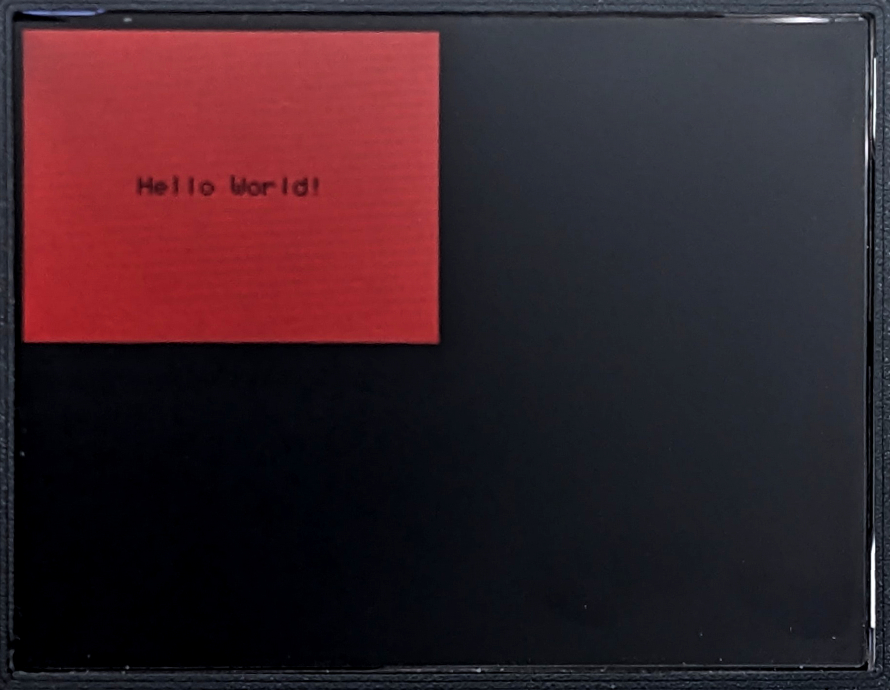

If you're working on an IoT project with a display, then you're almost certainly wanting to show information to a user. Drawing that information using drawing primitives can be both cumbersome and non-portable. We at Wilderness Labs have released our MicroLayout library to help .NET developers easily create lightweight HMIs for their projects.

MicroLayout uses a "screen with controls" paradigm for layout out your user interface. A DisplayScreen encapsulates and abstracts the physical display using MicroGraphics. To that DisplayScreen, you can add any number of Controls to the DisplayScreen.Controls collection. MicroLayout currently supports four controls: DisplayLabel, DisplayButton, DisplayImage and DisplayBox which you can then use to design your user interface using pixel-based coordinates and sizes.

For example, if you want to create a Box with a Label on it, you simply Create a DisplayBox and a DisplayLabel and then add them to the DisplayScreen in back-to-front order.

```csharp
_screen = new DisplayScreen(projLab.Display, Meadow.Foundation.Graphics.RotationType._270Degrees);

_screen.Controls.Add(
    new DisplayBox(0, 0, _screen.Width / 2, _screen.Height / 2)
    {
        ForeColor = Color.Red
    },
    new DisplayLabel(0, 0, _screen.Width / 2, _screen.Height / 2)
    {
        Text = "Hello World!",
        TextColor = Color.Black,
        BackColor = Color.Transparent,
        VerticalAlignment = VerticalAlignment.Center,
        HorizontalAlignment = HorizontalAlignment.Center
    });
```
It should look like this on a ILI4498 320x240 screen.



You can move, resize or recolor the controls at run time to easily create effects and animations. For example, I've created a very simple Menu sample for the [ProjectLab v3](https://store.wildernesslabs.co/collections/frontpage/products/project-lab-board) that uses DisplayLabels for the menu items and a DisplayBox that sits behind the DisplayLabels as a "highlight."

```csharp
// we compose the screen from the back forward, so put the box on first
_highlightBox = new DisplayBox(0, -1, screen.Width, ItemHeight + 2)
{
    ForeColor = SelectionColor,
    Filled = true,
};

screen.Controls.Add(_highlightBox);

for (var i = 0; i < items.Length; i++)
{
    _labels[i] = new DisplayLabel(
        left: x,
        top: i * height,
        width: screen.Width,
        height: height)
    {
        Text = items[i],
        Font = MenuFont,
        BackColor = Color.Transparent,
        VerticalAlignment = VerticalAlignment.Center,
    };

    screen.Controls.Add(_labels[i]);

    y += height;
}
```

Clicking on the up or down button moves the `DisplayBox` and changes the `TextColor` of selected menu item to provide contrast.

```csharp
public void Draw(int oldRow, int newRow)
{
    _labels[oldRow].TextColor = UnselectedTextColor;
    _labels[newRow].TextColor = SelectedTextColor;

    _highlightBox.Top = _labels[newRow].Top - 1;
}
```

The project running should look like this:


The full source for the Menu sample is available in the [Project Lab Samples](https://github.com/WildernessLabs/Meadow.ProjectLab.Samples) repository.

If you would like to try out MicroLayout or would like to contribute, the full source code is available in the [Meadow.Foundation](https://github.com/WildernessLabs/Meadow.Foundation) repository. If you have any questions or feature requests, reach out to us on our [public Slack](http://slackinvite.wildernesslabs.co/) channel.