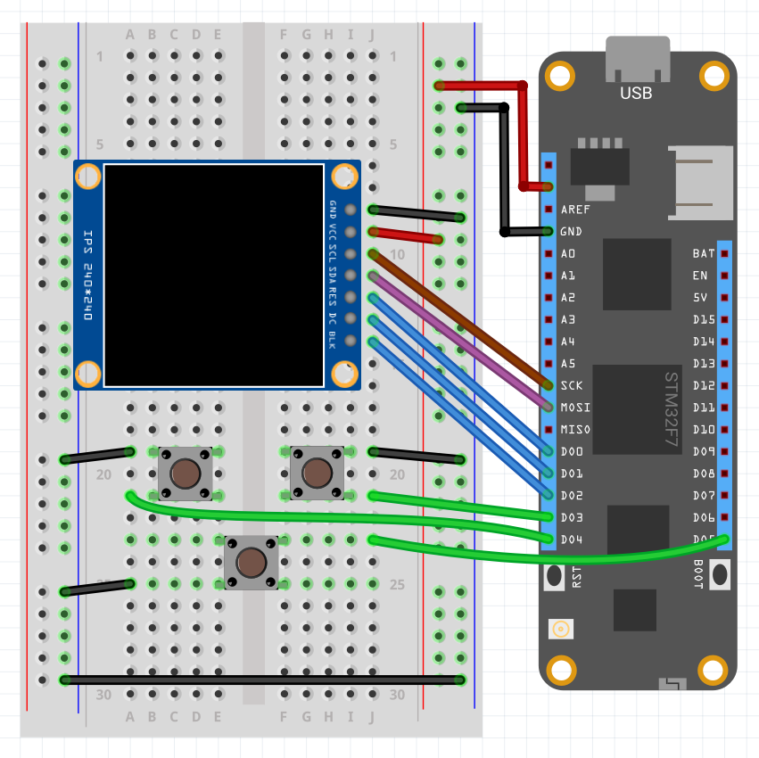

# Intro

The `TextDisplayMenu` library is an extensible framework for quickly creating hierarchical, editable menus that can display on a display that implements `ITextDisplay` - any graphical display via the [µGraphics Library](/Meadow/Meadow.Foundation/Libraries_and_Frameworks/uGraphics/)) or supported character display and can be driven using input devices such as buttons or rotary encoders.


The menu can be created programmatically or loaded from JSON, and has a number of built-in menu item types for display and editing input including time, temperature, and others. Additionally, you can quickly create custom menu item types that allow users to edit their value via the inputs.

## Using

Generally, to use `TextDisplayMenu` you need to:

 * Configure an `ITextDisplay` or `µGraphicsLibray` to display the menu.
 * Define the menu items in JSON or programmatically using the `MenuItem`, `MenuPage`, etc. classes.
 * Instantiate a new `Menu` class, passing the display object, and  either the JSON or menu classes.
 * Wire up user inputs (such as buttons or a rotary encoder) to call `Next()`, `Previous()` and `Select()` on the menu for navigation.
 * Render the menu by calling `Enable()`.

## Circuit

The following schematic illustrates a typical configuration for driving the menu and includes the ST7789 TFT LCD display found in the Hack Kit, as well as some simple push buttons:



## Configuring the Display

TextDisplayMenu requires an `ITextDisplay` to render on. You can either use any of the text [character displays](http://developer.wildernesslabs.co/docs/api/Meadow.Foundation/Meadow.Foundation.Displays.Lcd.CharacterDisplay.html) directly, such as the 4x20 LCD Character Display in the Hack Kit, or you can can use a graphics display in conjunction with the `µGraphics` library, which itself implements `ITextDisplay`.

## Defining the Menu

The menu data can be either be created programmatically in-memory or defined in JSON.

The menu items support the following properties:

| Object Property | JSON Property  | Usage    |
|-----------------|----------------|----------|
| `Text`     | `text`    | Display text to be rendered. Include {value} to display the current value of the type |
| `Command`  | `command` | Command name to distinguish menu selection events. If `command` is set, it takes precedence over editable menu item. |
| `ID`       | `id`      | Unique identifier for the type. Required for an editable menu item. |
| `Type`     | `type`    | Type of the input, ex: `Age`, `Time`. Required for an editable menu item. |
| `SubItems` | `sub`     | Array of child menu items for submenus. |


### Defining a Menu Programmatically

To create programmatically, create an array of `MenuItem` objects which represents a page of menu choices. Optionally, you can add sub-pages of items by adding them to the `SubItems` property.

The following code illustrates creating a simple one page menu:

```csharp
var menuItems = new MenuItem[]
{
    new MenuItem("FrogIt", command: "startFrogIt"),
    new MenuItem("Pong", command: "startPong"),
    new MenuItem("Span4", command: "startSpan4"),
    new MenuItem("Snake", command: "startSnake"),
    new MenuItem("Tetraminos", command: "startTetraminos"),
    new MenuItem("Tetraminos", command: "startTetraminos"),
    new MenuItem("Options", 
                subItems: new MenuItem[]{new MenuItem("Sound {value}", id: "sound", type: "OnOff", value: true),
                                         new MenuItem("Volume {value}", id: "volume", type: "Numerical", value: 5),
                                         new MenuItem("Clear scores", command: "clearScores"),
                                         new MenuItem($"Version {version}") }),
};
```

### Defining a Menu in JSON

To create a menu hierarchy from JSON, you'll need to define a root node that contains an array of menu items.  The following table enumerates the properties and associated usage:

For example, the following json code defines a hierarchical menu arranged in menu pages and items.

```json
[
  {
    "text": "My Temp: {value}",
    "id": "displayTemp",
    "value": 77
  },
  {
    "text": "My Age: {value}",
    "id": "displayAge",
    "value": 12
  },
  {
    "text": "My Time",
    "id": "time",
    "type": "TimeDetailed"
  },
  {
    "text": "Edit Temp",
    "id": "temp",
    "type": "Temperature",
    "value": 77
  },
  {
    "text": "Edit Age",
    "id": "age",
    "type": "Age",
    "value": 12
  },
  {
    "text": "Parent",
    "sub": [
      { "text": "Child 1" },
      { "text": "Child 2" },
      { "text": "Child 3" }
    ]
  },
  {
    "text": "My Command",
    "command": "DoSomething"
  },
  { "text": "Quit" },
  { "text": "Item 7" },
  {
    "text": "Item 8",
    "sub": [
      { "text": "Sub Item A" },
      { "text": "Sub Item B" },
      {
        "text": "Sub Item C",
        "sub": [
          { "text": "Sub Item D" },
          { "text": "Sub Item E" },
          { "text": "Sub Item F" }
        ]
      }
    ]
  },
  { "text": "Item 9" },
  { "text": "Item 10" },
  { "text": "Item 11" },
  {
    "text": "Item 12",
    "sub": [
      { "text": "Sub Item X" },
      { "text": "Sub Item Y" },
      { "text": "Sub Item Z" }
    ]
  }
]
```

### Adding the Menu JSON as a Resource 

To add the JSON file to the project as a resource:

1. Right-click the project and select Properties
2. Click `Resources` in the left pane
3. Click `Add Resource` and choose the appropriate file

## Instantiating the Menu

Once the menu hierarchy is created and the display is configured, the menu can be instantiated by passing the display and menu hierarchy:

```csharp
// loading from an in-memory object graph:
menu = new Menu(display, menuItems);

// loading from JSON
var menuData = LoadResource("menu.json");
menu = new Menu(display, menuData);
...

byte[] LoadResource(string filename)
{
    var assembly = Assembly.GetExecutingAssembly();
    var resourceName = $"Displays.TextDisplayMenu_Sample.{filename}";

    using (Stream stream = assembly.GetManifestResourceStream(resourceName))
    {
        using (var ms = new MemoryStream())
        {
            stream.CopyTo(ms);
            return ms.ToArray();
        }
    }
}
```

# Handling Events

The menu raises events when a command is select, menu item is edited, and the menu is exited.

## Selection Events

To get notified when a menu item with an assigned command is selected, assign a handler to the `Selected` event:

```csharp
menu.Selected += (s, e) =>
{
    Debug.Print("menu selected: " + e.Command);
};
```

## Exit Event

If the menu is not the desired application launch screen, then the menu can be programatically can be loaded or unloaded by using `Enable()` or `Disable()`, respectively.  Additionally, there is an optional parameter when instantiating a new Menu, `showBackOnRoot`, and when set to `true`, "< Back" displays as the first item on the root level and when selected, an `Exited` event will be raised.

To get notified when the menu is exited, assign a handler to the `Exited` event:

```csharp
menu.Exited += (s, e) =>
{
    Debug.Print("menu exited");
    menu.Disable();
};
```

## Edit Events

To get notified when a edit menu item value has changed, assign a handler to the `ValueChanged` event:

```csharp
menu.ValueChanged += (s, e) =>
{
    Debug.Print(e.ItemID + " changed with value: " + e.Value);
};
```

# Built in Types

The following table enumerates the built-in menu item types, and their associated usage and values:

| Type           | Description                                                |
|----------------|------------------------------------------------------------|
| `Age`          | An integer value between `0` and `200`                     |
| `Boolean`      | A list type including `True` and `False`                   |
| `Date`         | International date `YYYY:MM:DD`                            |
| `Numerical`    | An integer value between `0` and `10`                      |
| `OnOff`        | A list type including `On` and `Off`                       |
| `Temperature`  | A integer value between `-100` and `200`                   |
| `Time`         | 24 hour military time with `HH:MM`                         |
| `TimeDetailed` | 24 hour military time with `HH:MM:SS`                      |
| `TimeShort`    | 24 hour military time with `MM:SS`                         |

# Creating Custom Menu Item Types

There are two ways to create custom menu items. The easiest and most common is to inherit from, and modify, the built-in base types. However, you can also create completely custom menu item types.

## Customizing Built-In Base Types

`TextDisplayMenu` includes a number of built-in base types that handle common types and can be customized to suit:

| Base Type     | Description                                                   |
|---------------|---------------------------------------------------------------|
| `NumericBase` | Provides a generic numeric display and input. The min/max, and number of decimal places can be modified. |
| `TimeBase`    | Provides an input mask of `XX:XX:XX` or `XX:XX` depending on the mode. |
| `ListBase`    | Provides a selectable list of items. |

### Custom NumericBase Example

The following code is pulled from the `Age` menu type, and illustrates how to inherit from `NumericBase` and specify the floor, ceiling, and scale of the desired input.

```csharp
namespace Meadow.Foundation.Displays.TextDisplayMenu.InputTypes
{
    public class Age : NumericBase
    {
        public Age(): base(0, 100, 0) { }
    }
}
```

### Custom ListBase Example

The following code is pulled from the `Boolean` menu type, and illustrates how to inherit from `ListBase` and define the desired list values, in this case `true` and `false`.

```csharp
namespace Meadow.Foundation.Displays.TextDisplayMenu.InputTypes
{
    public class Boolean : ListBase
    {
        public Boolean()
        {
            choices = new string[2];
            choices[0] = "True";
            choices[1] = "False";
        }
    }
}
```

## Creating custom types

Creating a custom type is a bit more involved, but achievable. To start, inherit from `InputBase` and build out the implementation for the following methods:

```csharp
protected abstract bool Previous();
protected abstract bool Next();
protected abstract bool Select();
```

To see working examples, check out the implementations for [`NumericBase`](https://github.com/WildernessLabs/Meadow.Foundation/blob/main/Source/Meadow.Foundation.Libraries_and_Frameworks/Graphics/TextDisplayMenu/Driver/Graphics.TextDisplayMenu/BaseClasses/NumericBase.cs) and [`ListBase`](https://github.com/WildernessLabs/Meadow.Foundation/blob/main/Source/Meadow.Foundation.Libraries_and_Frameworks/Graphics/TextDisplayMenu/Driver/Graphics.TextDisplayMenu/BaseClasses/ListBase.cs)

# Troubleshooting

We experienced periodic problems with the display outputting nonsense data:


To resolve, check that are the connections are securely in place and/or use a different breadboard.

## Sample Apps

For complete sample code, check out the [Meadow.Foundation Libraries and Frameworks Samples](https://github.com/WildernessLabs/Meadow.Foundation/tree/main/Source/Meadow.Foundation.Libraries_and_Frameworks/Graphics/TextDisplayMenu/Samples)

<table>
    <tr>
        <td style="width:50%">
            
        </td>
        <td style="width:50%; font-size:20px;">
            <p style="font-size:22px;">
                <a style="font-size:25px;" href="https://www.hackster.io/wilderness-labs/build-an-interactive-menu-with-textdisplaymenu-using-meadow-218884">Build an Interactive Menu with TextDisplayMenu Using Meadow</a>
                <br/>
                Learn how easy is to create interactive menus with editable values and submenus using TextDisplayMenu with a ST7789 display and push buttons
            </p>
        </td>
    </tr>    
</table>