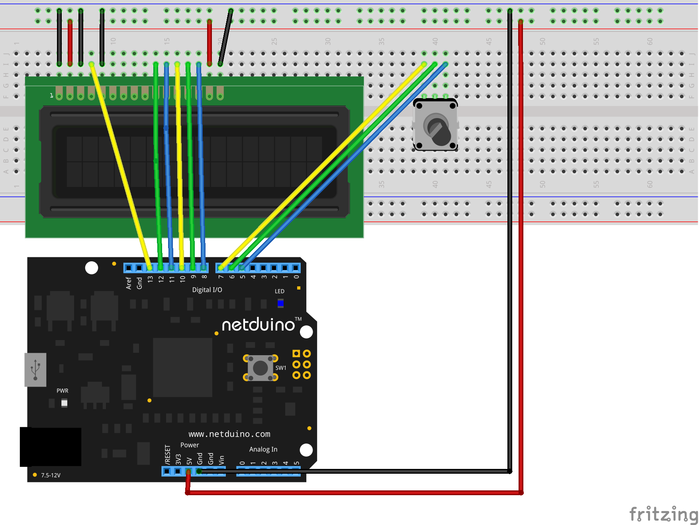
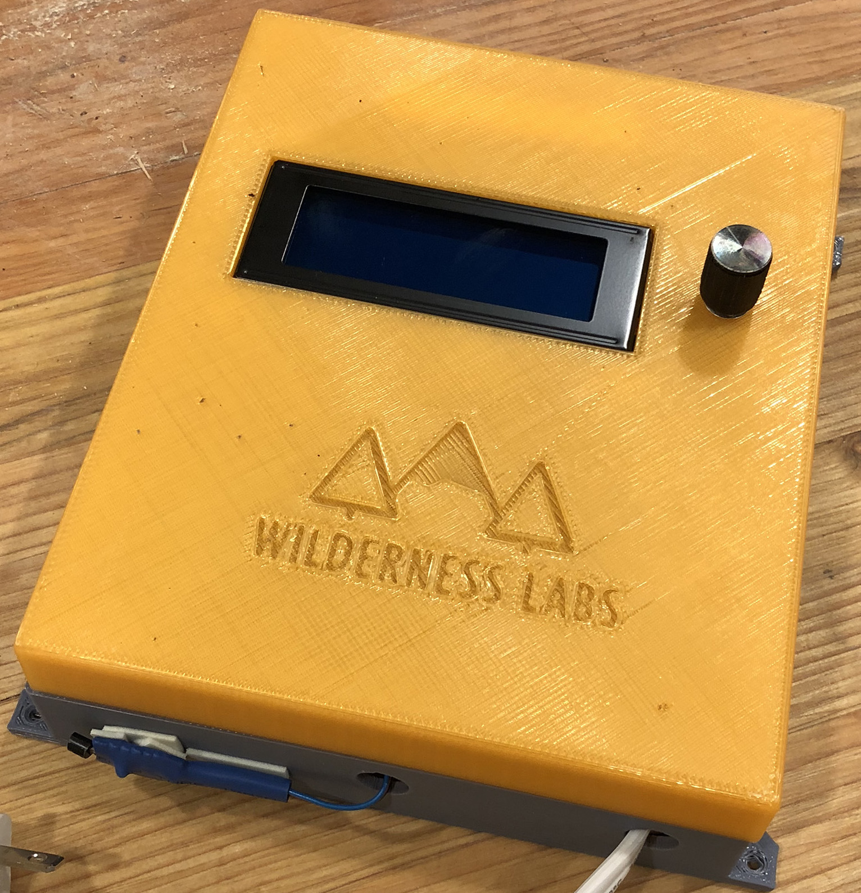
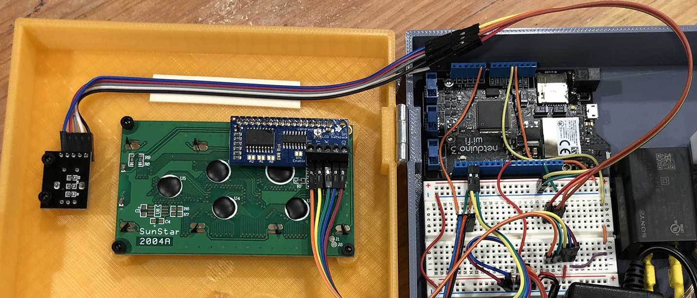

# Intro

The `TextDisplayMenu` library is an extensible framework for quickly creating hierarchical, editable menus that can display on an `ITextDisplay` and are driven using either an [`IRotaryEncoder`](/API/Sensors/Rotary/IRotaryEncoder) or [`IButton`](/API/Sensors/Buttons/IButton) interfaces. Drivers for displays, such as Serial LCD, share a common interface `ITextDisplay` that make it easy to plug in and integrate with the `TextDisplayMenu`.


The menu can be created programmatically or loaded from JSON, and has a number of built-in menu item types for display and editing input including time, temperature, and others. Additionally; you can easily create custom menu item types that allow users to edit their value via the inputs.

# Using

To use the menu, you'll need an [`ITextDisplay`](/API/Displays/ITextDisplay/) compatible LCD or other display, as well as some combination of buttons and rotary encoder that allows for **next**, **previous**, and **select** functionality. For instance, you can use; three discrete [`IButton`](/API/Sensors/Buttons/IButton/) inputs for next/previous/selection, a rotary encoder for next/previous and an `IButton` for selection, or a [`RotaryEncoderWithPushButton`](/API/Sensors/Rotary/RotaryEncoderWithButton/) to handle all three inputs.

Currently, display drivers are available for [Serial LCD](/Library/Displays/SerialLCD) and [SSD 1306](/Library/Displays/SSD1306) with more coming soon.

## Circuit

The following schematic illustrates a typical holistic configuration for driving the menu and includes a common four line LCD display that's driven directly from Netduino's digital GPIO pins, as well as a rotary encoder with push button:



The [Appliance Hacking Enclosure](https://github.com/WildernessLabs/3D_Print_Designs/tree/master/Enclosures/ApplianceControl) was specifically designed and 3D printed with the TextMenuDisplay in mind:





## Sample Code

The following code illustrates how to create a new `TextDisplayMenu`, driven by a `RotaryEncoderWithButton` that loads its contents from JSON:

```csharp
using System;
using System.Collections;
using System.Threading;
using Microsoft.SPOT;
using H = Microsoft.SPOT.Hardware;
using N = SecretLabs.NETMF.Hardware.Netduino;
using Netduino.Foundation.Sensors.Rotary;
using Netduino.Foundation.Displays;
using System.IO;
using TextDisplayMenu_Sample.Properties;
using Netduino.Foundation.Displays.TextDisplayMenu;

namespace TextDisplayMenu_Sample
{
    public class Program
    {
        public static void Main()
        {
            RotaryEncoderWithButton encoder = new RotaryEncoderWithButton(
                N.Pins.GPIO_PIN_D2, N.Pins.GPIO_PIN_D3, N.Pins.GPIO_PIN_D4,
                Netduino.Foundation.CircuitTerminationType.CommonGround);
                
            ITextDisplay display = new SerialLCD(new TextDisplayConfig() { 
                Height = 4, 
                Width = 20 }) as ITextDisplay;

            display.SetBrightness();

            Menu menu = new Menu(_display, _encoder, Resources.GetBytes(Resources.BinaryResources.menu), true);
            menu.Enable();

            Thread.Sleep(Timeout.Infinite);
        }
    }
}
```

The full sample can be found [here](https://github.com/WildernessLabs/Netduino.Foundation/tree/master/Source/Peripheral_Libs/Displays.TextDisplayMenu).

### Using Other Inputs

To create a menu with other inputs, such as buttons or an optional rotary encoder, you can use the other constructors:

```csharp
// Rotary encoder and select button
public Menu(ITextDisplay display, IRotaryEncoder encoder, IButton buttonSelect, byte[] menuResource, bool showBackOnRoot = false)

// Buttons for next, previous, and select
public Menu(ITextDisplay display, IButton buttonNext, IButton buttonPrevious, IButton buttonSelect, byte[] menuResource, bool showBackOnRoot = false)
```

# Loading a Menu From JSON

To create the menu from JSON, first define the menu contents in a JSON file, and then add it as a resource.

## Sample Definition

The root node must be a `menu` array of menu items.  The following table enumerates the properties and associated usage:

| Property  | Usage                                                                                  |
|-----------|--------------------------------------------------------------------------------------- |
| `text`    | Display text to the rendered. Include {value} to display the current value of the type |
| `command` | Command name to distinguish menu selection events. If command is set, it takes precedence over editable menu item. |
| `id`      | Unique identifier for the type.  Required for an editable menu item. |
| `type`    | Type of the input, ex: `Age`, `Time`. Required for an editable menu item. |
| `sub`     | Array of child menu items. |

For example, the following json code defines a hierarchical menu arranged in menu pages and items.

```json
{
  "menu": [
    {
      "text": "My Age: {value}",
      "id": "age",
      "type": "Age",
      "value": 12
    },
    {
      "text": "My Command",
      "command": "DoSomething"
    },
    {
      "text": "Parent",
      "sub": [
        {
          "text": "Sub Item A"
        },
        {
          "text": "Sub Item B"
        },
        {
          "text": "Sub Item C",
          "sub": [
            {
              "text": "Sub Item D"
            },
            {
              "text": "Sub Item E"
            },
            {
              "text": "Sub Item F"
            }
          ]
        }
      ]
    }
  ]
}
```

## Adding the Menu JSON as a Resource 

To add the JSON file to the project as a resource:

1. Right-click the project and select Properties
2. Click `Resources` in the left pane
3. Click `Add Resource` and choose the appropriate file.

Now, this resource can be accessed by `Resources.GetBytes(Resources.BinaryResources.[ResourceName])`.

# Handling Events

The menu raises events when a command is select, menu item is edited, and the menu is exited.

## Selection Events

To get notified when a menu item with an assigned command is selected, assign a handler to the `Selected` event:

```csharp
menu.Selected += (s, e) =>
{
    Debug.Print("menu selected: " + e.Command);
};
```

## Exit Event

If the menu is not the desired application launch screen, then the menu can be programatically can be loaded or unloaded by using `Enable()` or `Disable()`, respectively.  Additionally, there is an optional parameter when instantiating a new Menu, `showBackOnRoot`, and when set to `true`, "< Back" displays as the first item on the root level and when selected, an `Exited` event will be raised.

To get notified when the menu is exited, assign a handler to the `Exited` event:

```csharp
menu.Exited += (s, e) =>
{
    Debug.Print("menu exited");
    menu.Disable();
};
```

## Edit Events

To get notified when a edit menu item value has changed, assign a handler to the `ValueChanged` event:

```csharp
menu.ValueChanged += (s, e) =>
{
    Debug.Print(e.ItemID + " changed with value: " + e.Value);
};
```

# Built in Types

The following table enumerates the built-in menu item types, and their associated usage and values:

| Type           | Description                                                |
|----------------|------------------------------------------------------------|
| `Boolean`      | A list type including `true` and `false`.                  |
| `Age`          | An integer between `0` and `100`.                          |
| `Temperature`  | A decimal value between `-10` and `100` with a scale of 2. |
| `Time`         | 24 hour military time with `HH:MM`                         |
| `TimeDetailed` | 24 hour military time with `HH:MM:SS`                      |
| `TimeShort`    | 24 hour military time with `MM:SS`                         |

# Creating Custom Menu Item Types

There are two ways to create custom menu items. The easiest and most common is to inherit from, and modify, the built-in base types. However, you can also create completely custom menu item types.

## Customizing Built-In Base Types

`TextDisplayMenu` includes a number of built-in base types that handle common types and can be customized to suit:

| Base Type     | Description                                                   |
|---------------|---------------------------------------------------------------|
| `NumericBase` | Provides a generic numeric display and input. The min/max, and number of decimal places can be modified. |
| `TimeBase`    | Provides an input mask of `XX:XX:XX` or `XX:XX` depending on the mode. |
| `ListBase`    | Provides a selectable list of items. |

### Custom NumericBase Example

The following code is pulled from the `Age` menu type, and illustrates how to inherit from `NumericBase` and specify the floor, ceiling, and scale of the desired input.

```csharp
using System;
using Microsoft.SPOT;

namespace Netduino.Foundation.Displays.TextDisplayMenu.InputTypes
{
    public class Age : NumericBase
    {
        public Age(): base(0, 100, 0) { }
    }
}
```

### Custom ListBase Example

The following code is pulled from the `Boolean` menu type, and illustrates how to inherit from `ListBase` and define the desired list values, in this case `true` and `false`.

```csharp
using System;
using Microsoft.SPOT;

namespace Netduino.Foundation.Displays.TextDisplayMenu.InputTypes
{
    public class Boolean : ListBase
    {
        public Boolean()
        {
            this._choices = new string[2];
            _choices[0] = "True";
            _choices[1] = "False";
        }
    }
}
```

## Creating custom types

Creating a custom type is a bit more involved, but achievable.  To start, inherit from `InputBase` and build out the implementation for the following methods:

```csharp
protected abstract void HandlePrevious(object sender, EventArgs e);
protected abstract void HandleNext(object sender, EventArgs e);
protected abstract void HandleRotated(object sender, Sensors.Rotary.RotaryTurnedEventArgs e);
protected abstract void HandleClicked(object sender, EventArgs e);
```

To see working examples, check out the implementations for [`NumericBase`](https://github.com/WildernessLabs/Netduino.Foundation/blob/master/Source/Peripheral_Libs/Displays.TextDisplayMenu/Driver/InputTypes/NumericBase.cs) and [`ListBase`](https://github.com/WildernessLabs/Netduino.Foundation/blob/master/Source/Peripheral_Libs/Displays.TextDisplayMenu/Driver/InputTypes/ListBase.cs)

# Troubleshooting

We experienced periodic problems with the display outputting nonsense data:


To resolve, check that are the connections are securely in place and/or use a different breadboard.