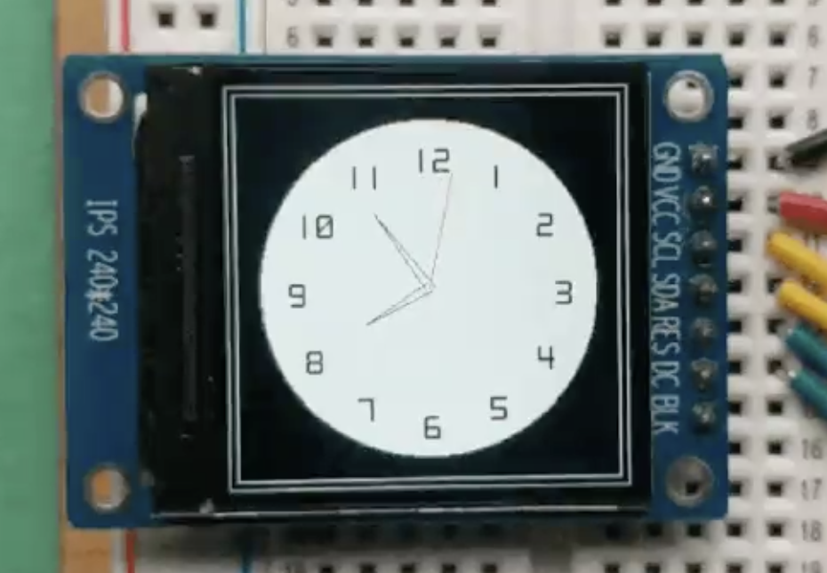

<!--
Doc Notes:
 * Need photos of the output of all the examples in here

-->

The Meadow.Foundation µGraphics library is an ultra-lightweight, 2D drawing framework that can draw to off screen (in-memory) display buffers and then present them on display devices. 

µGraphics includes the ability to draw many different primitives such as lines, shapes, text (using bitmap fonts), as well as bitmap images.

Additionally, it implements `ITextDisplay`, so it enables any graphic display to be a canvas for use with the `TextDisplayMenu` library, easily enabling menus to be created and displayed on graphics displays.

To use the graphics display you:
 1. Initialize it with a display.
 2. Draw your graphics to the canvas (in-memory display buffer).
 3. Call `Show()` to copy the canvas content to the display.

# Initializing the Graphics Library

In Meadow.Foundation, every display driver manages its own buffer, since each display has different requirements in terms of display size and color depth. 

For this reason, an initialized display driver must be passed to the µGraphics instance during construction. For example, the following code creates a graphics library canvas from the ST7789 display that can be found in the Hack Kit:

```csharp
St7789 st7789;
GraphicsLibrary canvas;

// our display needs mode3
var config = new SpiClockConfiguration(6000, SpiClockConfiguration.Mode.Mode3);

// new up the actual display on the SPI bus
display = new St7789
(
    device: MeadowApp.Device,
    spiBus: MeadowApp.Device.CreateSpiBus(MeadowApp.Device.Pins.SCK, MeadowApp.Device.Pins.MOSI, MeadowApp.Device.Pins.MISO, config),
    chipSelectPin: null,
    dcPin: MeadowApp.Device.Pins.D01,
    resetPin: MeadowApp.Device.Pins.D00,
    width: 240, height: 240, 
    displayColorMode: St7789.DisplayColorMode.Format16bppRgb565
);

// create our graphics canvas that we'll draw onto 
canvas = new GraphicsLibrary(display);

// finally, clear any artifacts from the screen from boot up
canvas.Clear(true);
```

## Setting Display Rotation

Note that you can also set the rotation of display, which allows you to match the physical orientation of the display in your project:

```csharp
canvas.Rotation = GraphicsLibrary.RotationType._270Degrees;
```

# Canvas and Painter's Model

The µGraphics Library utilizes the _painter’s model_. That means that as you draw onto the drawing surface, each subsequent drawing operation is applied on top of the previous. For this reason, it's useful to think of an instantiated µGraphics class as _canvas_ that you'll draw to.

Unlike layers in programs like photoshop, once you have drawn something, you can’t undraw it, or remove layers. If you want to build an application like that, you either need to store a list of your draw operations and then re-draw each of the ones that you want to apply.

## Clearing the Canvas

Drawing happens in-memory on the graphics canvas and is then sent to the display. After initializing the display, it's a good idea to call `Clear()` on the canvas to make sure the screen doesn't have any leftover artifacts from initialization:

```csharp
canvas.Clear(updateDisplay: true);
```

Passing `true` for the `updateDisplay` parameter copies the cleared canvas to the display immediately. If you pass `false` (or don't pass anything at all), the canvas in memory will be cleared but the screen itself will not be cleared immediately until `Show()` is called.

## Copying the Canvas to the Display

And after you've finished the drawing operations on the canvas, it can be pushed to the display via the `Show()` method:

```csharp
canvas.Show();
```

## Coordinate System

µGraphics uses a standard X/Y cartesian coordinate system for drawing and placing elements, with the origin (`0`,`0`) in the top left of the canvas. Increasing the X and Y coordinate moves right and down, respectively. 

<!-- TODO: need an illustration -->

Each integer point represents an actual pixel, there is no pixel density scaling.

## Drawing Primitives

There are a number of drawing methods available for drawing of various primitive including:
 * Pixel
 * Line
 * Triangle
 * Circle
 * Rectangle
 * RoundedRectangle

For example, the following code renders a clock face using a number of the primitives mentioned above:

```csharp
void DrawClock()
{
    graphics.Clear(true);

    hour = 8;
    minute = 54;
    DrawWatchFace();
    while (true)
    {
        tick++;
        Thread.Sleep(1000);
        UpdateClock(second: tick % 60);
    }
}
void DrawWatchFace()
{
    graphics.Clear();
    int hour = 12;
    int xCenter = displayWidth / 2;
    int yCenter = displayHeight / 2;
    int x, y;

    graphics.DrawRectangle(0, 0, displayWidth, displayHeight, Color.White);
    graphics.DrawRectangle(5, 5, displayWidth - 10, displayHeight - 10, Color.White);

    graphics.CurrentFont = new Font12x20();
    graphics.DrawCircle(xCenter, yCenter, 100, WatchBackgroundColor, true);
    for (int i = 0; i < 60; i++)
    {
        x = (int)(xCenter + 80 * Math.Sin(i * Math.PI / 30));
        y = (int)(yCenter - 80 * Math.Cos(i * Math.PI / 30));

        if (i % 5 == 0)
        {
            graphics.DrawText(hour > 9? x-10 : x-5, y-5, hour.ToString(), Color.Black);
            if (hour == 12) hour = 1; else hour++;
        }
    }

    graphics.Show();
}
void UpdateClock(int second = 0)
{
    int xCenter = displayWidth / 2;
    int yCenter = displayHeight / 2;
    int x, y, xT, yT;

    if (second == 0)
    {
        minute++;
        if (minute == 60)
        {
            minute = 0;
            hour++;
            if (hour == 12)
            {
                hour = 0;
            }
        }
    }

    graphics.Stroke = 3;

    //remove previous hour
    int previousHour = (hour - 1) < -1 ? 11 : (hour - 1);
    x = (int)(xCenter + 43 * Math.Sin(previousHour * Math.PI / 6));
    y = (int)(yCenter - 43 * Math.Cos(previousHour * Math.PI / 6));
    xT = (int)(xCenter + 3 * Math.Sin((previousHour - 3) * Math.PI / 6));
    yT = (int)(yCenter - 3 * Math.Cos((previousHour - 3) * Math.PI / 6));
    graphics.DrawLine(xT, yT, x, y, WatchBackgroundColor);
    xT = (int)(xCenter + 3 * Math.Sin((previousHour + 3) * Math.PI / 6));
    yT = (int)(yCenter - 3 * Math.Cos((previousHour + 3) * Math.PI / 6));
    graphics.DrawLine(xT, yT, x, y, WatchBackgroundColor);
    //current hour
    x = (int)(xCenter + 43 * Math.Sin(hour * Math.PI / 6));
    y = (int)(yCenter - 43 * Math.Cos(hour * Math.PI / 6));
    xT = (int)(xCenter + 3 * Math.Sin((hour - 3) * Math.PI / 6));
    yT = (int)(yCenter - 3 * Math.Cos((hour - 3) * Math.PI / 6));
    graphics.DrawLine(xT, yT, x, y, Color.Black);
    xT = (int)(xCenter + 3 * Math.Sin((hour + 3) * Math.PI / 6));
    yT = (int)(yCenter - 3 * Math.Cos((hour + 3) * Math.PI / 6));
    graphics.DrawLine(xT, yT, x, y, Color.Black);
    //remove previous minute
    int previousMinute = minute - 1 < -1 ? 59 : (minute - 1);
    x = (int)(xCenter + 55 * Math.Sin(previousMinute * Math.PI / 30));
    y = (int)(yCenter - 55 * Math.Cos(previousMinute * Math.PI / 30));
    xT = (int)(xCenter + 3 * Math.Sin((previousMinute - 15) * Math.PI / 6));
    yT = (int)(yCenter - 3 * Math.Cos((previousMinute - 15) * Math.PI / 6));
    graphics.DrawLine(xT, yT, x, y, WatchBackgroundColor);
    xT = (int)(xCenter + 3 * Math.Sin((previousMinute + 15) * Math.PI / 6));
    yT = (int)(yCenter - 3 * Math.Cos((previousMinute + 15) * Math.PI / 6));
    graphics.DrawLine(xT, yT, x, y, WatchBackgroundColor);
    //current minute
    x = (int)(xCenter + 55 * Math.Sin(minute * Math.PI / 30));
    y = (int)(yCenter - 55 * Math.Cos(minute * Math.PI / 30));
    xT = (int)(xCenter + 3 * Math.Sin((minute - 15) * Math.PI / 6));
    yT = (int)(yCenter - 3 * Math.Cos((minute - 15) * Math.PI / 6));
    graphics.DrawLine(xT, yT, x, y, Color.Black);
    xT = (int)(xCenter + 3 * Math.Sin((minute + 15) * Math.PI / 6));
    yT = (int)(yCenter - 3 * Math.Cos((minute + 15) * Math.PI / 6));
    graphics.DrawLine(xT, yT, x, y, Color.Black);
    //remove previous second
    int previousSecond = second - 1 < -1 ? 59 : (second - 1);
    x = (int)(xCenter + 70 * Math.Sin(previousSecond * Math.PI / 30));
    y = (int)(yCenter - 70 * Math.Cos(previousSecond * Math.PI / 30));
    graphics.DrawLine(xCenter, yCenter, x, y, WatchBackgroundColor);
    //current second
    x = (int)(xCenter + 70 * Math.Sin(second * Math.PI / 30));
    y = (int)(yCenter - 70 * Math.Cos(second * Math.PI / 30));
    graphics.DrawLine(xCenter, yCenter, x, y, Color.Red);
    graphics.Show();
}
```

Executing this code would result in something similar to the following:



## Drawing Images

µGraphics includes the ability to draw bitmap images via the `DrawBitmap()` method.

<!-- need sample -->

### JPEG Decoding

We recommend using the [`SimpleJpegDecoder` library](https://github.com/adrianstevens/SimpleJpegDecoder) to convert JPEG images into bitmaps for use with the µGraphics Library. For example, the following code illustrates how to load a JPEG image from a resource and display it on screen:

```csharp
var jpgData = LoadResource("meadow.jpg");
var decoder = new JpegDecoder();
var jpg = decoder.DecodeJpeg(jpgData);

int x = 0;
int y = 0;
byte r, g, b;

for (int i = 0; i < jpg.Length; i += 3) {
    r = jpg[i];
    g = jpg[i + 1];
    b = jpg[i + 2];

    graphics.DrawPixel(x + 55, y + 40, Color.FromRgb(r, g, b));

    x++;
    if (x % decoder.Width == 0) {
        y++;
        x = 0;
    }
}

display.Show();
```


## Drawing Text

For performance and typical IoT display size reasons, µGraphics supports drawing text using bitmap fonts which define glyphs by their pixels, rather than their curves (as is done in fonts such as TrueType or OpenType). Meadow.Foundation includes a number of bitmap fonts.

```csharp
graphics.CurrentFont = new Font12x20();
graphics.DrawText(x: 5, y: 5, "hello, Meadow!", Color.Black);
```

### Scale Factor

To increase the size of a bitmap font, a 'ScaleFactor` can be optionally passed:

```csharp
graphics.DrawText(
    x: 10, y: 10, text: text, color: Color.Black, 
    scaleFactor: GraphicsLibrary.ScaleFactor.X2);
```

### Implementing a Render Lock

When drawing to the canvas within a loop, it's a good practice to implement a render lock so that if a draw operation is already in progress, a render request isn't called in parallel to prevent the operations stacking up:

```csharp
public class DisplayController
{
    // rendering state and lock
    protected bool isRendering = false;
    protected object renderLock = new object();

    ...
    
protected void Render()
{
    lock (renderLock) {   // if we're already rendering, bail out.
        if (isRendering) {
            Console.WriteLine("Already in a rendering loop, bailing out.");
            return;
        }
        isRendering = true;
    }

    graphics.Clear(true);

    // drawing code goes here
    ...
    
    graphics.Show();
    isRendering = false;
}
```
