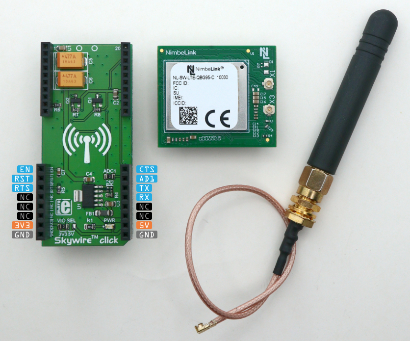
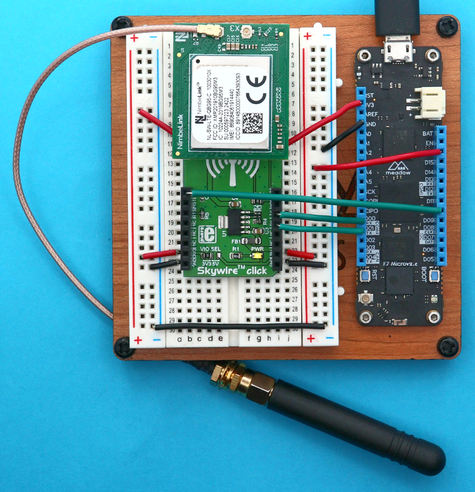
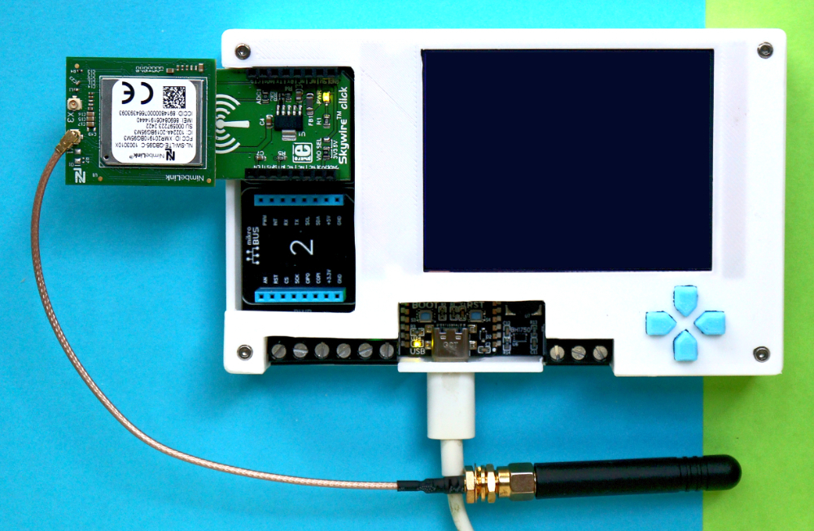
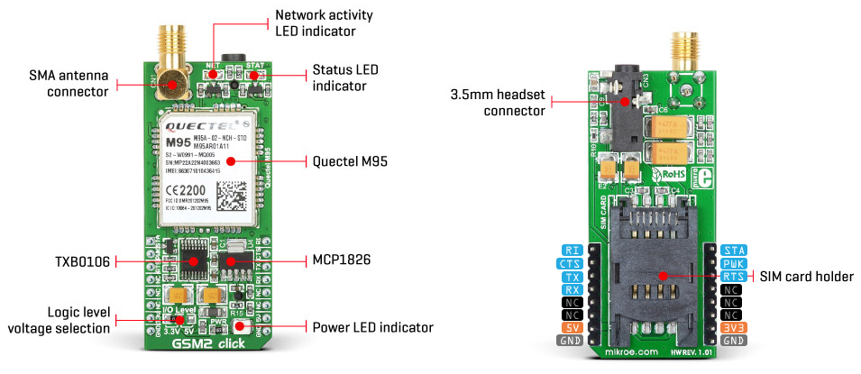
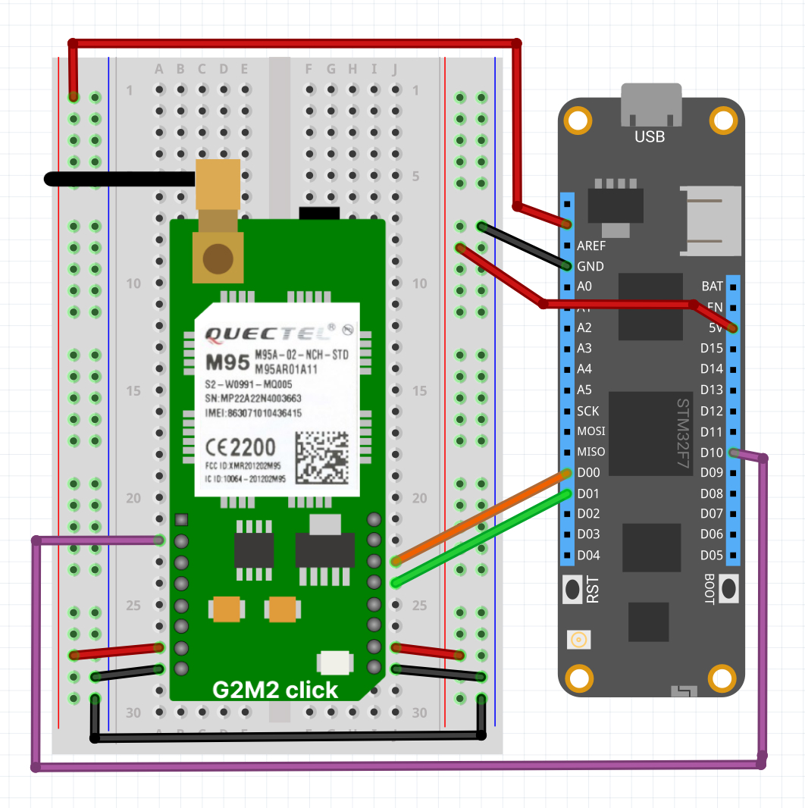
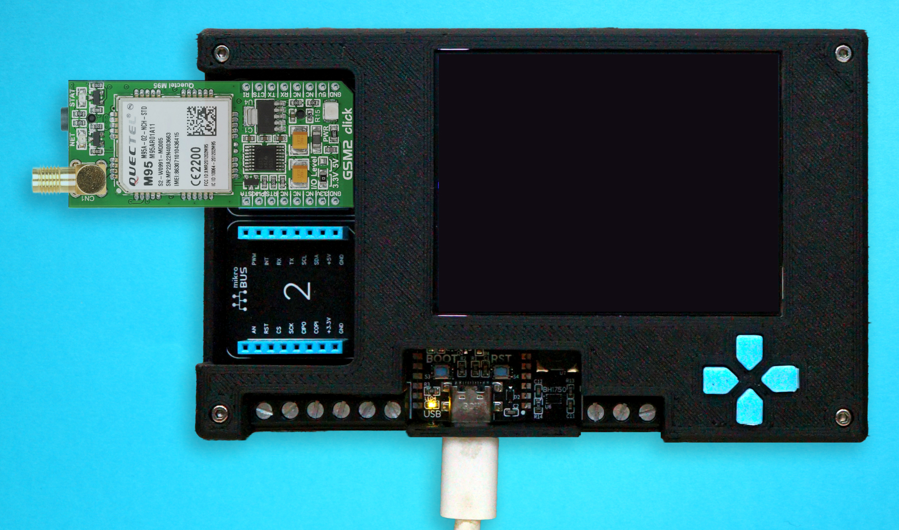

## Contents
* [Cellular Network Technologies](#cellular-network-technologies)
* [Supported Cellular Modules](#supported-cellular-modules)
* [Hardware configuration](#hardware-configuration)
    * [Quectel BG95M3 with NimbeLink Skywire click board](#quectel-bg95m3-with-nimbelink-skywire-click-board)
    * [Quectel M95 with GSM2 click board](#quectel-m95-with-gsm2-click-board)
    * [Choosing a SIM Card](#choosing-a-sim-card)
* [Enabling Cellular on your Meadow Application](#enabling-cellular-on-your-meadow-application)
    * [Adding a cell.config.yaml file](#adding-a-cellconfigyaml-file)
    * [Specify Network Interface and reserved pins](#specify-network-interface-and-reserved-pins)
    * [Handling Cell connection using a Meadow application](#handling-cell-connection-using-a-meadow-application)
        * [Getting module IMEI](#getting-module-imei)
        * [Fetching Cell Signal Quality](#fetching-cell-signal-quality)
* [Using GNSS with cellular modules](#using-gnss-with-cellular-modules)
    * [GNSS Hardware Setup](#gnss-hardware-setup)
* [Troubleshooting](#troubleshooting)
    * [Scanning Cell networks](#scanning-cell-networks)

# Cellular Network Technologies

**Cat-M1**, **NB-IoT**, and **GSM** (Global System for Mobile Communications) are all cellular network technologies with distinct characteristics. **GSM**, the most widely used cellular standard globally, provides higher data rates compared to **NB-IoT** and **Cat-M1** but has higher power consumption. In contrast, **Cat-M1** and **NB-IoT** are optimized for IoT applications. **Cat-M1** offers higher data rates and mobility, while **NB-IoT** provides ultra-low power consumption and extended coverage. The choice among **GSM**, **Cat-M1**, and **NB-IoT** depends on the specific requirements of the application, considering factors such as data rates, power consumption, and coverage area.

# Supported Cellular Modules

The cellular network for the Meadow platform is compatible with various modules, each supporting different network operation modes. The following table describes the network operation modes supported by each module:

| Modules / Network Modes   | Cat-M1 (LTE-M or eMTC) | NB-IoT | GSM/GRPS 2G | GNSS   |
|---------------------------|------------------------|--------|-------------|--------|
| Quectel BG95-M3           | ✔                     | ✔      | ✔           | ✔      |
| Quectel M95               | -                      | -      | ✔           | -      |

# Hardware configuration

## Quectel BG95M3 with NimbeLink Skywire click board

To setup the hardware, you could use a Skywire click adapter, which hosts NimbeLink/Skywire cellular modems (using stacking headers) to MikroElektronika development boards. 



To configure the hardware, start by connecting the necessary jumpers for communication between the Meadow device and the cell module. Then make the necessary connections to supply and turn on the cell module. Finally, connect an antenna to the click board.

### Using a Meadow F7v2 Feather



* **Connecting the serial pins (UART)**: If you're using a `Meadow F7v2 Feather` board, you will need to connect `D00` and `D01` pins to the `TX` and `RX` click board pins, respectively, to establish the data communication between them.
* **Power and supply pins**: Also, you need to connect the `D10` pin to the `EN` **NimbeLink Skywire click board** pin. Additionally, connect the `3.3V`, `5V`, and `GND` pins on both sides of the Skywire click board.  If you are using another click board for the **BG95-M3** module, you need to connect the `D10` pin to the equivalent power-up pin.
* **Attaching an antenna**: Finally, connect an LTE antenna (Rubber ducky or Dome) with the `X1` click board IPX connector, aiming for a preferred gain of 5 dBi (recommended) while ensuring a minimum gain of 2 dBi (required), and insert an **M2M** SIM card into the cell module.

### Using a Project Lab v3



* A [Project Lab](https://raw.githubusercontent.com/WildernessLabs/Meadow.ProjectLab/main/Design/projectlab-pinout-v3.jpg) has two mikroBUS connectors, so simply connect the Skywire click adapter on the mikroBUS connector 1 and you're all set! Whats left is to make a few adjustments to your Meadow application to use cellular.

## Quectel M95 with GSM2 click board



To configure the hardware, start by connecting the necessary jumpers for communication between the Meadow device and the cell module. Then make the necessary connections to supply and turn on the cell module. Finally, connect an antenna to the click board.

### Using a Meadow F7v2 Feather



* **Connecting serial pins (UART)**: To use this module you will need to connect the **Meadow F7v2 Feather** `D00` and `D01` pins to the `TX` and `RX` click board pins, respectively, to establish the data communication between them.
* **Power-up and supply pins**: Also, you need to connect the **Meadow F7v2 Feather** `D10` pin to the `PWK` **Quectel GSM2 click board** pin, to turn on the module. Additionally, connect the `3.3V` and `GND` pins from the **Meadow F7v2 Feather** to their corresponding pins on the click board. It's recommended to provide a 5V power supply to the click board `5V` and `GND` pins, since this module requires more energy than the LWPA modules (**BG95-M3** and **BG770A**). If you are using another click board for the **M95** module, you need to connect the `D10` pin to the equivalent power-up pin.
* **Attaching an antenna**: Finally, establish a connection by attaching a GSM antenna (Rubber ducky) with an SMA Plug connector, aiming for a preferred gain of 5 dBi (recommended) while ensuring a minimum gain of 2 dBi (required), and insert a SIM card into the cell module.

### Using a Project Lab v3



* A [Project Lab](https://raw.githubusercontent.com/WildernessLabs/Meadow.ProjectLab/main/Design/projectlab-pinout-v3.jpg) has two mikroBUS connectors, so simply connect the Skywire click adapter on the mikroBUS connector 1 and you're all set! Whats left is to make a few adjustments to your Meadow application to use cellular.

## Choosing a SIM Card

To enable **Cat-M1** (LTE-M or eMTC) or **NB-IoT** network modes, a specialized **M2M** (Machine-to-Machine) SIM card is required, distinct from the standard SIM cards used in cellphones. However, for **GSM/GPRS 2G** connections, a standard SIM card can generally be used.

# Enabling Cellular on your Meadow Application

Using Cellular on Meadow, you will need to do three things:

## Adding a cell.config.yaml file

Create a **cell.config.yaml** file, set the `Copy To Output` property to `Copy always` or `Copy if newer`, and fill out the values under the `Settings` section like APN, Module, and a additional optional pins to ensure a proper connection with your internet provider. Here's what a cell config file looks like with the required and optional fields:

```yaml
Settings:
    APN: YOUR-APN         # (required) Access Point Name
    Module: BG95M3        # (required) Module model (BG770A, BG95M3 or M95)
    User: USER            # (optional) APN user 
    Password: PASSWORD    # (optional) APN password
    Operator: 00000       # (optional) Carrier numeric operator code
    Mode: CATM1           # (optional) Network mode (CATM1, NBIOT or GSM)
    Interface: /dev/ttyS1 # (optional) Serial interface 
                          # UART1 (COM1) = /dev/ttyS0 
                          # UART4 (COM4) = /dev/ttyS1 (default), 
                          # UART6 = /dev/ttyS3) 
    TurnOnPin: D10        # (optional) Enable pin to turn the module on/off. 
                          # Default value is Meadow Pin name D10
```

A few things to consider:
 * If the carrier numeric operator code (**Operator**) or the network mode is not specified (**Mode**), the module will attempt to automatically determine the optimal network based on the M2M sim card inserted and your location. 
 * **However, if you encounter any connectivity issues, we recommend to set the operator code and operation mode to the `Operator` and `Mode` properties**. If you don't know this information, you can use the [**Cell Network Scanner**](https://github.com/WildernessLabs/Documentation/blob/cell-docs-updates/docs/Meadow/Meadow.OS/Cellular/index.md#scanning-cell-networks) method that will list nearby networks in the area.
 * `TurnOnPin` is a pin used to turn on the module.

## Specify Network Interface and reserved pins

In the `meadow.config.yaml` file, you need to specify `DefaultInterface` to `Cell` and specify the RX/TX serial pins and an additional pin to turn on or off Meadow the cellular module. **Important: The reserved pins must be specified by MCU Pin name, not by Meadow Pin name.**

* If you're using a [Meadow Feather V2](https://developer.wildernesslabs.co/Common_Files/Meadow_F7v2_Micro_Pinout.svg), you would connect the cellular module to `D00` and `D01`, which are the COM4 serial pins that, according to the [datasheet](https://developer.wildernesslabs.co/Meadow/Meadow_Basics/Hardware/Wilderness_Labs_Meadow_F7v2_Datasheet.pdf), the MCU Pin names are `PI9` and `PH13`, but in the config file we can ommit the `p` prefix. As for the enable pin, say if you connect it to the `D10` pin, the MCU pin name is `C7`. So the required values in the config file should look like this:

```yaml
# Device specific config
Device:
    # Name of the device
    Name: F7v2Feather

    # Corresponding MCU pin names for the reserved pins
    # (COMX_RX pin, COM_TX pin, ENABLE pin)
    ReservedPins: I9;H13;C7

# Network configuration
Network:
    #  Which interface should be used?
    DefaultInterface: Cell
```

* In the case that you're using a Project Lab v3, if you look at the [latest schematic](https://github.com/WildernessLabs/Meadow.ProjectLab/blob/main/Hardware/v3.e/Schematic.pdf) and trace what pins on the Meadow Core Compute Module are connected to the microBUS 1 connector, you'll find that are connected to pins `PB15`, `PB14` and `PA3` for the Serial RX/TX and Enable pins respectively:

```yaml
# Device specific config
Device:
    # Name of the device
    Name: ProjectLabV3

    # Corresponding MCU pin names for the reserved pins
    # (COMX_RX pin, COM_TX pin, ENABLE pin)
    ReservedPins: B15;B14;A3

# Network configuration
Network:
    #  Which interface should be used?
    DefaultInterface: Cell
```

## Handling Cell connection using a Meadow application

To check if you established a connection, you can use the `meadow listen` CLI command, which should return a message like this:
`Connection established successfully! IP address '100.69.106.222'.`

You can also check the Cell connection status by accessing the `IsConnected` property present in the `ICellNetworkAdapter`, as in the following example:

```csharp
var cell = Device.NetworkAdapters.Primary<ICellNetworkAdapter>();

if (cell.IsConnected)
{
    Console.WriteLine("Cell is connected!");
}
else
{
    Console.WriteLine("Cell isn't connected");
}
```

Therefore, you can use the `NetworkConnected` and `NetworkDisconnected` event handlers with Cell.

```csharp
var cell = Device.NetworkAdapters.Primary<ICellNetworkAdapter>();

cell.NetworkConnected += CellAdapter_NetworkConnected;
cell.NetworkDisconnected += CellAdapter_NetworkDisconnected;

void CellAdapter_NetworkConnected(INetworkAdapter networkAdapter, NetworkConnectionEventArgs e)
{
    Resolver.Log.Info("Cell network connected!");
}

void CellAdapter_NetworkDisconnected(INetworkAdapter networkAdapter)
{
    Resolver.Log.Info("Cell network disconnected!");
}
```

### Getting module IMEI

You can get some extra information about the connection and the module, such as the Cell Signal Quality (CSQ), and the International Mobile Equipment Identity (IMEI).

```csharp
var cell = Device.NetworkAdapters.Primary<ICellNetworkAdapter>();

cell.NetworkConnected += CellAdapter_NetworkConnected;

void CellAdapter_NetworkConnected(INetworkAdapter networkAdapter, INetworkAdapter networkAdapter)
{
    Resolver.Log.Info("Cell network connected!");

    ICellNetworkAdapter cellAdapter = networkAdapter as ICellNetworkAdapter;
    if (cellAdapter != null)
    {
        Console.WriteLine("Cell CSQ: " + cellAdapter.Csq);
        Console.WriteLine("Cell IMEI: " + cellAdapter.Imei);
    }
}
```

> **Notes**: Before using the mentioned properties, ensure a successful connection has been established. The `Csq` property returns a static value (0-31) representing the signal quality obtained on the connection.

### Fetching Cell Signal Quality

It's important to note that the `Csq` property returns a cached value obtained from the connection, then to retrieve the most up-to-date CSQ (Cellular Signal Quality), you should utilize the `GetSignalQuality` method, as illustrated in the following example:

```csharp
var cell = Device.NetworkAdapters.Primary<ICellNetworkAdapter>();

double csq  = cellAdapter.GetSignalQuality();
Console.WriteLine("Cell Signal Quality: " + csq);
```

> **Notes**: To convert the CSQ value to dBm, you need to use the formula: dBm = -113 + CSQ * 2 (where CSQ is the returned value). You may experience disconnection from the cellular network for a brief period while the module gets the signal quality, so we suggest to avoid calling this method frequently to ensure a seamless user experience.

# Using GNSS with cellular modules

Some cellular modules, such as the BG95-M3, offer support for GNSS functionalities. As illustrated in the following example, you can define an interval between the position fixes, as well as select which kind of NMEA sentence should be retrieved, by specifying it in an `IGnssResult` array:

```csharp
using Meadow.Foundation.Sensors.Location.Gnss;
using Meadow.Peripherals.Sensors.Location.Gnss;
using Meadow.Foundation.Sensors.Gnss;
...
    void ProcessGnssPosition(object sender, IGnssResult location)
    {
        Resolver.Log.Info("*********************************************");
        Resolver.Log.Info(location.ToString());
        Resolver.Log.Info("*********************************************");  
    }
...
    IGnssResult[] resultTypes = new IGnssResult[]
    {
        new GnssPositionInfo(),
        new ActiveSatellites(),
        new CourseOverGround(),
        new SatellitesInView(new Satellite[0])
    };

    ICellNetworkAdapter cell = networkAdapter as ICellNetworkAdapter;

    var bg95M3 = new Bg95M3(cellAdapter, TimeSpan.FromMinutes(30), resultTypes);

    bg95M3.GnssDataReceived += ProcessGnssPosition;

    bg95M3.StartUpdating();
```

For a more comprehensive example, you can refer to the [BG95-M3 GNSS sample](https://github.com/WildernessLabs/Meadow.Foundation/blob/develop/Source/Meadow.Foundation.Peripherals/Sensors.Gnss.Bg95M3/Samples/Bg95M3_Sample/MeadowApp.cs) available in the Meadow.Foundation repository.

## GNSS Hardware Setup

When utilizing a **Quectel BG95-M3 NimbeLink Skywire click board**, you can follow the same setup instructions as for the cellular connection. Additionally, ensure you attach a GPS antenna to the `X3` IPX connector to enable your cellular module to obtain position fixes.

> **Notes**: Due to a hardware limitation of this board, concurrent use of GNSS and Cellular functionality is not possible. Consequently, you may experience disconnection from the cellular network for a brief period while the module acquires a position fix. It is advisable to avoid using very short time intervals between obtaining position fixes for a seamless user experience.

# Troubleshooting

## Scanning Cell networks

To connect using Cell, you can omit the operator code in `cell.config.yaml` and then the module will try to find an operator automatically. However, if you know the carrier code, **you can ensure that you are connecting to the right network, connecting faster and more reliably**. To find out the carrier code, you can use the Cell network scanner as in the following example:

```csharp
using Meadow.Networking;
...

var cell = Device.NetworkAdapters.Primary<ICellNetworkAdapter>();

try
{
    CellNetwork[] availableNetworks = cell.ScanForAvailableNetworks();

    foreach (CellNetwork network in availableNetworks)
    {
        Console.WriteLine($"Network Status: {network.Status}, Operator Name: {network.Name}, Operator: {network.Operator}, Operator Code: {network.Code}, Mode: {network.Mode}");
    }
}
catch (Exception ex)
{
    Console.WriteLine("An error occurred: " + ex.Message);
}
```

> **Notes**: Some modules, such as the BG95-M3, memorize the last network mode used and consider it during scanning. For example, if you previously connected to an NB-IoT network, the scanner may return only the available NB-IoT networks. If you want to view available CAT-M1 networks, begin by connecting to this network initially, allowing the module to set CAT-M1 as network mode. Afterward, follow the steps mentioned above to initiate the scanner successfully.

## Getting Cellular network connection logs

The cellular network connection logs might be helpful for users' troubleshooting. This raw data often holds valuable clues to help pinpoint and fix errors or connectivity issues. The following example will show how to get the cellular module AT commands output:

```csharp
using Meadow.Networking;
...

var cell = Device.NetworkAdapters.Primary<ICellNetworkAdapter>();

while (!cell.IsConnected)
{
    await Task.Delay(10000);
    Console.WriteLine($"Cell AT commands output: {cell.AtCmdsOutput}");
}
```
