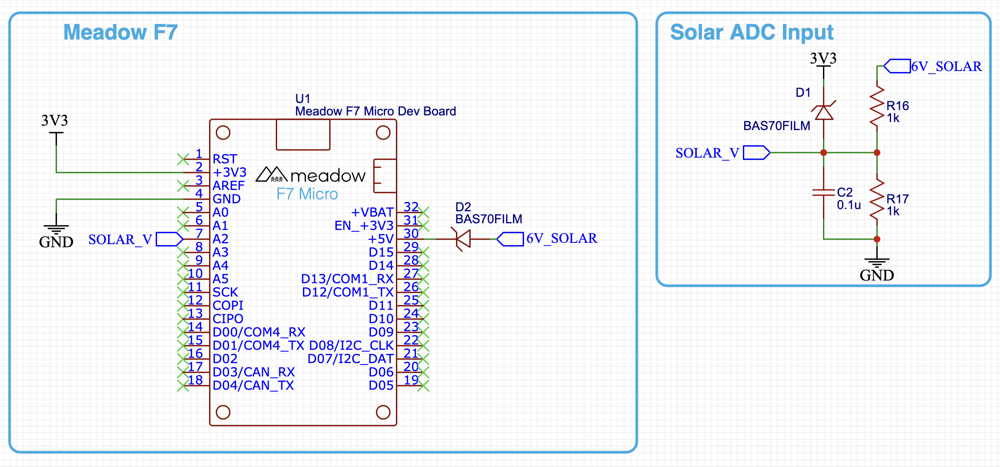

# Intro

In modern digital electronics, we often deal with finite states of `HIGH` or `LOW`, which represent digital `1`/`0`, or `On`/`Off`, respectively. However, there are many sensors or other integrations that communicate not in binary, but in a range of voltages. For instance, a [TMP35 analog temp sensor](/docs/api/Meadow.Foundation/Meadow.Foundation.Sensors.Temperature.AnalogTemperature.html) might output `0V` when it's reading an ambient temperature of `0ºC`, `1.6V` @ `50ºC`, and `3.3V` @ `100ºC`.

Analog ports are specifically design for this scenario, and are able to operate throughout a specified range of voltages, in both an input (reading) and output (writing) capacity. 

On the Meadow F7 Micro, Analog signals are written or read with a 12-bit resolution, which means that the total range of voltage values are divided by `4,096` steps.

Meadow has the capabilities to both read and write analog signals, but presently only the input/read functionality is exposed via API.

## Analog Input

Analog input is converted to a digital value via the onboard _Analog to Digital Converter_ (ADC), which is accessed via an [`AnalogInputPort`](/docs/api/Meadow/Meadow.Hardware.AnalogInputPort.html), and created from a device that implements `IAnalogInputController`:

```csharp
IAnalogInputPort analogIn = Device.CreateAnalogInputPort(Device.Pins.A02);
```

### Getting the voltage value via the `Read()` method.

Once the analog input port has been created, the voltage input can be read on a one-off fashion via the `Read()` method:

```csharp
Voltage voltage = await analogIn.Read();
```

### Events and IObservable API

As with other input APIs, the Analog input APIs support both classic .NET events and the `IObservable` pattern, for advanced notification filtering. 

#### Classic .NET Events

For example, the following code illustrates subscribing to the `Updated` event to read the voltage on a more regular basis:

```csharp
analogIn.Updated += (s, result) => {
    Console.WriteLine($"Analog event, new voltage: {result.New.Volts:N2}V, old: {result.Old?.Volts:N2}V");
};
analogIn.StartUpdating();
```

#### Filterable Observers

For more advanced filtering, or to use reactive-style programming, an `Observer` can be created and subscribe to notifcations, with an optional filter. For example, the following code creates a filterable observer than is only notified when when the voltage changes by at least `0.1V`:

```csharp
var observer = IAnalogInputPort.CreateObserver(
    handler: result => {
        Console.WriteLine($"Analog observer triggered; new: {result.New.Volts:n2}V, old: {result.Old?.Volts:n2}V");
    },
    // filter is optional. in this case, we're only notifying if the
    // voltage changes by at least `0.1V`.
    filter: result => {
        if (result.Old is { } oldValue) {
            return (result.New - oldValue).Abs().Volts > 0.1;
        } else { return false; }
    }
);
analogIn.Subscribe(observer);
analogIn.StartUpdating();
```

Because the filter is optional, passing `null` for it will result in getting notified every time the analog input port is sampled.

For more information, see the [Events and IObservable guide](/Meadow/Meadow_Basics/Events_and_IObservable/).

#### `StartUpdating()`/`StopUpdating()`

In order to get events or notifications, the `StartUpdating()` method must be called. By default, it will automatically oversample (take multiple samples and average them), and has optional parameters which allow you to control whether or not it will oversample, how many samples to take, as well as the duration between samples and between readings:

```csharp
void StartUpdating(int sampleCount = 10, int sampleIntervalDuration = 40, int standbyDuration = 100);
```

For more information on oversampleing, see the [Working with Sensor guide](/Meadow/Meadow.Foundation/Working_with_Sensors/).


### Input Voltage Tolerance and Sample Circuit

When using the analog input ports, your circuit should take into account two considerations:

 * **Input Voltage Tolerance** - The maximum voltage that the ADC can handle is `3.3V`.
 * **Value Normalization** - A small capacitor can be used to help normalize the input voltage.

#### Input Voltage Tolerance

It's important to note that unlike the digital inputs (which are `5V` tolerant), the analog inputs on the F7 Micro are only `3.3V` tolerant, meaning any input signals above `3.3V` may damage the chip. If you expect input signals to exceed `3.3V`, there are two ways to protect the input.

##### Dividing Input Voltage

If your sensor regularly operates at a higher voltage range, for instance, if it's a `5V` sensor, a two resistor [_voltage divider_](/Hardware/Tutorials/Electronics/Part5/Level_Shifting_Lab/) should be used to "divide" the voltage down from `5V` to `3.3V`.

##### Transient Voltage Suppression

Additionally, it's important to protect the ADC from occasional voltage spikes, typically by using a [Diode](/Hardware/Tutorials/Electronics/Part6/General_Diodes) and a [resistor](/Hardware/Tutorials/Electronics/Part4/Resistance/) as illustrated in this [tutorial](https://www.electroniclinic.com/input-overvoltage-protection-for-arduino-inputs-using-a-zener-diode/)

##### Voltage "Storage" and Normalization

Finally, a small capacitor, typically `0.1µF`, can be used to "store" the voltage input to provide a more normalized voltage value if the input is being read (sampled), very often, which can deplete the circuit of the voltage value. This capacitor will also help to smoot out the signal if there is noise on the line, or the sensor being read is noisy.

#### Example Circuit

For example, the following circuit illustrates these concepts in action. It's used as an analog solar intensity gauge that can read the current output of a solar panel (`6V_Solar`):



Examining it, it has several important features:

 * **Voltage Divider** - The output of the solar panel comes in on the `6V_Solar` net and the first thing that happens is that it hits a voltage divider (`R16` and `R17`) that divides the input voltage in half by sinking half of it to `GND`. Typically, solar panels output a maximum of `6.5V`, so by dividing that in half, at full power the ADC will only receive `3.25V` at maximum. 
 * **Transient Voltage Suppression** - `D1` in the diagram is a diode that connects the divided voltage output to the `3V3` rail. As long as the voltage to that diode is less than the voltage on the `3V3` rail, it will go into the ADC as, expected. However, if a voltage spike occurs and that voltage exceeds the `3V3` raile, for instance, if there's a static eletricity discharge from the solar panel, it will dump any excess voltage onto that rail.
 * **Smoothing Capacitor** - `C2` in the diagram is a `0.1µf` capacitor that will store the input voltage and resist fast changes to the voltage level, providing a smoother value.

Additionally, there is one more intersting component in the circuit, `D2`, which is a diode that will make sure when the Meadow board is plugged into USB, the `5V` rail power isn't fed into the solar intensity gauge circuit.

### Analog Reference (`AREF`)

The _analog reference_ (`AREF`) pin provides a reference voltage for the [_Analog to Digital Converter_ (ADC)](/Meadow/Meadow_Basics/IO/Analog/) to compare against. Typically, this should be supplied with `3.3V`, so as a convenience, the `AREF` pin is actually connected to the `3.3V` rail via `0Ω` resistor that is located next to the `D08` pin, just below the main MCU:


If you need to provide a different analog reference voltage, make sure to remove that resistor before hooking `AREF` to your voltage reference.

## Analog Output

Analog output can be generated via the _Digital to Analog Converter_ (DAC) on the Meadow device. This feature is not currently exposed, and these docs will be updated when we ship it.