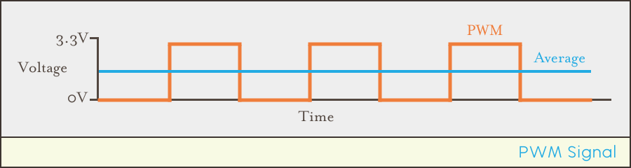
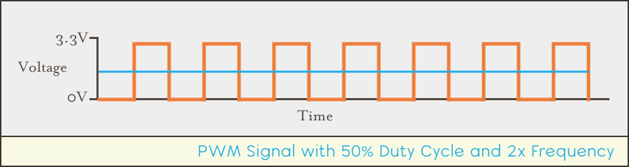
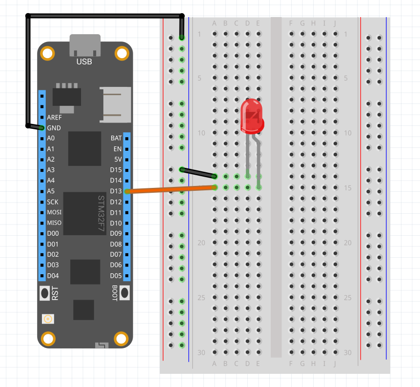
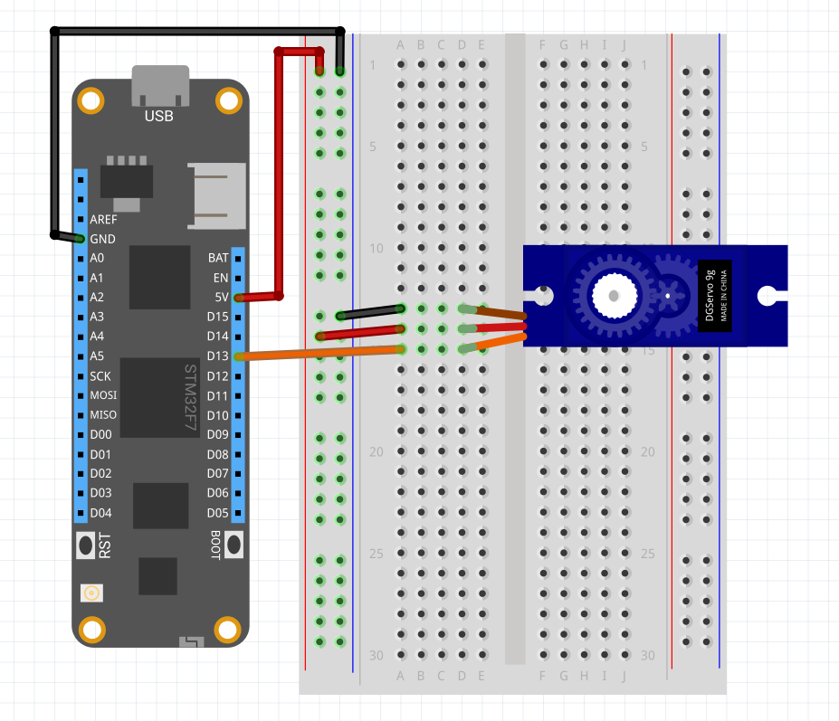

# Introduction

Pulse-Width-Modulation is a way of controlling voltage digitally to emulate an analog signal. By turning a digital output `ON` and `OFF` very rapidly, an intermediate average output voltage can be achieved:

{:standalone}

Although PWM is a modulation technique that can be used for communication, it's most often used to:

- Limit the voltage being supplied to a device.
- Vary the output of LEDs.
- Control motors such as servos.

A PWM signal generated by a Meadow is a square wave that can be described by two key parameters known as the _duty cycle_ and _frequency_.

## Duty Cycle

The duty cycle describes the percentage of time the signal is `ON`/`HIGH`, and the average output voltage is directly tied to this parameter. Consider the following wave with a duty cycle of `0.5` (50%):

![![Illustration of a PWM signal at 50% duty cycle between 0V and 3.3V, averaging half that voltage (1.6V)]](50p_PWM_Signal.svg){:standalone}

In the above diagram, the signal is `ON`/`HIGH` half of the time, and `OFF`/`LOW` the other half. The average voltage output is therefore `1.6V`, since `3.3V * 0.5 = 1.6V`.

If the duty cycle were lowered to 25% (`0.25`), then the average voltage output would also be lowered:

![![Illustration of a PWM signal at 25% duty cycle between 0V and 3.3V, averaging one quarter that voltage (0.8V)]](25p_PWM_Signal.svg){:standalone}

In this case, the average voltage output would be around `0.8V`, since `3.3V * 0.25 = 0.825V`

## Frequency

Note that in both cases, the frequency is the same; the rising edges of the signal are aligned to the same point in time.

So the frequency is the same but the duty cycle is different.

However, for a higher resolution signal, the frequency can be increased while keeping the same duty cycle. Consider the following PWM with a 50% duty cycle but a frequency twice as high as the previous signals:

{:standalone}

In this case, the signal is cycling `ON`/`OFF` twice as fast as the 50% cycle before, but still providing the same average voltage output.

Higher frequencies create smoother signals, and are required in some cases. For instance, when using a PWM signal to control the brightness of an LED, a frequency of at least 60Hz (60 cycles per second) is required because humans will notice a flicker in frequencies below that.

## Signal Generation

PWM signals can be generated via hardware (on the microcontroller) as well as via software. However, except for very slow frequencies, the hardware PWM generator should be used, as it doesn't cause any load on the processor.

# PWM Support in Meadow

## Hardware/Pins

Nearly every digital pin on the Meadow F7 board supports PWM.

{:standalone}

<!-- TODO:
[separated into timer groups, in which each pin frequency must be set on an integer multiple of each other]
-->


## APIs

### Hardware PWM

Hardware PWM signals are controlled via an [`IPwmPort`](/docs/api/Meadow/Meadow.Hardware.IPwmPort.html), which is created via an `IIODevice`:

```csharp
IPwmPort pwm = Device.CreatePwmPort(Device.Pins.D07, 100, 0.5f);
pwm.Start();
```

### Software Generated via `SoftPwmPort`

For PWM frequencies below `1hz` (one cycle per second), as used in industrial control systems such as HVACs, Meadow.Foundation contains a [`Generators.SoftPwmPort`](http://beta-developer.wildernesslabs.co/docs/api/Meadow.Foundation/Meadow.Foundation.Generators.SoftPwmPort.html) that can be created on any  `IDigitalOutputPort` and used just like a hardware PWM port:

```csharp
IDigitalOutputPort digiOut = Device.CreateDigitalOutputPort(Device.Pins.D00);
IPwmPort softPwmPort = new SoftPwmPort(digiOut); 
```

# Examples

<!-- TODO: just link to these examples where they're doc'd -->

## Driving an LED

Here is a complete example of a [`Meadow.Foundation`](http://beta-developer.wildernesslabs.co/Meadow/Meadow.Foundation/) application that controls an LED using a PwmLed object and shows the different methods the API provides to turn it on or off, make it blink and pulse

### Hardware

Connect a red LED with the long leg (anode) on the D13 pin and the short leg (cathode) to GND, like the following fritzing diagram:

{:standalone}

### Software

Create a Meadow project named `PwmLed_Sample` and copy the code so your app looks like this:

If you want to know more about `PwmLed`, You can check out the [`Meadow.Foundation.Servo Reference API`](http://beta-developer.wildernesslabs.co/docs/api/Meadow.Foundation/Meadow.Foundation.Leds.PwmLed.html) 


```csharp
using System;
using System.Threading;
using Meadow;
using Meadow.Devices;
using Meadow.Foundation.Leds;
using System.Threading;

namespace PwmLed_Sample
{
    class MainClass
    {
        static IApp app;

        public static void Main(string[] args)
        {
            app = new PwmLedApp();
            Thread.Sleep(Timeout.Infinite);
        }
    }

    public class PwmLedApp : App<F7Micro, PwmLedApp>
    {
        PwmLed pwmLed;

        public PwmLedApp()
        {
            pwmLed = new PwmLed(Device.CreatePwmPort(Device.Pins.D02), TypicalForwardVoltage.Red),
            
            while (true)
            {                
                pwmLed.IsOn = true;
                Thread.Sleep(500);
                pwmLed.IsOn = false;

                pwmLed.StartBlink();
                Thread.Sleep(3000);
                pwmLed.Stop();

                pwmLed.StartPulse();
                Thread.Sleep(3000);
                pwmLed.Stop();
            }
        }
    }
}
```

## Controlling a Servo

Here is another complete example of a [`Meadow.Foundation`](http://beta-developer.wildernesslabs.co/Meadow/Meadow.Foundation/) application that controls a servo motor using a `Servo` driver available as a [`NuGet Package`](https://www.nuget.org/packages/Meadow.Foundation.Servo/), and shows how to initialize it and use its API methods.

### Hardware

Connect your servo like the following fritzing diagram:

| Servo      | Meadow Pin |
|------------|------------|
| GND        | GND        |
| VCC        | 3V3        |
| PWM Signal | D13        |

{:standalone}

### Software

Create a Meadow project named `Servo_Sample` and paste the following code. Make sure to add the [`Meadow.Foundation.Servos`](https://www.nuget.org/packages/Meadow.Foundation.Servo/) NuGet Package so the project builds and runs.

Notice that when initializing *servo*, the library provides a set of `NamedServoConfigs` that especifies a predefined group of values such as minimum and maximum angles, minimum and maximum pulse durations and frequency. If your servo is not behaving like you would expect, you can create your own `ServoConfig` object and pass it in the constructor.

If you want to know more about `Servo`, You can check out the [`Meadow.Foundation.Servos Reference API`](http://beta-developer.wildernesslabs.co/docs/api/Meadow.Foundation/Meadow.Foundation.Servos.Servo.html) 

```csharp
using System;
using System.Threading;
using Meadow;
using Meadow.Devices;
using Meadow.Foundation.Servos;
using System.Threading;

namespace Servo_Sample
{
    class MainClass
    {
        static IApp app;

        public static void Main(string[] args)
        {
            app = new ServoApp();
            Thread.Sleep(Timeout.Infinite);
        }
    }

    public class ServoApp : App<F7Micro, ServoApp>
    {
        readonly IPwmPort pwm;
        readonly Servo servo;

        public ServoApp() 
        {
            pwm = Device.CreatePwmPort(Device.Pins.D05);
            servo = new Servo(pwm, NamedServoConfigs.Ideal180Servo);

            while(true)
            {
                if (servo.Angle <= servo.Config.MinimumAngle)
                {
                    Console.WriteLine($"Rotating to {servo.Config.MaximumAngle}");
                    servo.RotateTo(servo.Config.MaximumAngle);
                }
                else
                {
                    Console.WriteLine($"Rotating to {servo.Config.MinimumAngle}");
                    servo.RotateTo(servo.Config.MinimumAngle);
                }

                Thread.Sleep(4000);
            }
        }
    }
}
```