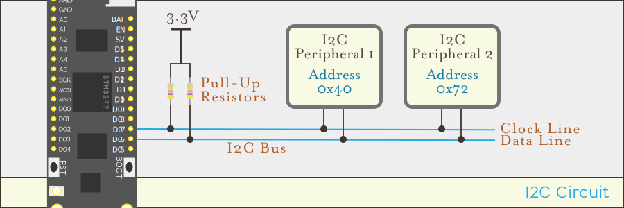

[I2C (Inter-Integrated Circuit)](https://en.wikipedia.org/wiki/I%C2%B2C), pronounced, "eye-squared-sea", is a communication protocol allowing bi-directional communication between devices using only two signal wires (in addition to power and ground):

{:standalone}

## Hardware

I2C uses a _bus_ architecture which allows multiple peripherals to share two wires; one carrying a clock signal, and another carrying message data.

### Clock Signal (`CLK`)

Typical speeds for I2C devices are `100KHz` or `400KHz` (100,000 or 400,000 clock pulses per second, respectively), but some high speed devices go up to `5MHz` (5 million per second).

The clock signal determines the rate at which data can be transferred, however, all devices on an I2C must use the same speed. Additionally, speed is affected by the length of the bus lines. Speeds up to `100Khz` are achievable with a bus wire length up to 1 meter, but at 10 meters, about `10Khz` is at the top of the practical limit.

Additionally, adding more devices to the bus can also limit the maximum speed.

The I2C `CLK` pin can be found on the Meadow F7 Micro labeled `D08`.

### Data Signal (`DAT`)

The data signal wire carries the actual messages and can be found on the F7 Micro pin labeled `D07`.

## Master + Client Messaging

I2C uses a multi-master, multi-client model in which multiple master devices can speak to any number of client peripherals by prefacing messages with a unique peripheral address. However, in practice, typically there is only one master device. In the case of Meadow, the Meadow board is the master, and each connected I2C peripheral is a client.

### Addressing

The use of multiple devices on the single bus is made possible through 7-bit device addresses. Each client device on the bus is allocated a specific address by the manufacturer of the device. Many times peripherals have a way to toggle between additional addresses to help prevent address collisions.

The master initiates communication with a client device by first transmitting the client device's address. The client device that has its address set to the address transmitted knows that all data transmitted between the address and the stop bit is intended for itself.

The use of 7-bit addresses restricts the number of devices to 128 per bus although in practice the number of devices connected to the bus is usually much lower.

#### Read / Write Bit

In addition to the seven address bits, the master device will also send a single bit that indicates the mode of the communication: _read_ or _write_. The combination of the 7-bit address and the single read/write bit gives an 8-bit packet header.

## Pull-Up Resistors

Both of the bus lines require [pull-up resistors](http://127.0.0.1:4002/Hardware/Tutorials/Electronics/Part4/PullUp_PullDown_Resistors/) to be connected to them. Pull-up resistors allow a tiny amount of current to flow on the bus lines which gives them a default logic value of `1`/`ON`, so that clean digital logic transitions can occur and provide a reliable signal.

The value of the pull-up resistors depends on the speed and number of devices, length of the bus, and capacitance. However, in practice, most I2C circuits will work reliably with a couple of `4.7kΩ` resistors. In fact, many I2C breakout boards already have `4.7kΩ` resistors installed on them.

For a more in depth discussion on how to determine ideal resistance value, see the [Effects of Varying I2C Pull-Up Resistor (external link)](http://dsscircuits.com/articles/effects-of-varying-i2c-pull-up-resistors) article.

# Using the Meadow I2C API

## Creating an I2C Bus

To use I2C in Meadow, first create an [`II2cBus`](/docs/api/Meadow/Meadow.Hardware.II2cBus.html) from the [`IIODevice`](/docs/api/Meadow/Meadow.Hardware.IIODevice.html) you're using:

```csharp
II2cBus i2cBus = Device.CreateI2cBus();
```

## Working with I2C Peripherals

Once the I2C Bus has been created, peripherals can be created by passing in the I2C Bus and the address of the peripheral:

```csharp
II2cPeripheral i2cPeripheral = new I2cPeripheral(i2cBus, 39);
```

### Peripheral Communication

Generally, you won't need to handle low-level I2C peripheral communication directly, as the peripheral drivers in Meadow.Foundation expose high level APIs for working with their features. However, if you're creating a new driver, or want to talk to a peripheral directly, there are a number of communications methods exposed via the [`IByteCommunications`](/docs/api/Meadow/Meadow.Hardware.IByteCommunications.html) interface, which I2C peripherals implement. Among these are methods to read and write bytes directly to the device as well as read and write to memory registers on the device:

```csharp
i2cPeripheral.WriteByte(0x01);
```

These methods are also available via the I2C bus, but require the address of the device to be explicitly passed:

```csharp
i2cBus.WriteByte(i2cPeripheral.Address, 0x01);
```

