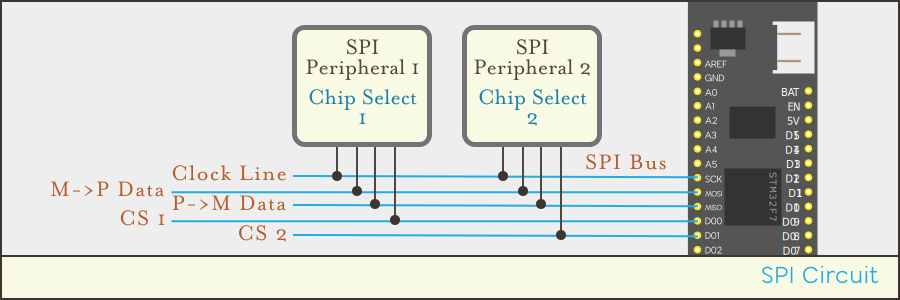

# Introduction

[Serial Peripheral Interface (SPI)](https://en.wikipedia.org/wiki/Serial_Peripheral_Interface) is a high speed communication protocol for short distances between devices using four signal wires:

{:standalone}

Unlike I2C, there is no upper limit on the speed of SPI devices, so clock speeds of `100MHz` or more are generally possible. However, SPI is intended to be used over very short distances, with an absolute maximum of around 3 meters, and performs best when it's traveling over 10cm or less.

Because of its high speed, SPI is often used for data-heavy, low-latency communications with devices such as cameras and displays.

## Hardware

SPI uses a master + client _bus_ architecture which enables a master controller to communicate with multiple client peripherals using shared communication wires but each client being addressed by individual _chip select_ (`CS`) wires.

In addition to the chip select, SPI requires two lines for bidirectional communication (`MOSI`, `MISO`), as well as a shared clock line for each peripheral. However, some peripherals only require one-way communication, and therefore only need three wires in total.

### MOSI

`MOSI` stands for _Master-Out, Slave-In_, and transmits data from the master controller to the client peripheral.

### MISO

`MISO` stands for _Master-In, Slave-Out_, and is used to transmit data from the client peripherals to the master controller.

### SCLK

All the peripherals are on the same clock, which is set by the master controller and pulsed over the `SCLK` line, which stands for _Serial Clock_.

### CS

SPI uses the _Chip Select_ line to select individual devices to communicate with. Usually, there is one `CS` per device, and it's pulled `LOW`/`0V` for the device that the messages are intended for.

Note: SPI supports shared `CS` lines in a _daisy-chain_ configuration, but it's rarely used and is unsupported in Meadow.

## Meadow SPI Pins

The SPI pins on the F7 Micro are labeled `SCK`, `MOSI`, and `MISO` and can be found between `A05` and `D00`:

{:standalone}

Any pin that supports digital output can be used as a chip select line.

# Using the Meadow SPI API

## Creating an SPI Bus

To use SPI in Meadow, first create an [`ISpiBus`](/docs/api/Meadow/Meadow.Hardware.ISpiBus.html) from the [`IIODevice`](/docs/api/Meadow/Meadow.Hardware.IIODevice.html) you're using:

```csharp
ISpiBus spiBus = Device.CreateSpiBus();
```

## Working with SPI Peripherals

Once the SPI Bus has been created, peripherals can be created by passing in the SPI Bus and the `IDigitalOutputPort` that is connected to the chip select on the peripheral:

```csharp
IDigitalOutputPort spiPeriphChipSelect = Device.CreateDigitalOutputPort(Device.Pins.D03);
ISpiPeripheral spiPeriph = new SpiPeripheral(spiBus, spiPeriphChipSelect);
```

### Peripheral Communication

Generally, you won't need to handle low-level SPI peripheral communication directly, as the peripheral drivers in Meadow.Foundation expose high level APIs for working with their features. However, if you're creating a new driver, or want to talk to a peripheral directly, there are a number of communications methods exposed via the [`IByteCommunications`](/docs/api/Meadow/Meadow.Hardware.IByteCommunications.html) interface, which SPI peripherals implement. Among these are methods to read and write bytes directly to the device as well as read and write to memory registers on the device:

```csharp
spiPeriph.WriteByte(0x01);
```

These methods are also available via the SPI bus, but require the chip select port of the device to be explicitly passed:

```csharp
spiBus.WriteByte(spiPeriph.ChipSelect, 0x01);
```


