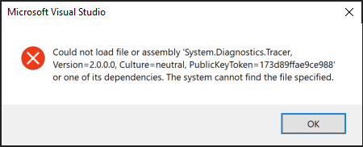

## Which COM port do I use?

* After successfully flashing, the Meadow device shows up as **USB Serial Device (COMXX)** in Device Manager under Ports (COM & LPT). In the Meadow Device Explorer window in Visual Studio, select the appropriate **COMXX** port to target your Meadow device.

## How do I fix the exception when trying to debug a Meadow app?

If you see an assembly exception alert from Visual Studio when trying to debug a Meadow app, verify that you installed the **Mobile development with .NET** workload.

> Could not load file or assembly 'System.Diagnostics.Tracer, Version=2.0.0.0, Culture=neutral, PublicKeyToken=173d89ffae9ce988' or one of its dependencies. The system cannot find the file specified.

1. Launch **Visual Studio Installer**.
2. Select your Visual Studio installation where you are having the debug issue.
3. Verify that **Desktop & Mobile** > **Mobile development with .NET** is checked, installing it if needed.

    

## Support

If you are still experiencing an issue, please [file a bug](https://github.com/WildernessLabs/VS_Win_Meadow_Extension/issues) or [join our public slack](http://slackinvite.wildernesslabs.co/) for support.
