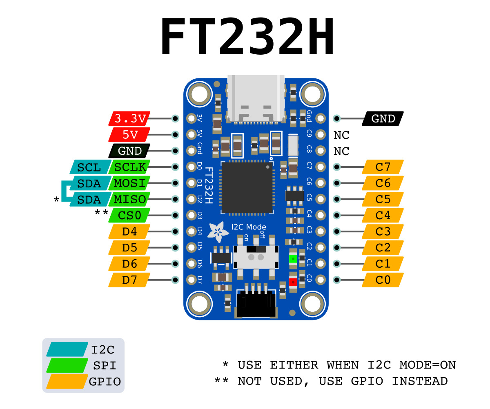

With Meadow.Desktop, you can use simulated sensors if you dont have a way to connect peripherals to your development machine. However, if you have an USB IO Expander such as an FT232H, you can connect physical peripherals, control them just like you would on a Meadow F7 device.

:::info Disclosure
Connecting Hardware fully works on Windows. Linux and macOS systems are untested.
:::

### Step 1 - Install the driver on your dev machine

You'll need to install the D2XX native driver libraries to use IO Expanders directly from your dev machine such as a FT232H USB IO Expander.

Head over to [https://ftdichip.com/drivers/d2xx-drivers/](https://ftdichip.com/drivers/d2xx-drivers/) and select your appropriate platform and CPU architecture.

### Step 2 - Add the FT232H NuGet package on a Meadow.Desktop App

On a Meadow.Desktop app, you'll need to add the NuGet package to use the IO Expander board. Open your NuGet manager window in Visual Studio and look for [Meadow.Foundation.ICs.IOExpanders.Ft232h](https://www.nuget.org/packages/Meadow.Foundation.ICs.IOExpanders.Ft232h)

### Step 3 - Using the FT232H board

Since you could connect more than one FT232H board on your dev machine, you can access them from a collection of FTDI Expanders (`FtdiExpanderCollection`). 

```csharp
var expander = FtdiExpanderCollection.Devices[0];
```

#### Pinout Diagram

Before connecting peripherals to the FT232H, you might want to keep this pinout diagram handy to wire things properly:



#### Using GPIO Pins

This example shows how to access one and use its GPIO pins to create an `RgbLed` object:

```csharp
var expander = FtdiExpanderCollection.Devices[0];
var rgbLed = new RgbLed(
    expander.Pins.C2,
    expander.Pins.C1,
    expander.Pins.C0);
rgbLed.StartBlink(RgbLedColors.Red);
```

#### Using an SPI Peripheral 

```csharp
var expander = FtdiExpanderCollection.Devices[0];
var display = new St7789(
    expander.CreateSpiBus(),
    expander.Pins.C0,
    expander.Pins.C1,
    expander.Pins.C2,
    240, 240);
display.Fill(Color.Green, true);
```

#### Using an I2C Peripheral

```csharp
var expander = FtdiExpanderCollection.Devices[0];
var sensor = new Vl53l0x(expander.CreateI2cBus());
sensor.Updated += (sender, result) =>
{
    if (result.New == null) { return; }

    if (result.New < new Length(0, LU.Millimeters))
    {
        Resolver.Log.Info("out of range.");
    }
    else
    {
        Resolver.Log.Info($"{result.New.Millimeters}mm / {result.New.Inches:n3}\"");
    }
};
sensor.StartUpdating(TimeSpan.FromMilliseconds(250));
```