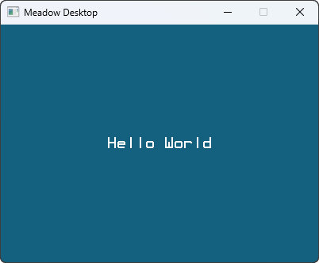
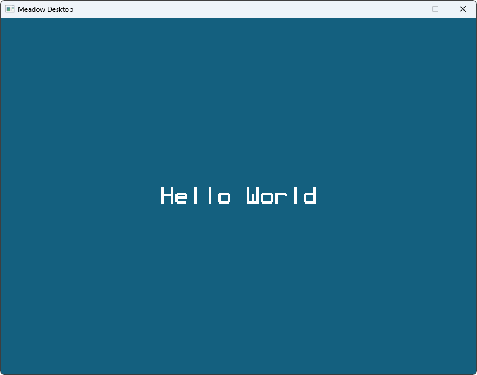

Cross-platform Display

### Using Meadow.Desktop's Display

```csharp
IResizablePixelDisplay display = Device.Display;
```


### Set Display dimensions and scaling

Since that `Device.Display` is a `IResizablePixelDisplay`, you can change the resolution to whatever dimensions you want using the `Resize()` method:

```csharp
Device.Display.Resize(width: 400, height: 300);
```

The code snippet above creates a pixel perfect 400x300 display (not accounting for window borders and top bar).



However, if your monitor has a high pixel density, a 400x300 pixel window might look quite small, but you can use the `displayScale` to scale up the `Display`s buffer size, drawing bigger pixels:

```csharp
Device.Display.Resize(width: 400, height: 300, displayScale: 2);
```

The code snippet above now generates a 400x300 pixel display with a `displayScale` of 2, showing a window thats twice the size.

