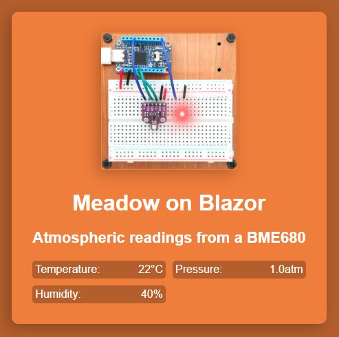

Meadow.Blazor in combination with Meadow.Desktop offers an environment for developing Meadow applications that can run on Windows, Mac and Linux. Developing with Meadow.Blazor requires setting up your development machine with some prerequisites. Then, after connecting any external components, you can deploy and run your Meadow application.

Meadow Blazor enables you to combine a Blazor front-end while accessing physical components by way of an FTDI breakout board such as FT232H that provide GPIO, SPI, and I2C.

## Prerequisites

Before you can get started with Meadow.Blazor, make sure your [development machine is set up for Meadow development](/Meadow/Getting_Started/Hello_World/).

If not installed already, install the .NET 8.0 SDK. You can find the latest version of the .NET SDK from the [.NET downloads](https://dotnet.microsoft.com/download/dotnet/).

### Using GPIO and SPI

With an additional accessory, you can add GPIO and SPI capabilities to your desktop device. You can use an [FTDI breakout board such as FT232H](https://www.adafruit.com/product/2264) to provide GPIO and SPI capabilities.

## Create your first Meadow.Blazor app

1. Create a new dotnet app on your development machine and navigate to that new project.

    ```command
    dotnet new blazorserver -n MeadowBlazorSampleApp
    cd MeadowBlazorSampleApp
    ```

1. Add the Meadow.Blazor NuGet reference to your project.

    ```command
    dotnet add package Meadow.Blazor
    ```

1. Create a new file named `MeadowApplication` in your project with the following code:

    ```csharp
    using Meadow;

    internal class MeadowApplication : App<Meadow.Desktop>
    {
        public override Task Initialize()
        {
            //initialize hardware here and add to sensor serivce
            return base.Initialize();
        }

        public override Task Run()
        {
            return base.Run();
        }
    }

1. If using external hardware, you'll need to add the relevant Meadow nuget packages and initialize the drivers in the `Initialize` method - for example:

    ```csharp
    using Meadow;
    using Meadow.Foundation.ICs.IOExpanders;
    using Meadow.Foundation.Leds;
    using Meadow.Foundation.Sensors.Atmospheric;
    using Meadow.Peripherals.Leds;

    internal class MeadowApplication : App<Meadow.Desktop>
    {
        public override Task Initialize()
        {
            FtdiExpanderCollection.Devices.Refresh();
            var ftdi = FtdiExpanderCollection.Devices[0];
            var output = ftdi.Pins.D7.CreateDigitalOutputPort(false);
            Resolver.Services.Add(output);

            var bme680 = new Bme680(ftdi.CreateSpiBus(), ftdi.Pins.C7);
            Resolver.Services.Add(bme680);

            var led = new Led(ftdi.Pins.C0);
            Resolver.Services.Add<ILed>(led);

            return base.Initialize();
        }

        public override Task Run()
        {
            return base.Run();
        }
    }
    ```

1. Meadow.Desktop is initialized via an extension method on `WebApplication` included with Meadow.Blazor method named `UseMeadow`. Add `UseMethod` to your program.cs file.

    ```csharp
    using Meadow.Blazor;
    using Meadow.Blazor.Services;

    var builder = WebApplication.CreateBuilder(args);

    ...

    var app = builder.Build();

    ...

    app.UseMeadow<MeadowApplication>();

    ...

    app.Run();
    ```

1. Build the app for your development machine using either Visual Studio or the `dotnet` tool.

    ```command
    dotnet build
    ```

1. Run the app.

    ```command
    dotnet run
    ```

## Access peripherals from a Blazor server app

You'll decide on the architecture of your Blazor application but a common pattern is to create view models to support razor pages.

Below is example code to present sensor for a `BME680` atmospheric sensor. 



1. Create a view model that exposes your data as public properties along with a `StateChanged` `Action`. Note the use `Resolver.Services` to access the peripherals you registed in `MeadowApplication`. 

    ```csharp
    using Meadow.Foundation.Sensors.Atmospheric;
    using Meadow.Peripherals.Leds;
    using Meadow.Units;

    namespace Meadow.Blazor.Services
    {
        public class SensorViewModel : IDisposable
        {
            private readonly Bme680 _bme680;

            public string TemperatureValue { get; private set; } = "0°C";
            public string HumidityValue { get; private set; } = "0%";
            public string PressureValue { get; private set; } = "0atm";

            public event Action? StateChanged;

            public SensorViewModel()
            {
                _bme680 = Resolver.Services.Get<Bme680>() ?? throw new Exception("BME680 not found");
                _bme680.Updated += Bme680Updated;
                _bme680.StartUpdating(TimeSpan.FromSeconds(2));
            }

            private void Bme680Updated(object? sender, IChangeResult<(Temperature? Temperature, RelativeHumidity? Humidity, Pressure? Pressure, Resistance? GasResistance)> e)
            {
                TemperatureValue = $"{e.New.Temperature?.Celsius:n0}°C";
                HumidityValue = $"{e.New.Humidity?.Percent:n0}%";
                PressureValue = $"{e.New.Pressure?.StandardAtmosphere:n2}atm";

                StateChanged?.Invoke();
            }

            public void Dispose()
            {
                _bme680?.StopUpdating();
            }
        }
    }
    ```

2. Create a razor page that uses the view model:

    ```razor
    @page "/"
    @inject Meadow.Blazor.Services.SensorViewModel ViewModel

    <div class="container">
        <div class="content">
            <div class="image-container">
                
            </div>
            <h1>Meadow Blazor</h1>
            <h2>Atmospheric readings from a BME680</h2>

            <div class="readings">
            <div class="reading">
                <span>Temperature:</span>
                <span>@ViewModel.TemperatureValue</span>
            </div>
            <div class="reading">
                <span>Pressure:</span>
                <span>@ViewModel.PressureValue</span>
            </div>
            <div class="reading">
                <span>Humidity:</span>
                <span>@ViewModel.HumidityValue</span>
            </div>
            </div>
        </div>
    </div>

    @code {
        protected override void OnInitialized()
        {
            ViewModel.StateChanged += OnViewModelStateChanged;
        }

        private void OnViewModelStateChanged()
        {
            InvokeAsync(StateHasChanged);
        }

        public void Dispose()
        {
            ViewModel.StateChanged -= OnViewModelStateChanged;
        }
    }
    ```

## Next steps

Now that you have your Meadow.Blazor device set up and your first Meadow app running on it, you can start working with the [Meadow.Foundation](../../../Meadow.Foundation/Getting_Started/) libraries to add functionality to your Meadow app. Check out the other [samples in the Meadow.Desktop.Samples](https://github.com/WildernessLabs/Meadow.Samples/tree/main/Source/).
