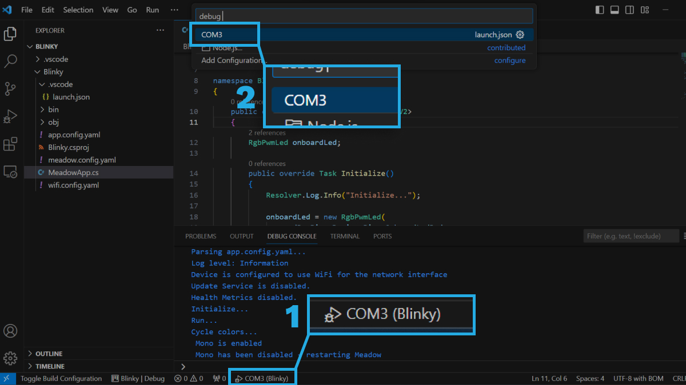

The Meadow developer Extension for Visual Studio Code enables projects to be built, debugged and deployed to any of our Meadow-powered devices.

## Pre-requisites

If you havent, download and Install [Visual Studio Code](https://visualstudio.microsoft.com/) to prepare your development machine.

## Installation

1. In VSCode go to the Extensions tab (macOS: Cmd+Shift+X. Others: Ctrl+Shift+X)
1. In the search bar type `VSCode Tools for Meadow`. It should be the first extension in the list.

  

1. Click it the **Install** button on the bottom right of the listed item.
1. The extension should now be installed.

## Usage

In the bottom toolbar, click on the COM port button that will open a drop down menu at the top, where you’ll select the corresponding port your board is using.

## References

* This extension is open source and you check the source [here](https://github.com/WildernessLabs/VSCode_Meadow_Extension).

## Support

Having trouble using this extension? 
* File an [issue](https://github.com/WildernessLabs/Meadow.Desktop.Samples/issues) with a repro case to investigate, and/or
* Join our [public Slack](http://slackinvite.wildernesslabs.co/), where we have an awesome community helping, sharing and building amazing things using Meadow.