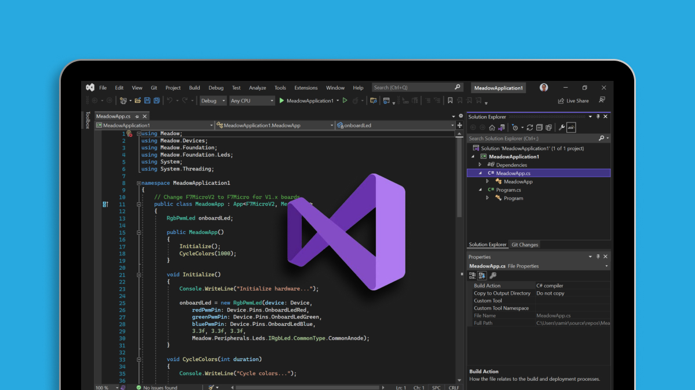
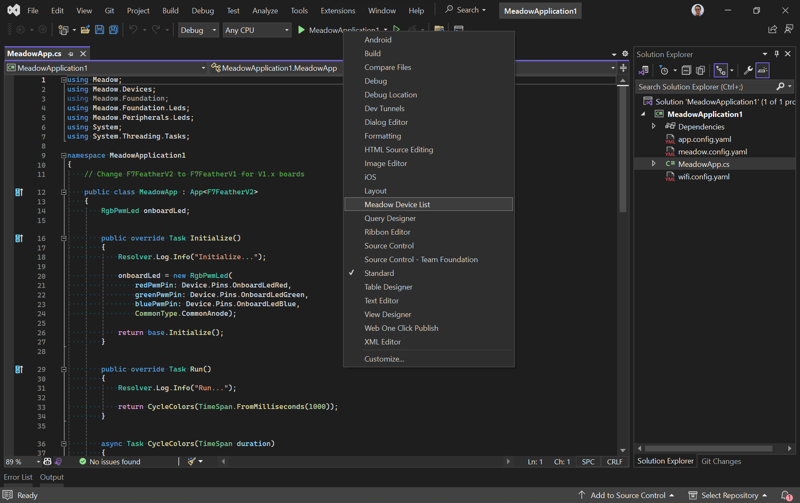
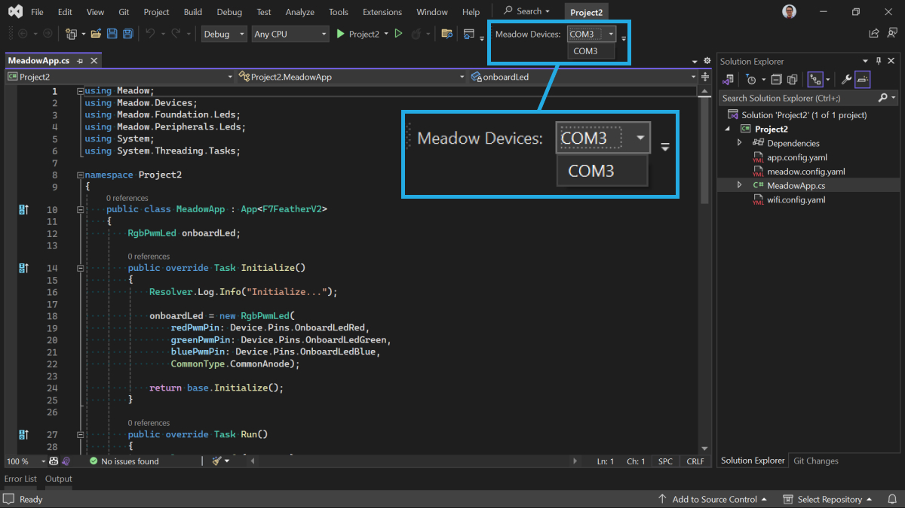

## Installation

You'll need to install the VS Tools for Meadow Extension by [downloading it](https://marketplace.visualstudio.com/items?itemName=WildernessLabs.vsmeadow2022) or through the Extension Manager

1. In Visual Studio, go to **Extensions** =&gt; **Manage Extensions**
1. Click **Online** and search for `VS 2022 Tools for Meadow`. It should be the first extension in the list.

  

1. Install **VS Tools for Meadow**, then close all instances of Visual Studio so the extension gets installed.

## Usage

Right-click on the toolbar area and select the **Meadow Device List** item. This is your device selector to deploy applications to Meadow devices.

When you connect a Meadow board to your computer, the **Meadow devices** drop down menu should list its corresponding COM port. Once selected, you can click on the play **Debug button** to start transferring the application to your board.

## References

* This extension is open source and you check the source [here](https://github.com/WildernessLabs/VS_Win_Meadow_Extension).

## Support

Having trouble using this extension? 
* File an [issue](https://github.com/WildernessLabs/Meadow.Desktop.Samples/issues) with a repro case to investigate, and/or
* Join our [public Slack](http://slackinvite.wildernesslabs.co/), where we have an awesome community helping, sharing and building amazing things using Meadow.