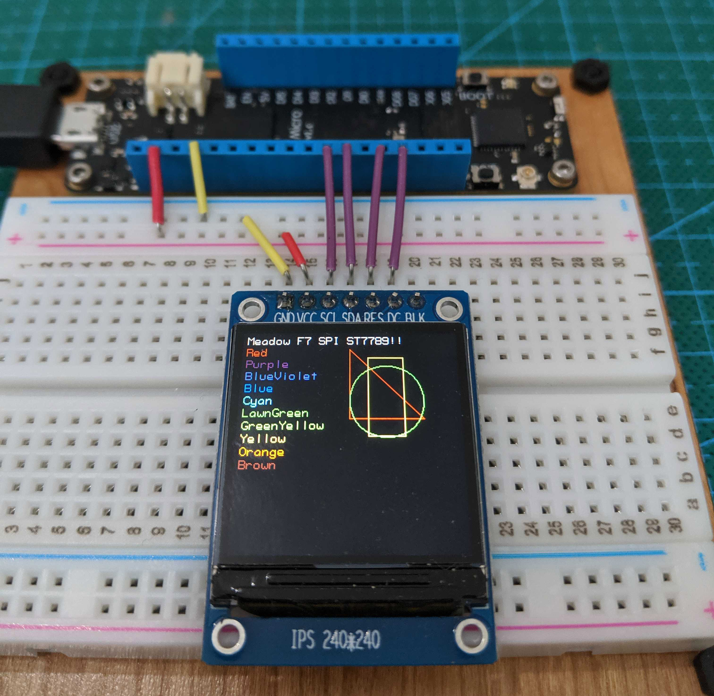

## Beta 3.5

This is quite a big release with new features, including UART, and a major overhaul to Meadow.Foundation. We also launched a new developer site and added docs for Meadow.CLI.

### Serial/UART

Meadow now has Serial/UART support! Check out the new [UART guide](/Meadow/Meadow_Basics/IO/Digital/Protocols/UART/) for all the details!

### Better Digital Protocol Errs

As part of the Serial work, we also improved error messaging across all the digital protocols (I2C, SPI, UART). We now get an actual linux error number back when things go wrong. Those error numbers still need to be looked up online to make sense of them, but before we were only getting `-1` when something wrong. There's still work to be done here, though. We plan on recreating common failures, mapping their errors, and generally trying to provide better guidance.

### I2C Speed Setting

You can now set the speed of the I2C bus. Somehow we missed this when we launched the I2C feature.

### Meadow.CLI Docs

We've published a [guide for the Meadow.CLI (Command Line Interface)](/Meadow/Meadow_Basics/Meadow_CLI/).

### Meadow.Foundation

#### `Read()`, `StartUpdating()`, and `StopUpdating` Sensor Pattern

Meadow.Foundation got a major sensor overhaul for b3.5, including the new `Read()`, `StartUpdating()`, and `StopUpdating()` pattern for sensor reads. We also published a new [Working with Sensors in Meadow.Foundation](/Meadow/Meadow.Foundation/Working_with_Sensors/) guide that is recommended reading, and explains the new pattern.

#### Display Updates

We've added new features to `GraphicsLibrary`:
- two new large pixel fonts: 12x16 and a 12x20
- new `Rotation` property allows screen rotation on any display (even if the driver doesn't support it directly)
- smarter drawing calls, allows more optimizations to be performed by the display driver

SPI display driver performance:
- drivers share a buffer with SPI bus under-the-hood, this reduces memory usage and should help performance
- drivers now caches color values to reduce conversions from 24bit color to display-specific values
- automatic partial screen updates (when possible) to reduce drawing time

Better display support:
- fixes to improve display support across several drivers including support for the 135x240 varient of the ST7789 display
- re-write of the ePaper display drivers to expand supported displays and make it easier to identify the correct driver

### New Developer Site

You're looking at it! We took our beta-developer site live, with the hot new redesign, and of course, Meadow docs! The whole site has been redesigned, including the API docs, which also got a major information architecture overhaul.

### Updating

To use this new beta, you'll need to reflash your board with the [latest Meadow.OS binaries](https://www.wildernesslabs.co/downloads?f=/Meadow_Beta/MeadowOS.zip), as well as update your IDE extensions.

## Beta 3.4

This is another small release that expands the SPI capabilities, adds robustness to the IDE extensions, and sees some more things open-sourced.

### Advanced SPI Configuration

When using SPI, you can now have control over advanced configuration such as speed, clock polarity, and phase. This adds the ability to use more SPI peripherals, such as the OLED display included in the Hack Kit Pro, and NeoPixels!

To use the new SPI configurations, simply pass them in during construction:

```csharp
Device.CreateSpiBus(
    Device.Pins.SCK,
    Device.Pins.MOSI,
    Device.Pins.MISO,
    new SpiBus.ClockConfiguration(4000, SpiBus.Mode.Mode2));
```

You can also change configurations during runtime.

#### ST7789 OLED Display Meadow.Foundation Driver

Along with the configuration options, we've also released a [Meadow.Foundation driver for the state ST7789 OLED display](http://developer.wildernesslabs.co/docs/api/Meadow.Foundation/Meadow.Foundation.Displays.Tft.ST7789.html) included in the Hack Kit Pro:



 
### Visual Studio IDE Extensions Open-Sourced

We've open sourced the Visual Studio Meadow extensions! We're slowly working towards open sourcing all of the Meadow tooling, but we need to clean a lot of it up first, so this is the first step.

You can find the source code in the following repos:

 * [VS Windows Meadow Extension Repo](https://github.com/WildernessLabs/VS_Win_Meadow_Extension) - **Note**: this will be opened by October 28th, 2019 @ 6p PT. We're cleaning code.
 * [VS Mac Meadow Extension Repo](https://github.com/WildernessLabs/VS_Mac_Meadow_Extension)

### Meadow.CLI and Visual Studio Extension Enhancements

We've also made some updates to the Meadow.CLI to enable the IDE extensions to check for updates to files already deployed on the Meadow device. 

#### Meadow.CLI Updates

There is a new command, `--ListFilesAndCrcs`, that lists files as well as the [CRC values](https://en.wikipedia.org/wiki/Cyclic_redundancy_check) for each of the files.

#### IDE Extension Enhancements

With the CLI returning CRC values, the IDE extensions now check to see if any files need updating when deploying. This solves an issue where if a dll such as Meadow.Foundation.dll had already been deployed to the device, and a newer version existed in the project, it wouldn't get updated. 

### Updating

To use this new beta, you'll need to reflash your board with the [latest Meadow.OS binaries](https://www.wildernesslabs.co/downloads?f=/Meadow_Beta/MeadowOS.zip), as well as update your IDE extensions.

## Beta 3.3

This is a small release with some sundry fixes:

* **Multiple PWMs** - We fixed a bug where only one or two PWM channels would be active at one time. With this bug fix, you will now have full multi-PWM access, enabling things like the onboard LED to do full color spectrum.
* **Analog IObservable** - These now work. They actually worked all along, but our sample was using `Debug.WriteLine()` which doesn't currently work (`Console.WriteLine()` is fine).
* **VS Extension Updates** - We've made some sundry fixes to the Meadow project templates. Meadow.Foundation is now linked by default, and **File** > **New** > **Meadow App** now creates an app that walks the color hue spectrum on the onboard LED.

To use this new beta, you'll need to reflash your board with the [latest Meadow.OS binaries](https://www.wildernesslabs.co/downloads?f=/Meadow_Beta/MeadowOS.zip), as well as update your IDE extensions.

**Note:** Meadow.Core updates also require the latest `Meadow.dll` be deployed to your Meadow. Currently, the IDE extensions will not update this dll if it's already on your board, so you'll need to manually delete it via the CLI, via the following command:

```bash
MeadowCLI.exe -s [NameOfSerialPort] --DeleteFile --TargetFileName Meadow.dll
```

Make sure to replace `[NameOfSerialPort]` with the serial port name of your device. Once deleted, the IDE extensions will automatically re-deploy with the latest bits.

## Beta 3.2

### New File System

We upgraded the file system that Meadow uses to LittleFS; which has the distinct advantage of initializing and formatting in seconds, as opposed to the 15-20 minutes of the last file system we were using.

Now, after when you deploy Meadow.OS, the first startup should be very fast, and you won't need to wait for the flash to format.

To upgrade, you'll need to [flash the latest version of Meadow.OS](/Meadow/Getting_Started/Deploying_Meadow/) to your device.

### Basic Analog Input is Up

We got basic [analog](/Meadow/Meadow_Basics/IO/Analog/) input ports working on pins `A0` through `A3`. To read an analog input value, create an [`AnalogInputPort`](/docs/api/Meadow/Meadow.Hardware.AnalogInputPort.html) on one of those pins and call the [`Read()`](/docs/api/Meadow/Meadow.Hardware.AnalogInputPort.html#Meadow_Hardware_AnalogInputPort_Read_System_Int32_System_Int32_) method. 

Note that advanced `IObservable` and events do not work at this time.

To use analog inputs, make sure you update the `Meadow.Core` nuget packages in your projects.

### Debug Output on Visual Studio for Windows

`Console.WriteLine()` calls are now being forwarded to a Meadow output window in Visual Studio on Windows, enabling basic debug output. Make sure to upgrade your Meadow Visual Studio extension to get support.

### Meadow.CLI Updates

In order to be compatible with the file system changes, the `Meadow.CLI` has also been updated. Make sure download and use the [new binaries](https://www.wildernesslabs.co/downloads?f=/Meadow_CLI/Latest/MeadowCLI.zip).

## Beta 3.1

### SPI

We got [SPI](/Meadow/Meadow_Basics/IO/Digital/Protocols/SPI/) validated and merged. We’re excited to get this out, as we know that several of you are working on integrations that require SPI. To use it, you’ll need to flash your Meadow board with the [latest OS firmware binaries](https://www.wildernesslabs.co/downloads?f=/Meadow_Beta/MeadowOS.zip).

### Visual Studio Extension

Our project template is now included enabling the creation of new Meadow Apps within Visual Studio, [check out the update](/Meadow/Getting_Started/Hello_World/). Debugging remains unavailable, but the console app gracefully exists.

### Meadow.CLI
Now available for [download](https://www.wildernesslabs.co/downloads?f=/Meadow_CLI/Latest/MeadowCLI.zip).

<hr />

## Beta 3

Beta 3 is here, and it's awesome! This is the biggest release we've done yet and is the first beta that makes Meadow truly productive. We're excited to get it in your hands.

### New Core Features

* USB Deployment
* PWM, I2C

#### USB Deployment

Wahoo!! No more painful JTAG deployment, deploying your app is now a cinch via the USB deployment feature.

##### Meadow.CLI

We've created a _Command Line Interface_ for meadow that allows you to deploy a Meadow application to a Meadow device over USB. Check out the guide on how to [Deploy Meadow OS to your Board](/Meadow/Getting_Started/).

#### Visual Studio Windows and Mac Extensions

Say hello to productivity! That's right, we now have extensions for [Visual Studio](https://marketplace.visualstudio.com/items?itemName=WildernessLabs.vsmeadow01) and [Visual Studio for Mac](https://addins.monodevelop.com/Project/Index/394) to deploy apps. To get up and running, check out [Hello, World; Meadow-style](/Meadow/Getting_Started/).

#### Digital Outputs and Protocols

##### [Pulse-Width-Modulation (PWM)](/Meadow/Meadow_Basics/IO/Digital/PWM/)

PWM is now live! Along with it, PwmLed, RgbPwmLed, Servo Core, etc.

```
IPwmPort pwm = Device.CreatePwmPort(
    pin: Device.Pins.D05, 
    frequency: 100, 
    dutyCycle: 0.5f);
pwm.Start();
```

##### [Inter-Integrated Circuits (I2C)](/Meadow/Meadow_Basics/IO/Digital/Protocols/I2C/)

The I2C protocol is also available in our latest Meadow OS.

```
II2cBus i2c = Device.CreateI2cBus();
GY521Test(i2c); // Pass i2c to an I2C capable device
```

### Fixed Bugs

* [Pull-up and Pull-Down resistors don't work](https://github.com/WildernessLabs/Meadow_Issues/issues/6) - Fixed. You no longer need external PU/PDs, you can use the internal ones.
* [Tasks Behave Strangely](https://github.com/WildernessLabs/Meadow_Issues/issues/2) - This was just an error in the sample. Thanks [Ryan Davis](https://github.com/rdavisau) for the fix.
* [BiDirectionPort doesn't work](https://github.com/WildernessLabs/Meadow_Issues/issues/9) - Works now! Thanks to [Adam Patridge](https://github.com/patridge) for pointing it out. We regressed the API right before beta 2 release.
* [`AnalogInputPort`](https://github.com/WildernessLabs/Meadow_Issues/issues/7) readings are not correct. - Fixed this was a hardware issue. [TODO: Verify]

### Known Issues

* Meadow runtime is slow. For instance, we're currently only able to get about 30-40hz out of the `SoftPwmPort`. There's still a lot of debug code, so this will get much faster in future releases.
* `GlitchFilterCycleCount` is not implemented in `DigitalInputPort`. This is coming soon.
* [`Debug.Write` calls don't output to the console](https://github.com/WildernessLabs/Meadow_Issues/issues/3) - Workaround is to use `Console.Write` calls.
* [Serial Peripheral Interface (SPI)](/Meadow/Meadow_Basics/IO/Digital/Protocols/SPI/) - not working as expected, investigating.
