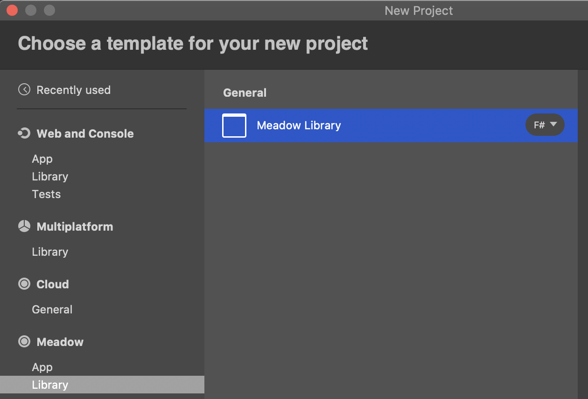
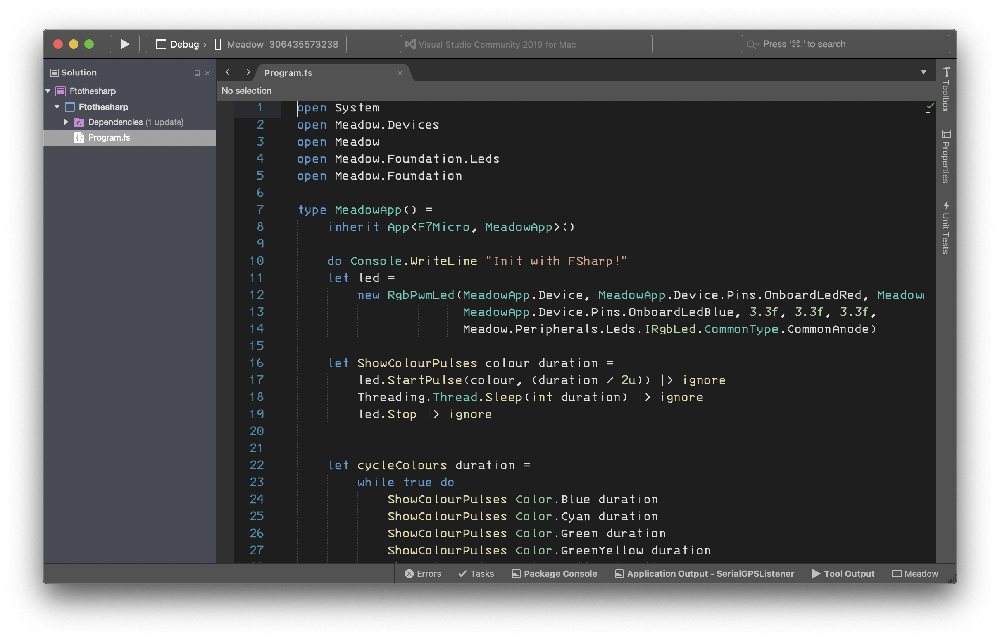
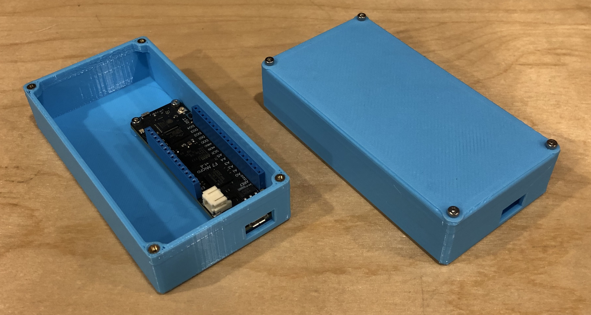
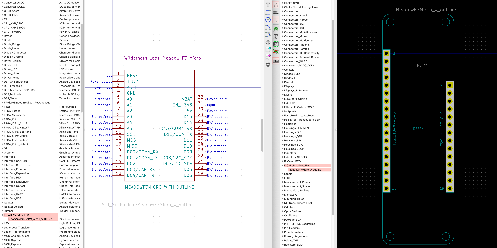

## Beta 3.12

This is a huge release, and is a precursor to `b4.0` while we finish out the last of the network stack.

Improvements and upgrades include:

 * **Garbage Collector tuned up for our MCU.**
 * **Application crasher fix.**
 * **Tons of bug fixes and driver improvements.**
 * **Serial/UART events fixed and a big overhaul with a new way to use serial.**
 * **FilterableObserver changes.**
 * **A cleaned up and expanded Meadow.Core sample repo.**
 * **Piles of new Meadow.Foundation drivers.**
 * **GPS/GNSS NMEA processor overhaul.**
 * **Meadow library project template.**
 * **F# Meadow templates.**
 * **Parametric enclosure.**
 * **Meadow EDA schematic and PCB footprint parts.**

### Updating

This release is cut from the `b4.0` work and requires an OS update as well as IDE extension updates. 
If you're on Windows, it's easy, we've added a one-click upgrade to the extension. However, on macOS 
(and Linux) it's significantly more complicated. We recommend updating on a Windows machine in Visual 
Studio if you have access to one, but the manual steps for macOS and Linux are provided as well.

#### macOS/Linux Manual Instructions

Open a terminal window and execute the following steps. Please note that if you don't have DFU-Util 
installed, you can find instructions on how to install it [here](/Meadow/Getting_Started/Deploying_Meadow/DFU/).

1. Download and unzip the latest [Meadow.OS](http://wldrn.es/latestmeadowos) files.
2. DFU Meadow.OS.bin:  
  `dfu-util -a 0 -S [serial] -D Meadow.OS.bin -s 0x08000000`
3. Reset F7 (press `RST` button).
4. Disable mono (may need to run twice if you get an exception the first time):  
  `mono ./Meadow.CLI/Meadow.CLI.exe -s /dev/tty.usbmodem01 --MonoDisable`
5. Erase flash:  
  `mono ./Meadow.CLI/Meadow.CLI.exe --EraseFlash --KeepAlive`  
   This will take a few minutes. After it says "Bulk erase completed," hit space to exit.
6. Reset F7.
7. Upload new Mono Runtime:  
  `mono ./Meadow.CLI/Meadow.CLI.exe --WriteFile -f Meadow.OS.Runtime.bin --KeepAlive`  
   After "Download success," hit space again.
8. Move the runtime into it's special home on the 2MB partition:  
  `mono ./Meadow.CLI/Meadow.CLI.exe --MonoFlash --KeepAlive`  
   After "Mono runtime successfully flashed," hit space to exit.
9. Reset F7.

### Meadow.OS Improvements

#### Garbage Collector Tuning

The Mono garbage collector that we use in Meadow.OS got a major tune-up, making it much 
more suited for our architecture and use case. You should find that garbage collection 
works far better now than it did before.

#### Application Crash

The dreaded application crash that got introduced a few beta releases back that prevents
Meadow applications from standing up for more than a few minutes has been fixed! As well, with the garbage collector fixes, Meadow apps are now very unlikely to run out of memory. This is the most stable release of Meadow OS to date!

#### Bug Fixes

* [#37 - Threading and event callback lockup](https://github.com/WildernessLabs/Meadow_Issues/issues/37) - Fixed!
* [#62 - Constant 10ms delay when calling Thread.Sleep()](https://github.com/WildernessLabs/Meadow_Issues/issues/62) - Fixed, timer resolution is now 1ms.
* [#67 - RgbPwmLed.StartBlink() does not have accurate timings](https://github.com/WildernessLabs/Meadow_Issues/issues/67) - Fixed, related to timer resolution.
* [#68 - Static class in its own namespace hangs in constructor](https://github.com/WildernessLabs/Meadow_Issues/issues/68) - Fixed. Constructor race condition.
* [#69 - Timer creep](https://github.com/WildernessLabs/Meadow_Issues/issues/69) - Fixed, also related to timer resolution
* [#70 - Assertion at sgen-stw.c:69](https://github.com/WildernessLabs/Meadow_Issues/issues/70) - Fixed as part of the Garbage Collector work.
* [#77 - PWM duration with TimeScale.MicroSecond off by 10µs](https://github.com/WildernessLabs/Meadow_Issues/issues/77) - Fixed, math error. :)
* [#89 - All file system objects appear as files](https://github.com/WildernessLabs/Meadow_Issues/issues/89) - Fixed.
* [#94 - Too many threads cause a crash](https://github.com/WildernessLabs/Meadow_Issues/issues/94) - Fixed! This was a real doozie. 
  We did a major overhaul of the Garbage Collector for this release.

### Meadow.Core Improvements

#### Serial/UART Communications

We did a major overhaul of the UART/Serial Port in Meadow for b4.0. Big changes include:
 * **Serial Port Events Fixed** - Serial port events now work, which enables more efficient 
   communications, without the need for a polling thread.
 * **New `ISerialMessagePort` class** - We fundamentally reworked the way legacy serial 
   communications work, and created an `ISerialMessagePort` class that modernizes them. 
   It's thread-safe and asynchronous by default, and massively simplifies communications
   with serial devices by taking a _message_ approach. We recommend using this class 
   instead of `ISerialPort` for serial communications from now on.
   
For more info, check out the awesome [Serial Communications Guide](/Meadow/Meadow_Basics/IO/Digital/Protocols/UART/).

To see the new `ISerialMessagePort` class at work, check out the [`SerialMessagePort` Sample](https://github.com/WildernessLabs/Meadow.Core.Samples/tree/master/Source/Meadow.Core.Samples/IO/SerialMessagePort).

#### `FilterableObserver` Changes

We renamed `FilterableObserver` to `FilterableChangeObserver`.

We made this naming change because the `FilterableObserver`, as designed, was based on change 
notification and as such had `Old` and `New`  values, along with built in comparison. However, 
it became clear that we should also have a non histrionic version for cases where `Old` and `New` 
had no meaning. In the next beta release we'll likely re-introduce a non-histrionic version of 
`FilterableObserver`.

#### Meadow.Core Samples

We completely re-did the old `Meadow_Samples` repo and renamed it to 
[`Meadow.Core.Samples`](https://github.com/wildernesslabs/Meadow.Core.Samples). The samples are now much better
organized and all updated to the latest `.csproj` format.

### Meadow.Foundation

Meadow.Foundation got a pile of new peripheral drivers, including:

* [PwmLedBarGraph](/docs/api/Meadow.Foundation/Meadow.Foundation.Leds.PwmLedBarGraph.html)
* [Displays.Led.FourDigitSevenSegment](/docs/api/Meadow.Foundation/Meadow.Foundation.Displays.Led.FourDigitSevenSegment.html)
* [Sensors.Location.Gnss.NmeaParsing](/docs/api/Meadow.Foundation/Meadow.Foundation.Sensors.Location.Gnss.NmeaParsing.html)
* [FeatherWings.CharlieWing](/docs/api/Meadow.Foundation/Meadow.Foundation.FeatherWings.CharlieWing.html)
* [FeatherWings.DotstarWing](/docs/api/Meadow.Foundation/Meadow.Foundation.FeatherWings.DotstarWing.html)
* [FeatherWings.GPSWing](/docs/api/Meadow.Foundation/Meadow.Foundation.FeatherWings.GPSWing.html)
* [FeatherWings.LedMatrix8x16](/docs/api/Meadow.Foundation/Meadow.Foundation.FeatherWings.LedMatrix8x16.html)
* [FeatherWings.MotorWing](/docs/api/Meadow.Foundation/Meadow.Foundation.FeatherWings.MotorWing.html)
* [FeatherWings.OLED128x32Wing](/docs/api/Meadow.Foundation/Meadow.Foundation.FeatherWings.OLED128x32Wing.html)
* [FeatherWings.ServoWing](/docs/api/Meadow.Foundation/Meadow.Foundation.FeatherWings.ServoWing.html)
* [ICs.IOExpanders.Is31fl3731](/docs/api/Meadow.Foundation/Meadow.Foundation.ICs.IOExpanders.Is31fl3731.html)
* [ICs.IOExpanders.Pca9685](/docs/api/Meadow.Foundation/Meadow.Foundation.ICs.IOExpanders.Pca9685.html)
* [Leds.Apa102](/docs/api/Meadow.Foundation/Meadow.Foundation.Leds.Apa102.html)
* [Motors.Stepper.A4988](/docs/api/Meadow.Foundation/Meadow.Foundation.Motors.Stepper.A4988.html)
* [Sensors.Atmospheric.Mpl3115a2](/docs/api/Meadow.Foundation/Meadow.Foundation.Sensors.Atmospheric.Mpl3115a2.html)
* [Sensors.Location.MediaTek.Mt3339](/docs/api/Meadow.Foundation/Sensors.Location.MediaTek.Mt3339.html)
* [Sensors.Light.Max44009](/docs/api/Meadow.Foundation/Meadow.Foundation.Sensors.Light.Max44009.html)
* [Sensors.Light.Tsl2591](/docs/api/Meadow.Foundation/Meadow.Foundation.Sensors.Light.Tsl2591.html)
* [Sensors.LoadCell.Hx711](/docs/api/Meadow.Foundation/Meadow.Foundation.Sensors.LoadCell.Hx711.html)
* [Sensors.Radio.Rfid.IDxxLA](/docs/api/Meadow.Foundation/Meadow.Foundation.Sensors.Radio.Rfid.IDxxLA.html)

#### GPS/GNSS NMEA Processing

We did a major overhaul of the NMEA (GPS/GNSS) sentence processing library. In the process we 
re-worked, upgraded, and modernized it. It now handles a wider array of sentence structures, 
is more fault tolerant, has a better API and is easier to add new decoders to.

Check out the [GPS/GNSS NMEA Sentence Processing Library guide](/Meadow/Meadow.Foundation/Libraries_and_Frameworks/Gps_Gnss_Nmea_Processor/)
for more information.

#### PwmLed minor change

We consolidated the logic and code convention across our LEDs drivers in Meadow.Foundation.Core, and when we did, we removed the method `public void StartBlink(uint onDuration = 200, uint offDuration = 200)` which was redundant and we kept `public void StartBlink(uint onDuration = 200, uint offDuration = 200, float highBrightness = 1f, float lowBrightness = 0f)` since its more flexible since you can also change the values of brightness.

### Deployment & Tooling

#### New Meadow Library Templates

We added a new Meadow library project template to both Visual Studio for Windows and Visual Studio 
for Mac. Meadow library projets automatically have the essential Meadow package references and 
SDK type all set:



#### F# Meadow Templates

We've also released F# templates for both Meadow apps and library projects! 

So if you <3 F#, now it's easy to start building Meadow apps with it:



### Other Stuff

#### Parametric Enclosure

Are you building a project and need an enclosure? We've created an easily modifiable enclosure template 
in Fusion 360 that allows you to change variables like length/depth/height, as well as the position of 
Meadow inside, and it'll automatically resize for you:



You can use it as is, or use it as the starting point for more complicated enclosures by adding features.

Check it out at our [3D Print Designs repo](https://github.com/WildernessLabs/3D_Print_Designs).

#### Meadow EDA (Schematic and PCB Footprint) Parts

We've posted schematic symbols, PCB footprints, and 3D files of the Meadow F7 board for use in your own custom
circuit designs. You can find them in our [Meadow_EDA_Parts repo](https://github.com/WildernessLabs/Meadow_EDA_Parts).




## Beta 3.11

Beta 3.11 is a major release that brings a pile of stabilizations and fixes across Meadow.OS, Meadow.Core, and Meadow.Foundation.

### Updating

You'll need to [flash a new Meadow.OS binary to your device](/Meadow/Getting_Started/Deploying_Meadow/), upgrade your IDE extension(s), and if you use the Meadow.CLI, you'll also need to download and use the latest version of that as well. All files can be found on the [downloads](/Meadow/Getting_Started/Downloads/) page.

### Meadow.OS Changes

We reduced the time resolution in the underlying OS to `1ms`, down from `10ms`. This should fix a number of issues where `10ms` delays were happening with calls, and the time functions such as `Stopwatch` were reporting incorrect timings.

### Meadow.Core Changes

* **Improved I2C support in Meadow.Core** - I2C now uses a `Span<byte>` internally and the I2CPeripheral added overloads taking `Span<byte>` params. `Span<T>` was introduced in .NET Core 2.1 and allows I2C comms to be much more efficient in their use of memory.
* **Fixed internal Pull-Up & Pull-Down resistor settings** - `DigitalInputPort` now has working internal pull-up and pull-down resistors.
* **Improved Interrupts** - We implemented a glitch filter and reworked the debounce filter to move it further down the OS stack to operate with less overhead. Docs on glitch filter coming soon.

### Meadow.Foundation Changes

#### Motion Sensor Read/StartUpdating/IObservable fixes

We did a major overhaul to the motion sensor (accelerometers and such) APIs, updating their APIs to match the [`Read()`, `StartUpdating()`, `StopUpdating()` and `IFilterableObservable` pattern](/Meadow/Meadow.Foundation/Working_with_Sensors/) found in the other drivers.

#### Driver Improvement

* **`ITextDisplay`** - Updated the API to work with larger variety of display types, `TextDisplayMenu` coming soon!
* **`RotaryEncoder`** - Is now more responsive when turning quickly 
* **`RgbPwmLed`** - Improved brightness control when setting the color
* **`Max7219`** - Has been updated to support more display configutations when driving 8x8 led arrays
* **`TftSpi` Display Driver** - Improved performance when making partial screen updates  
* **`GraphicsLibrary`** - Performance improvements and several rendering fixes when drawing basic shapes 
* **`Button`** - Long press does not raise click event and is disabled by default

#### `TextDisplayMenu` Draft

TextDisplayMenu prerelease nuget published! You can now leverage the power of TextDisplayMenu in your Meadow projects with any display currently supported in Meadow.Foundation!

## Beta 3.10

Beta 3.10 is a cleanup release to fix several regressions introduced in `b3.8` and `b3.9` due to a mismatch in git submodules that slipped through the cracks and resulted in an awkward build. It's also an opportunity for us to test out our new release pipelines and QA processes, which should lead to greatly increased quality of releases from here forward. Finally, we also unlocked another serial (UART) port on the Meadow, so there are now two accessible serial ports.

### Updating

You'll need to [flash a new Meadow.OS binary to your device](/Meadow/Getting_Started/Deploying_Meadow/), upgrade your IDE extension(s), and if you use the Meadow.CLI, you'll also need to download and use the latest version of that as well. All files can be found on the [downloads](/Meadow/Getting_Started/Downloads/) page.

### Additional Free Serial Port

Previously, `COM1` (pins `D13` and `D12`) was unavailable for use as a serial port because we were outputting debug information from Meadow.OS on that port. However, we've moved that debug stream to USB, freeing that port (and pins) for use. For more information see the [Serial (UART) guide](/Meadow/Meadow_Basics/IO/Digital/Protocols/UART/).

### Bug Fixes

* [#66 - Resources do not work](https://github.com/WildernessLabs/Meadow_Issues/issues/66) - Regression. Fixed.
* [#76 - DateTime.Parse() enters an infinite loop](https://github.com/WildernessLabs/Meadow_Issues/issues/76) - Fixed.
* [#85 - Reading only 0 from serial (UART) receive buffer](https://github.com/WildernessLabs/Meadow_Issues/issues/85) - Regression. Fixed.
* [#86 - b3.9 UART issues](https://github.com/WildernessLabs/Meadow_Issues/issues/86) - Regression. Fixed.
* [#88 - Board works only if plugged in USB socket](https://github.com/WildernessLabs/Meadow_Issues/issues/88) - Regression. Fixed.

### Meadow Foundation

This release includes bug fixes and performance improvements in several drivers.

#### Bug Fixes

* **GraphicsLibrary** - We fixed a bug when  vertical and horizontal lines were drawn 1 pixel too short.
* **Analog Temperature Sensors** - We merged two pull-requests fixing analog temperature sensor calculation. Thanks to [James Fraser](https://github.com/jbfraser1) for the fixes.

#### Other Improvements

* **CharacterDisplay** - We improved error checking and gracefull handle long strings.

## Beta 3.9

`b3.9` is a minor release that adds more API stability, fixes some things we broke in `b3.8`, and adds some new features, including exposing the Real-Time-Clock on Meadow.

### Updating

You'll need to [flash a new Meadow.OS binary to your device](/Meadow/Getting_Started/Deploying_Meadow/), upgrade your IDE extension(s), and if you use the Meadow.CLI, you'll also need to download and use the latest version of that as well. All files can be found on the [downloads](/Meadow/Getting_Started/Downloads/) page.

### New Features & Changes

#### Real-Time-Clock Setting

We've exposed an API to set the system clock:

```csharp
//Set the current date and time to March 30, 2020 at 12pm
Device.SetClock(new DateTime(2020, 3, 30, 12, 0, 0));
//Can now use DateTime.Now and the RTC will accurately mainting the correct time
Console.WriteLine($"Today is: {DateTime.Now}");
```

As long as the board is continuously powered, the clock will retain its time. Check out the [power guide](/Meadow/Meadow_Basics/IO/Power/) for more information on keeping the clock active.

### Bug Fixes

* [#81 - Feature request: serial buffer overrun event](https://github.com/WildernessLabs/Meadow_Issues/issues/81) - Added!
* [#79 - PWM.Period cannot be set when TimeScale is different from Seconds](https://github.com/WildernessLabs/Meadow_Issues/issues/79) - Fixed.
* [#78 - PWM Channel info is null](https://github.com/WildernessLabs/Meadow_Issues/issues/78) - Fixed. 
* [#71 - Unhandled exceptions do not output information to the Console](https://github.com/WildernessLabs/Meadow_Issues/issues/71) - Fixed. We added exception handling to the `App` class, so they should catch most things. 
* [#61 - Meadow Serial Communication not working](https://github.com/WildernessLabs/Meadow_Issues/issues/61) - Fixed. We broke this in the last build. Ooops. Someday we'll have integration tests that run on hardware to catch things like this.
* [#29 - Pin D04 as DigitalOutputPin is not responsive when pin D03 is setup as PWM.](https://github.com/WildernessLabs/Meadow_Issues/issues/29) - Fixed with hacky workaround. This issue is because of the underlying funkiness of the NuttX API. We've implemented a workaround for it for now. Long term, we'll need to revisit this.

### Meadow.Foundation

We've added a new driver for the Veml7700 light sensor and improved the performance of the Max7219 driver. You can find an example of the Max7219 in action in the [Meadow Samples GitHub repo](https://github.com/WildernessLabs/Meadow_Samples/tree/master/Source/MeadowSamples/Meadow.Foundation/Tetris).

## Beta 3.8 

This is another point release but it gets us another step closer to `b4.0`. The `b3.8` release adds further API stabilization and functionality, specifically focusing on I2C and SPI. This release also takes advantage of the performance increases from `b3.7` to unlock more drivers, including a couple of exciting input peripherals: `AnalogJoystick` and `RotaryEncoder`.

### Updating

You'll need to [flash a new Meadow.OS binary to your device](/Meadow/Getting_Started/Deploying_Meadow/), upgrade your IDE extension(s), and if you use the Meadow.CLI, you'll also need to download and use the latest version of that as well. All files can be found on the [downloads](/Meadow/Getting_Started/Downloads/) page.

### Bug Fixes

* [#65 - Feature request : SPI reading/writing ushorts without address](https://github.com/WildernessLabs/Meadow_Issues/issues/65) - This was actually two parts. One was adding an overload to allow `ushorts`, the other part was making it possible to do 16-bit words in SPI. Now you can write words of any length.
* [#63 - I2C frequencies not correct](https://github.com/WildernessLabs/Meadow_Issues/issues/63) - This wasn't so much a bug, but we made the frequency setting make some more sense.
* [#55 - Feature request : SPI frequency change](https://github.com/WildernessLabs/Meadow_Issues/issues/55) - Ok, hopefully this is fixed for real this time. :)
* [#22 - I2C Frequency cannot be set.](https://github.com/WildernessLabs/Meadow_Issues/issues/22) - Fixed again. :)

### Meadow.Foundation

There's continued improvement of driver features and stability as well as a handful of new peripheral drivers.

#### New Peripheral Drivers

We've published eight new drivers:

* [AnalogJoystick](/docs/api/Meadow.Foundation/Meadow.Foundation.Sensors.Hid.AnalogJoystick.html)
* [Sensors.Rotary.RotaryEncoder](/docs/api/Meadow.Foundation/Meadow.Foundation.Sensors.Rotary.RotaryEncoder.html)
* [Sensors.Rotary.RotaryEncoderWithButton](/docs/api/Meadow.Foundation/Meadow.Foundation.Sensors.Rotary.RotaryEncoderWithButton.html)
* [ICs.IOExpanders.Mcp23x08](/docs/api/Meadow.Foundation/Meadow.Foundation.ICs.IOExpanders.Mcp23x08.html)
* [Displays.Ssd1309](/docs/api/Meadow.Foundation/Meadow.Foundation.Displays.Ssd1309.html)
* [Sensors.Temperature.Lm75](/docs/api/Meadow.Foundation/Meadow.Foundation.Sensors.Temperature.Lm75.html)
* [Sensors.Power.Ina260](/docs/api/Meadow.Foundation/Meadow.Foundation.Sensors.Power.Ina260.html)
* [Transceivers.SX127x](/docs/api/Meadow.Foundation/Meadow.Foundation.Transceivers.SX127x.html)

### New Power Guide

We added a [guide on Power IO](/Meadow/Meadow_Basics/IO/Power/) that explains the options for powering the board, battery charging, solar, and more.

## Beta 3.7

Though this is a point release, it's actually cut from the `b4.0` work, and represents a significant Meadow upgrade. It continues the API stabilization and bug fixes started in `b3.6`, but also includes major performance increases, an up-to-date Mono runtime (with pre-cursor support for Core 3.x), and a pile of new Meadow.Foundation drivers that were unlocked by both the performance improvements and IO bug fixes.

### Updating

You'll need to [flash a new Meadow.OS binary to your device](/Meadow/Getting_Started/Deploying_Meadow/), upgrade your IDE extension(s), and if you use the Meadow.CLI, you'll also need to download and use the latest version of that as well. All files can be found on the [downloads](/Meadow/Getting_Started/Downloads/) page.

### Performance Improvements

We enabled various low-level caching mechanisms available on the F7 chip and fixed some long-outstanding memory bugs that were preventing their use up until this point. With these fixes and optimizations, we're able to realize one to two magnitudes of performance increases across various aspects of execution. The most significant being in IO access, which saw an `8,600%` increase since `b3.6`. However, we also saw significant improvement in general execution, as well. The following charts were created from the [Meadow Performance Benchmarking application](https://github.com/WildernessLabs/Meadow_Performance_Benchmarks) readme data:

<iframe width="600" height="371" seamless frameborder="0" scrolling="no" src="https://docs.google.com/spreadsheets/d/e/2PACX-1vR6LF3jduievLwj3H_JNeO_yFrX3NewR8bAijKCfVsKTOTRuyfdNzvpPdNN0MWrP5-eaAxaRVFu0rn3/pubchart?oid=2104450466&amp;format=interactive"
style="width: -webkit-fill-available;"></iframe>
 
<iframe width="600" height="371" seamless frameborder="0" scrolling="no" src="https://docs.google.com/spreadsheets/d/e/2PACX-1vR6LF3jduievLwj3H_JNeO_yFrX3NewR8bAijKCfVsKTOTRuyfdNzvpPdNN0MWrP5-eaAxaRVFu0rn3/pubchart?oid=103861413&amp;format=interactive"
style="width: -webkit-fill-available;"></iframe>


<iframe width="600" height="371" seamless frameborder="0" scrolling="no" src="https://docs.google.com/spreadsheets/d/e/2PACX-1vR6LF3jduievLwj3H_JNeO_yFrX3NewR8bAijKCfVsKTOTRuyfdNzvpPdNN0MWrP5-eaAxaRVFu0rn3/pubchart?oid=2010951639&amp;format=interactive"
style="width: -webkit-fill-available;"></iframe>

<iframe width="600" height="371" seamless frameborder="0" scrolling="no" src="https://docs.google.com/spreadsheets/d/e/2PACX-1vR6LF3jduievLwj3H_JNeO_yFrX3NewR8bAijKCfVsKTOTRuyfdNzvpPdNN0MWrP5-eaAxaRVFu0rn3/pubchart?oid=867053354&amp;format=interactive"
style="width: -webkit-fill-available;"></iframe>

**Overall, since `b3.5`, IO writes have gotten `318x` faster. And since the last beta, general operation execution speed is `4-8x` faster.** 

These improvements made several additional Meadow.Foundation drivers practical, now that execution speed can handle them. 

### Meadow Deployment

We made a number of optimizations to the CLI, including making deployment much more robust.

We also merged the OS binaries into a single binary.

### Bug Fixes

This release is a major leap in API stability. We closed nearly all of the open bugs around the IO API, including:

* [#5 - Calling DateTime.Now causes exception](https://github.com/WildernessLabs/Meadow_Issues/issues/5) - Fixed.
* [#18 - PushButton only works with constructor where Device is passed.](https://github.com/WildernessLabs/Meadow_Issues/issues/18) - Fixed. There was a code issue in the driver itself, the underlying IO was working as expected.
* [#21 - Issues with multiple buttons](https://github.com/WildernessLabs/Meadow_Issues/issues/21) - Fixed. 
* [#22 - I2C Frequency cannot be set.](https://github.com/WildernessLabs/Meadow_Issues/issues/22) - Fixed. We made it public. Was a silly API mistake.
* [#43 - Issues with Multiple Analog Inputs](https://github.com/WildernessLabs/Meadow_Issues/issues/43) - Fixed. Multiple analog inputs now work, as expected.
* [#48 - PwmPorts on D11 and D13 are linked together](https://github.com/WildernessLabs/Meadow_Issues/issues/48) - Fixed.
* [#50 - SpiPeripheral.ReadRegister always returns 0](https://github.com/WildernessLabs/Meadow_Issues/issues/50) - Fixed.
* [#55 - Feature request : SPI frequency change](https://github.com/WildernessLabs/Meadow_Issues/issues/55) - Fixed; you can now change the configuration after constructing, including frequency and polarity.
* [#56 - Setting PWM frequency on D13 changed D12](https://github.com/WildernessLabs/Meadow_Issues/issues/56) - This is fixed. We did an overhaul of the checks during this API call. PWMs on the same timer must have the same frequency, though their duty cycle can differ. We now throw an exception if you try and create two PWM channels on the same timer using different frequencies.
* [#57 - Console.WriteLine output disappearing](https://github.com/WildernessLabs/Meadow_Issues/issues/57) - Fixed. We re-architected and re-implemted how the output gets passed from Meadow to the CLI, and it's much cleaner, simpler, and hopefully, works better.
* [#58 - Can't deploy due to HCOM thread starvation](https://github.com/WildernessLabs/Meadow_Issues/issues/58) - At least partially fixed. This issue cropped up for folks on a second deploy, where they were unable to deploy or even make CLI calls. The thread that listens for the CLI wasn't responding. The workaround was to reset the board and then immediately make a call to recreate the file system via the CLI. It seems to be more or less fixed now, though we have some additional improvements on the plate for the future.

#### Known Issues

With that said, there are still three bugs that we were hoping to squish, but did not:

* [#29 - Pin D04 as Digital Output is not responsive when pin D03 is setup as PWM](https://github.com/WildernessLabs/Meadow_Issues/issues/29)
* [#59 - Multiple inputs trigger duplicate/incorrect interrupts](https://github.com/WildernessLabs/Meadow_Issues/issues/59)
* [#37 - Threading and event callback lockup ](https://github.com/WildernessLabs/Meadow_Issues/issues/37)

### Meadow.Foundation

This is a big update, there are numerous improvements and fixes across published drivers. 

#### New Peripheral Drivers

As well, we've published 13 new drivers via NuGet:

* [ICs.EEPROM.AT24C](/docs/api/Meadow.Foundation/Meadow.Foundation.ICs.EEPROM.At24Cxx.html)
* [ICs.IOExpanders.x74595](/docs/api/Meadow.Foundation/Meadow.Foundation.ICs.IOExpanders.x74595.html)
* [RTCs.Ds323x](/docs/api/Meadow.Foundation/Meadow.Foundation.RTCs.Ds323x.html)
* [Sensors.Atmospheric.Bmp085](/docs/api/Meadow.Foundation/Meadow.Foundation.Sensors.Atmospheric.Bmp085.html)
* [Sensors.Atmospheric.Bmp180](/docs/api/Meadow.Foundation/Meadow.Foundation.Sensors.Atmospheric.Bmp180.html)
* [Sensors.Atmospheric.Dht10](/docs/api/Meadow.Foundation/Meadow.Foundation.Sensors.Atmospheric.Dht10.html)
* [Sensors.Atmospheric.Dht12](/docs/api/Meadow.Foundation/Meadow.Foundation.Sensors.Atmospheric.Dht12.html)
* [Sensors.Atmospheric.Ms5611](/docs/api/Meadow.Foundation/Meadow.Foundation.Sensors.Atmospheric.Ms5611.html)
* [Sensors.Environmental.Ags01Db](/docs/api/Meadow.Foundation/Meadow.Foundation.Sensors.Environmental.Ags01Db.html)
* [Sensors.Light.Bh1745](/docs/api/Meadow.Foundation/Meadow.Foundation.Sensors.Light.Bh1745.html)
* [Sensors.Light.Bh1750](/docs/api/Meadow.Foundation/Meadow.Foundation.Sensors.Light.Bh1750.html)
* [Sensors.Light.Temt6000](/docs/api/Meadow.Foundation/Meadow.Foundation.Sensors.Light.Temt6000.html)
* [Sensors.Motion.ADXL362](/docs/api/Meadow.Foundation/Meadow.Foundation.Sensors.Motion.Adxl362.html)
* [Sensors.Motion.Hcsens0040](/docs/api/Meadow.Foundation/Meadow.Foundation.Sensors.Motion.Hcsens0040.html)


## Beta 3.6

This release is focused on quality and stabilization. It's mostly bug fixes, API stabilization, and new drivers based on that work. This is also just the first part of this work. We have a number of additional bug fixes that were originally due for b3.6, but there are so many good things already in this, we decided not to wait until they were all in and instead break it up into multiple releases, so there will likely be a b3.7 release soon as well.

### Bug Fixes

* [#45 - Typos in DigitalChannelIInfoBase](https://github.com/WildernessLabs/Meadow_Issues/issues/45) - Fixed typos in the API.
* [#42 - Device.CreateAnalogInputPort() prints debug messages](https://github.com/WildernessLabs/Meadow_Issues/issues/42) - Got rid of the debug output.
* [#35 - SPI Exception when calling ReadRegister](https://github.com/WildernessLabs/Meadow_Issues/issues/35) - Fixed. `SpiPeripheral` got reworked.
* [#26 - `PwmPort.From` does not show friendly error when the target pin doesn't support pwm](https://github.com/WildernessLabs/Meadow_Issues/issues/26) - Proper error checks now.
* [#24 - Get Build Date with version](https://github.com/WildernessLabs/Meadow_Issues/issues/24) - Fixed. Returns both the proper version and build date/time now.
* [#20 - DigitalInputPortEventArgs.Value always returns false](https://github.com/WildernessLabs/Meadow_Issues/issues/20) - `Value` now returns the actual post-event value
* [#19 - DigitalInputPortEventArgs - Rename Value to State To Be Consistent with pin properties](https://github.com/WildernessLabs/Meadow_Issues/issues/19) - Fixed. Now uses the `State` property.

### Performance Improvements

While Meadow.OS is still slow overall, due to the fact that we're running .NET code in interpreted mode (as opposed to compiled via Just-in-Time (JIT) or Ahead-of-Time (AoT) compilation), we did optimize some things within Meadow.Core, and realized `~380%` speed increase in digital output writes. In running the [Meadow Performance Benchmarking application](https://github.com/WildernessLabs/Meadow_Performance_Benchmarks), digital output writes went from `~16ms` to `~4ms`, which, while still slow, is a major improvement.

AoT compilation (which should give us at least two magnitudes of performance improvement) is still schedule for b4.0.

### Meadow.Foundation Fixes and New Drivers

#### Changes

We fixed the following drivers:

* `PwmLed` - Pulse now works without blinking.
* `RgbPwmLed` - Pulse and colors now work without blinking. Also, we fixed it to work with common anode LEDs, so it now works with the onboard LED.
* `PushButton` - Resistor stuff now works. 

#### New Peripheral Drivers

This is a big update, there are numerous improvements and fixes across published drivers. 

As well, we've published 14 new drivers via NuGet:
* [PCD8544 LCD display controller](/docs/api/Meadow.Foundation/Meadow.Foundation.Displays.Pcd8544.html)
* [MAX7219 led display controller](/docs/api/Meadow.Foundation/Meadow.Foundation.Displays.Max7219.html)
* [TM1637 led display controller](/docs/api/Meadow.Foundation/Meadow.Foundation.Displays.Tm1637.html)
* [ULN2003 stepper motor controller](/docs/api/Meadow.Foundation/Meadow.Foundation.Motors.Stepper.Uln2003.html)
* [HIH6130 I2C temperature and humidity sensor](/docs/api/Meadow.Foundation/Meadow.Foundation.Sensors.Atmospheric.Hih6130.html)
* [HTU21D I2C temperature and humidity sensor](/docs/api/Meadow.Foundation/Meadow.Foundation.Sensors.Atmospheric.Htu21d.html)
* [SI70xx I2C temperature and humidity sensor](/docs/api/Meadow.Foundation/Meadow.Foundation.Sensors.Atmospheric.Si70xx.html)
* [ALS-PT19-315C light sensor](/docs/api/Meadow.Foundation/Meadow.Foundation.Sensors.Light.Alspt19315C.html)
* [ADXL335 Analog triple axis, +/-3g accelerometer](/docs/api/Meadow.Foundation/Meadow.Foundation.Sensors.Motion.Adxl335.html)
* [ADXL337 Analog triple axis, +/-3g accelerometer](/docs/api/Meadow.Foundation/Meadow.Foundation.Sensors.Motion.Adxl337.html)
* [ADXL345 I2C triple axis accelerometer, +/-16g accelerometer](/docs/api/Meadow.Foundation/Meadow.Foundation.Sensors.Motion.Adxl345.html)
* [ADXL377 Analog triple axis, +/-200g accelerometer](/docs/api/Meadow.Foundation/Meadow.Foundation.Sensors.Motion.Adxl377.html)
* [BNO055 I2C 9-Axis absolute orientation sensor](/docs/api/Meadow.Foundation/Meadow.Foundation.Sensors.Motion.Bno055.html)
* [TMP102 I2C temperature sensor](/docs/api/Meadow.Foundation/Meadow.Foundation.Sensors.Temperature.Tmp102.html)

### Meadow.CLI Fixes, Updates, and Open-Sourcing

Most of the Meadow.CLI changes involve more complete information being returned by Meadow. Previously, Meadow only returned text strings. Now it returns more structured information and is more stable. Some of these changes will become important in future releases. One new command was added, `RenewFileSys`. This command recreates a new, empty file system.

#### Open Sourced

Also, we open-sourced the [Meadow.CLI](https://github.com/WildernessLabs/Meadow.CLI) code. Some of the code is ugly. We know. :)

### Samples and Documentation 
We've updated and standardized all of the sample projects in Meadow.Foundation to match the latest template. And we've invested heavily in our docs, you'll notice we've added details and wiring diagrams for most of our peripheral docs.

### Updating

You'll need to flash new Meadow.OS binaries to your device, upgrade your IDE extension(s), and if you use the Meadow.CLI, you'll also need to download and use the latest version of that as well. All files can be found on the [downloads](/Meadow/Getting_Started/Downloads/) page.

## Beta 3.5

This is quite a big release with new features, including UART, and a major overhaul to Meadow.Foundation. We also launched a new developer site and added docs for Meadow.CLI.

### Serial/UART

Meadow now has Serial/UART support! Check out the new [UART guide](/Meadow/Meadow_Basics/IO/Digital/Protocols/UART/) for all the details!

### Better Digital Protocol Errs

As part of the Serial work, we also improved error messaging across all the digital protocols (I2C, SPI, UART). We now get an actual linux error number back when things go wrong. Those error numbers still need to be looked up online to make sense of them, but before we were only getting `-1` when something wrong. There's still work to be done here, though. We plan on recreating common failures, mapping their errors, and generally trying to provide better guidance.

### I2C Speed Setting

You can now set the speed of the I2C bus. Somehow we missed this when we launched the I2C feature.

### Meadow.CLI Docs

We've published a [guide for the Meadow.CLI (Command Line Interface)](/Meadow/Meadow_Basics/Meadow_CLI/).

### Meadow.Foundation

#### `Read()`, `StartUpdating()`, and `StopUpdating` Sensor Pattern

Meadow.Foundation got a major sensor overhaul for b3.5, including the new `Read()`, `StartUpdating()`, and `StopUpdating()` pattern for sensor reads. We also published a new [Working with Sensors in Meadow.Foundation](/Meadow/Meadow.Foundation/Working_with_Sensors/) guide that is recommended reading, and explains the new pattern.

#### Display Updates

We've added new features to `GraphicsLibrary`:
- two new large pixel fonts: 12x16 and a 12x20
- new `Rotation` property allows screen rotation on any display (even if the driver doesn't support it directly)
- smarter drawing calls, allows more optimizations to be performed by the display driver

SPI display driver performance:
- drivers share a buffer with SPI bus under-the-hood, this reduces memory usage and should help performance
- drivers now caches color values to reduce conversions from 24bit color to display-specific values
- automatic partial screen updates (when possible) to reduce drawing time

Better display support:
- fixes to improve display support across several drivers including support for the 135x240 varient of the ST7789 display
- re-write of the ePaper display drivers to expand supported displays and make it easier to identify the correct driver

### New Developer Site

You're looking at it! We took our beta-developer site live, with the hot new redesign, and of course, Meadow docs! The whole site has been redesigned, including the API docs, which also got a major information architecture overhaul.

### Updating

To use this new beta, you'll need to reflash your board with the [latest Meadow.OS binaries](http://wldrn.es/latestmeadowos), as well as update your IDE extensions.

## Beta 3.4

This is another small release that expands the SPI capabilities, adds robustness to the IDE extensions, and sees some more things open-sourced.

### Advanced SPI Configuration

When using SPI, you can now have control over advanced configuration such as speed, clock polarity, and phase. This adds the ability to use more SPI peripherals, such as the OLED display included in the Hack Kit Pro, and NeoPixels!

To use the new SPI configurations, simply pass them in during construction:

```csharp
Device.CreateSpiBus(
    Device.Pins.SCK,
    Device.Pins.MOSI,
    Device.Pins.MISO,
    new SpiBus.ClockConfiguration(4000, SpiBus.Mode.Mode2));
```

You can also change configurations during runtime.

#### ST7789 OLED Display Meadow.Foundation Driver

Along with the configuration options, we've also released a [Meadow.Foundation driver for the state ST7789 OLED display](http://developer.wildernesslabs.co/docs/api/Meadow.Foundation/Meadow.Foundation.Displays.Tft.ST7789.html) included in the Hack Kit Pro:


 
### Visual Studio IDE Extensions Open-Sourced

We've open sourced the Visual Studio Meadow extensions! We're slowly working towards open sourcing all of the Meadow tooling, but we need to clean a lot of it up first, so this is the first step.

You can find the source code in the following repos:

 * [VS Windows Meadow Extension Repo](https://github.com/WildernessLabs/VS_Win_Meadow_Extension) - **Note**: this will be opened by October 28th, 2019 @ 6p PT. We're cleaning code.
 * [VS Mac Meadow Extension Repo](https://github.com/WildernessLabs/VS_Mac_Meadow_Extension)

### Meadow.CLI and Visual Studio Extension Enhancements

We've also made some updates to the Meadow.CLI to enable the IDE extensions to check for updates to files already deployed on the Meadow device. 

#### Meadow.CLI Updates

There is a new command, `--ListFilesAndCrcs`, that lists files as well as the [CRC values](https://en.wikipedia.org/wiki/Cyclic_redundancy_check) for each of the files.

#### IDE Extension Enhancements

With the CLI returning CRC values, the IDE extensions now check to see if any files need updating when deploying. This solves an issue where if a dll such as Meadow.Foundation.dll had already been deployed to the device, and a newer version existed in the project, it wouldn't get updated. 

### Updating

To use this new beta, you'll need to reflash your board with the [latest Meadow.OS binaries](http://wldrn.es/latestmeadowos), as well as update your IDE extensions.

## Beta 3.3

This is a small release with some sundry fixes:

* **Multiple PWMs** - We fixed a bug where only one or two PWM channels would be active at one time. With this bug fix, you will now have full multi-PWM access, enabling things like the onboard LED to do full color spectrum.
* **Analog IObservable** - These now work. They actually worked all along, but our sample was using `Debug.WriteLine()` which doesn't currently work (`Console.WriteLine()` is fine).
* **VS Extension Updates** - We've made some sundry fixes to the Meadow project templates. Meadow.Foundation is now linked by default, and **File** > **New** > **Meadow App** now creates an app that walks the color hue spectrum on the onboard LED.

To use this new beta, you'll need to reflash your board with the [latest Meadow.OS binaries](http://wldrn.es/latestmeadowos), as well as update your IDE extensions.

**Note:** Meadow.Core updates also require the latest `Meadow.dll` be deployed to your Meadow. Currently, the IDE extensions will not update this dll if it's already on your board, so you'll need to manually delete it via the CLI, via the following command:

```bash
MeadowCLI.exe -s [NameOfSerialPort] --DeleteFile --TargetFileName Meadow.dll
```

Make sure to replace `[NameOfSerialPort]` with the serial port name of your device. Once deleted, the IDE extensions will automatically re-deploy with the latest bits.

## Beta 3.2

### New File System

We upgraded the file system that Meadow uses to LittleFS; which has the distinct advantage of initializing and formatting in seconds, as opposed to the 15-20 minutes of the last file system we were using.

Now, after when you deploy Meadow.OS, the first startup should be very fast, and you won't need to wait for the flash to format.

To upgrade, you'll need to [flash the latest version of Meadow.OS](/Meadow/Getting_Started/Deploying_Meadow/) to your device.

### Basic Analog Input is Up

We got basic [analog](/Meadow/Meadow_Basics/IO/Analog/) input ports working on pins `A0` through `A3`. To read an analog input value, create an [`AnalogInputPort`](/docs/api/Meadow/Meadow.Hardware.AnalogInputPort.html) on one of those pins and call the [`Read()`](/docs/api/Meadow/Meadow.Hardware.AnalogInputPort.html#Meadow_Hardware_AnalogInputPort_Read_System_Int32_System_Int32_) method. 

Note that advanced `IObservable` and events do not work at this time.

To use analog inputs, make sure you update the `Meadow.Core` nuget packages in your projects.

### Debug Output on Visual Studio for Windows

`Console.WriteLine()` calls are now being forwarded to a Meadow output window in Visual Studio on Windows, enabling basic debug output. Make sure to upgrade your Meadow Visual Studio extension to get support.

### Meadow.CLI Updates

In order to be compatible with the file system changes, the `Meadow.CLI` has also been updated. Make sure download and use the [new binaries](http://wldrn.es/latestmeadowcli).

## Beta 3.1

### SPI

We got [SPI](/Meadow/Meadow_Basics/IO/Digital/Protocols/SPI/) validated and merged. We’re excited to get this out, as we know that several of you are working on integrations that require SPI. To use it, you’ll need to flash your Meadow board with the [latest OS firmware binaries](http://wldrn.es/latestmeadowos).

### Visual Studio Extension

Our project template is now included enabling the creation of new Meadow Apps within Visual Studio, [check out the update](/Meadow/Getting_Started/Hello_World/). Debugging remains unavailable, but the console app gracefully exists.

### Meadow.CLI
Now available for [download](http://wldrn.es/latestmeadowcli).

<hr />

## Beta 3

Beta 3 is here, and it's awesome! This is the biggest release we've done yet and is the first beta that makes Meadow truly productive. We're excited to get it in your hands.

### New Core Features

* USB Deployment
* PWM, I2C

#### USB Deployment

Wahoo!! No more painful JTAG deployment, deploying your app is now a cinch via the USB deployment feature.

##### Meadow.CLI

We've created a _Command Line Interface_ for meadow that allows you to deploy a Meadow application to a Meadow device over USB. Check out the guide on how to [Deploy Meadow OS to your Board](/Meadow/Getting_Started/).

#### Visual Studio Windows and Mac Extensions

Say hello to productivity! That's right, we now have extensions for [Visual Studio](https://marketplace.visualstudio.com/items?itemName=WildernessLabs.vsmeadow01) and [Visual Studio for Mac](https://addins.monodevelop.com/Project/Index/394) to deploy apps. To get up and running, check out [Hello, World; Meadow-style](/Meadow/Getting_Started/).

#### Digital Outputs and Protocols

##### [Pulse-Width-Modulation (PWM)](/Meadow/Meadow_Basics/IO/Digital/PWM/)

PWM is now live! Along with it, PwmLed, RgbPwmLed, Servo Core, etc.

```
IPwmPort pwm = Device.CreatePwmPort(
    pin: Device.Pins.D05, 
    frequency: 100, 
    dutyCycle: 0.5f);
pwm.Start();
```

##### [Inter-Integrated Circuits (I2C)](/Meadow/Meadow_Basics/IO/Digital/Protocols/I2C/)

The I2C protocol is also available in our latest Meadow OS.

```
II2cBus i2c = Device.CreateI2cBus();
GY521Test(i2c); // Pass i2c to an I2C capable device
```

### Fixed Bugs

* [Pull-up and Pull-Down resistors don't work](https://github.com/WildernessLabs/Meadow_Issues/issues/6) - Fixed. You no longer need external PU/PDs, you can use the internal ones.
* [Tasks Behave Strangely](https://github.com/WildernessLabs/Meadow_Issues/issues/2) - This was just an error in the sample. Thanks [Ryan Davis](https://github.com/rdavisau) for the fix.
* [BiDirectionPort doesn't work](https://github.com/WildernessLabs/Meadow_Issues/issues/9) - Works now! Thanks to [Adam Patridge](https://github.com/patridge) for pointing it out. We regressed the API right before beta 2 release.
* [`AnalogInputPort`](https://github.com/WildernessLabs/Meadow_Issues/issues/7) readings are not correct. - Fixed this was a hardware issue. [TODO: Verify]

### Known Issues

* Meadow runtime is slow. For instance, we're currently only able to get about 30-40hz out of the `SoftPwmPort`. There's still a lot of debug code, so this will get much faster in future releases.
* `GlitchFilterCycleCount` is not implemented in `DigitalInputPort`. This is coming soon.
* [`Debug.Write` calls don't output to the console](https://github.com/WildernessLabs/Meadow_Issues/issues/3) - Workaround is to use `Console.Write` calls.
* [Serial Peripheral Interface (SPI)](/Meadow/Meadow_Basics/IO/Digital/Protocols/SPI/) - not working as expected, investigating.
