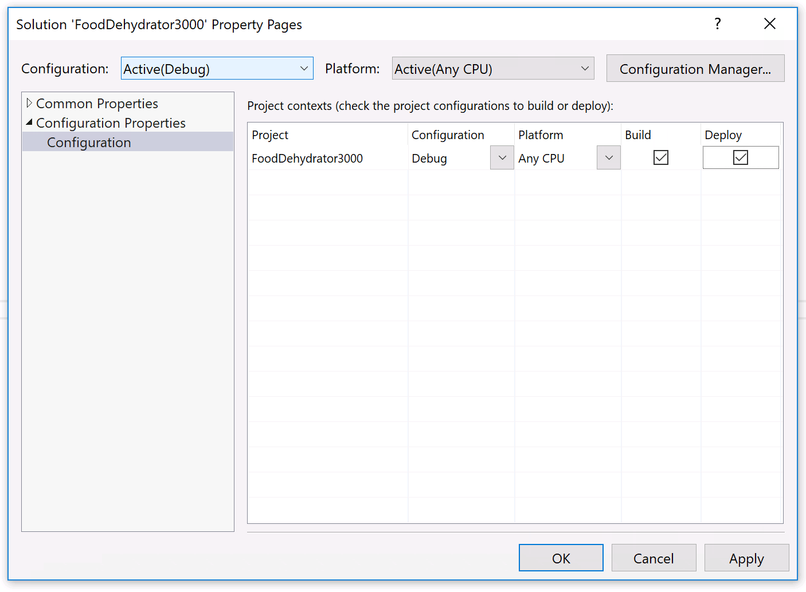

# Info


## Runtime Errors

### App doesn't run or `No entrypoint found!` message

If you deploy your app and a `No entrypoint found!` message is displayed in the **Output Window**, or the app doesn't run, this could be because of a Visual Studio bug where the "deploy" option in the solution configuration has become un set.

#### Fix

Right-click on the solution and choose **properties**. In the **Configuration Properties** section, make sure **Deploy** is checked:



### `Resolve: unknown type: System.Diagnostics.DebuggerBrowsableState`

Right after deployment, your application fails to execute and this error show up in the **Output** window:

```
Resolve: unknown type: System.Diagnostics.DebuggerBrowsableState
Error: ff000000
```

This is a bug in the Roslyn compiler that showed up in VS 2015 (it doesn't express itself in VS 2013).

#### Fix

To fix, add a file called `DebuggerBrowsableState.cs` to your project with the following code in it:

```csharp
namespace System.Diagnostics
{
    public enum DebuggerBrowsableState
    {
        Never = 0,
        Collapsed = 2,
        RootHidden = 3
    }
}
```
