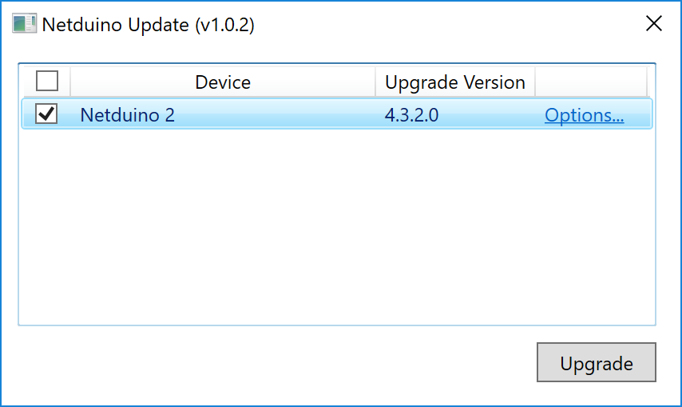
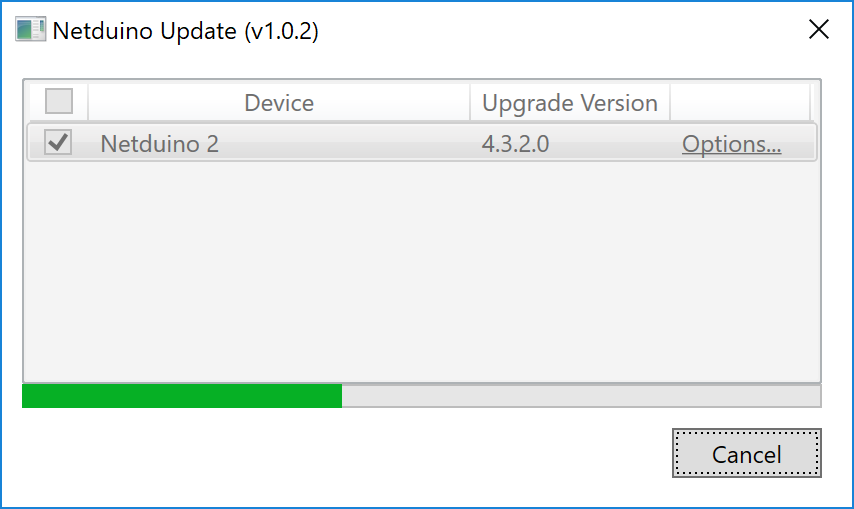
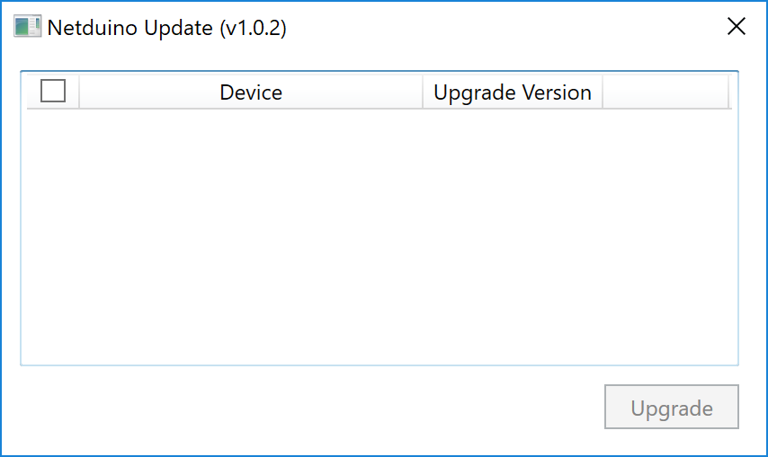

Ensuring that your Netduino has the latest firmware means that it will be up to date with the current Netduino-specific .NET Micro Framework runtime. Additionally, unless your Netduino has the latest firmware, you may have issues deploying your application to it.

Instructions are OS specific:

 * **[Windows Instructions](#windows)**
 * **[Mac Instructions](#mac)**

## Windows

 1. Download and launch the [Netduino Updater](https://www.wildernesslabs.co/downloads?f=/Netduino_SDK/NetduinoUpdate_4.3.2.3.zip) application.
 2. While your Netduino is unplugged, hold down the button and then plug it in, to put it into _DFU Bootloader Mode_:
 
 3. Your Netduino should show up in the list device list, click the checkbox next to it and click the **Upgrade** button:
 
 4. Netduino updater will automatically install the latest firmware:
 
 5. When it's done, the Netduino will be rebooted and so it should no longer show up in the devices list.
 

## Mac

 1. While your Netduino is unplugged, hold down the button and then plug it in, to put it into _DFU Bootloader Mode_:

 2. Launch the _Netduino Mac Deploy_ (available from the [downloads](../Downloads/) page):
 3. Click the `Install Firmware` button, firmware should install:
 
 
### Manual Installation of Firmware from .hex or .s19 files

The Mac Firmware tool also enables manual firmware deployment:

 1. Follow steps 1 & 2 above.
 2. Click the `Choose` button, and select either the `.hex` or `.s19` `ER_CONFIG` and `ER_FLASH` files:
 
 3. Click `Deploy` and it should deploy the firmware:
 
