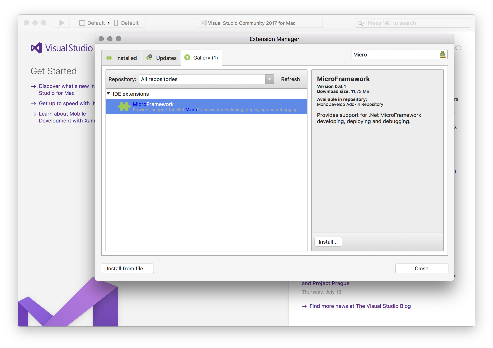

## Instructions

Download and install the latest [Visual Studio for Mac](https://www.visualstudio.com/vs/visual-studio-mac/) or [Xamarin Studio](http://www.monodevelop.com/download/)

Launch Visual Studio for Mac and install the NETMF plug-in:

1. Open the *Visual Studio* menu and select *Extensions*. Note, for Xamarin Studio users, the menu item is called *Add-ins...*.
2. Select the *Gallery* Tab.
3. In the *search* box, type `MicroFramework`
{:standalone}
4. Click *install* and follow the directions.
5. Restart Visual Studio/Xamarin Studio.
