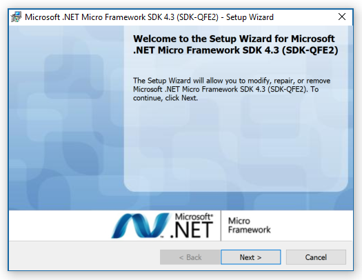
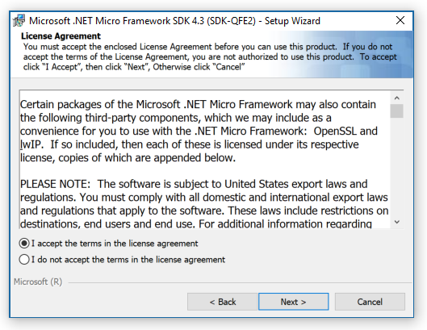
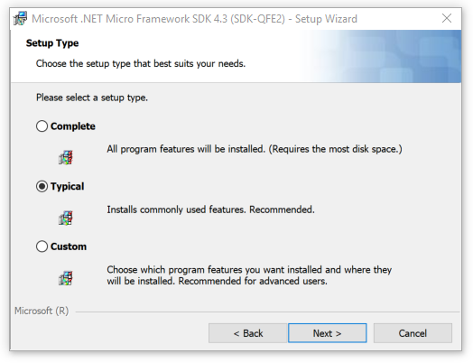
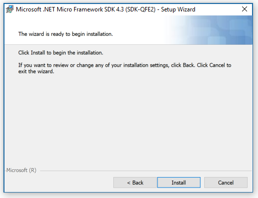
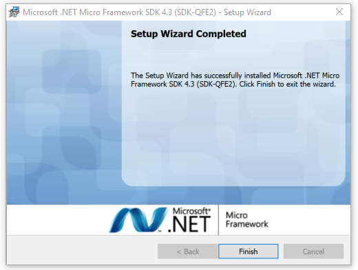
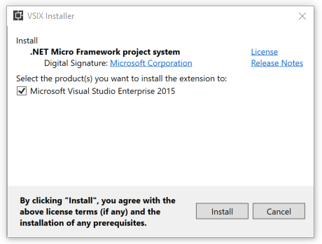
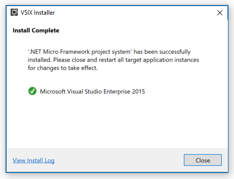
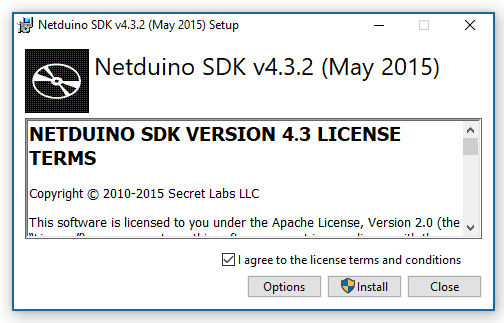
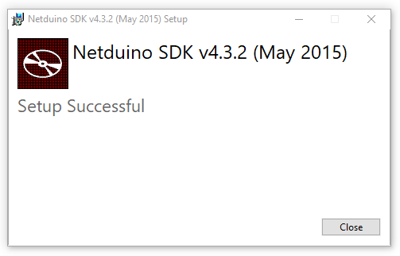

# Instructions

Install the following Development Tools:

1. .NET Micro Framework SDK
2. .NET Micro Framework Plugin for Visual Studio
3. Netduino SDK

## Installing the .NET Micro Framework SDK

1. Download the [.NET Micro Framework SDK v4.3.2 (QFE2)](https://www.wildernesslabs.co/downloads?f=/NETMF_SDK/netmf-v4.3.2-SDK-QFE2-RTM.zip) installer.

2. Run the Microsoft installer by double clicking the **MicroFrameworkSDK.MSI** file.

3. The following installation screen should appear. Click the **Next** button.

   

4. Select **I accept the terms in the license agreement**. Click the **Next** button.

   

5. Keep the default selection for **Typical** installation. Click the **Next** button.

   

6. Click the **Install** button.

   

7. After installation the following installation screen will appear. Click the **Finish** button.

   

## Installing the .NET Micro Framework Plugin for Visual Studio

**Prerequisite**: The .NET Micro Framework Plugin is currently only supported in Visual Studio 2015 Community, Professional and Enterprise editions. If you do not have Visual Studio 2015 installed, you can download it from this [Visual Studio downloads](https://visualstudio.microsoft.com/vs/older-downloads/) page.

1. Download the [.NET Micro Framework Plugin](https://www.wildernesslabs.co/downloads?f=/NETMF_SDK/netmfvs14.vsix) for Visual Studio 2015.
2. Run the VS Extension installer by double clicking the **netmfvs14.vsix** file.
3. The follow installation screen should appear. Select your Visual Studio installation under the section labeled **Select the product(s) you want to install the extension to**. Click the **Install** button.

   

4. After install completion the following installation screen will appear. Click the **Close** button.

   

## Installing the Netduino SDK

1. Download the [Netduino SDK](https://www.wildernesslabs.co/downloads?f=/Netduino_SDK/netduinosdk_v5.exe) installer.
2. Run the installer by double clicking the **netduinosdk_v5.exe** file.
3. The following installation screen should appear. Select **I agree to the license terms and conditions**. Click on the **Install** button.

   

4. After install completion the following installation screen will appear. Click the **Close** button.

   