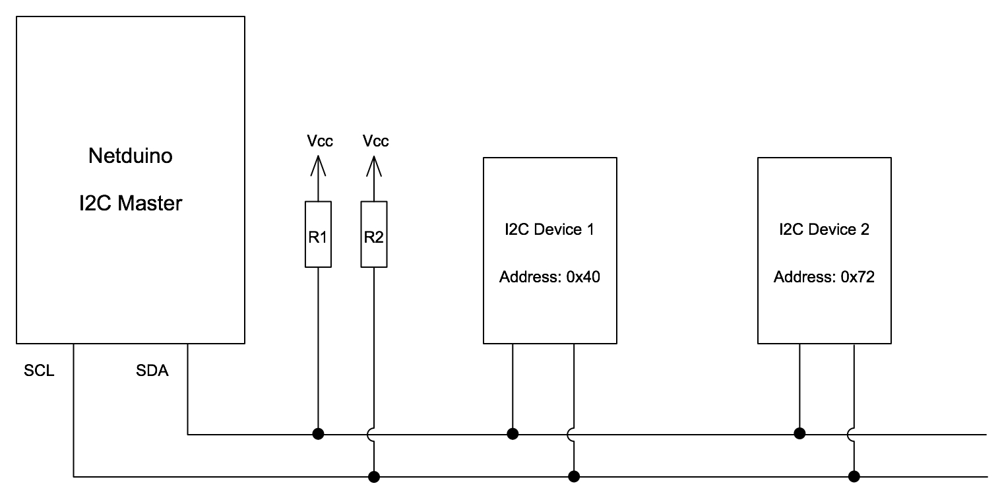

## Info

[I2C (Inter-Integrated Circuit)](https://en.wikipedia.org/wiki/I%C2%B2C), pronounced, "eye squared see", is a communication protocol allowing bi-directional communication between two or more devices using only two signal wires (in addition to power and ground).  One of the main advantages of this protocol is the ability to communicate with multiple devices using only a two wire bus.

This guide will:

* Provide an overview of the I2C communication protocol
* Demonstrate [reading data from an I2C temperature sensor](Reading/)
* Reconfigure the I2C temperature sensor by [writing data to the I2C temperature sensor](Writing/)

### Netduino.Foundation I2CBus

The [Netduino.Foundation](http://Netduino.Foundation) framework contains an [`I2CBus`](http://netduino.foundation/API/Devices/Netduino/I2CBus/) class that makes I2C communication easy by encapsulating all of the low-level plumbing calls in an easy to use object. We recommend using that class for I2C communications rather than using the low-level calls directly.

### Overview

I2C devices are connected to the Netduino via the `SCL` and `SDA` pins, and are addressed via unique addresses on the communication bus. The following diagram illustrates a typical setup for I2C devices connected to a Netduino:

{:standalone}

In this circuit:

* The Netduino is a _master_ device talking to two other devices (known as _slaves_)
* Each slave device has an address.  This allows the master device to choose which of the slaves it is communicating with
* The two signal (bus) wires used are usually labelled `SDA` (Data) and `SCL` (Clock)
* `SDA` and `SCL` are common to all devices on the bus
* `SDA` and `SCL` are [open drain outputs](https://en.wikipedia.org/wiki/Open_collector) and so require [pull up resistors](/Hardware/Reference/Components/Resistors/PullUpAndPullDownResistors/) to connect the two lines to V<sub>cc</sub>

I2C is normally used to connect low speed devices over short distances.  Compare this to the main characteristics of [SPI](../SPI/) and [Serial](../UART) communications:

| Protocol | Characteristics                                                                                            |
|----------|------------------------------------------------------------------------------------------------------------|
|   I2C    | Two wires<br/>Short distance<br/>Low speed                                                                 |
|   SPI    | Minimum of two wires, often more<br/>High speed                                                            |
|  Serial  | Low speed<br/>Used for communication between boards<br/>Can be used to communicate on to on board devices  |

#### Clock Signal (`SCL`)

Typical clock speeds are 100KHz for low speed devices with speeds of 3.4MHz possible for high speed devices.  Common speeds encountered are 100KHz and 400KHz.

The clock signal determines the rate at which data can be transferred between the master and slave devices.

#### Data Signal (`SDA`)

Both master and slave can transmit and receive on the bus.

### Communicating with I2C Devices

From a high level, the following events take place when the master device is communicating with slave device:

1. master device sends a start signal
2. master transmits one byte on the bus.  This byte indicates the address of the slave device it wishes to talk to and the mode of operation (read or write)
3. master sends data to the slave device
4. slave acts or responds to the master
	* If reading, the slave will send data back to the master device
	* If writing then the slave device will act upon the data received
5. master sends a stop signal on the bus

The start and stop signals are taken care of by the .NET Microframework and are not considered in detail in this article.  A comprehensive description can be found in the Wikipedia article, [I2C (Inter-Integrated Circuit)](https://en.wikipedia.org/wiki/I%C2%B2C).

In code, the sequence of events looks as follows:


```csharp
// create a new TMP102 device at address 0x48
I2CDevice tmp102 = new I2CDevice(new I2CDevice.Configuration(0x48, 50));

// create a buffer to read data from the deivce
byte[] buffer = new byte[2];
I2CDevice.I2CTransaction[] reading = new I2CDevice.I2CTransaction[1];

// read the data in
reading[0] = I2CDevice.CreateReadTransaction(buffer);
```

Reading from an I2C device is covered in more detail in the [reading](Reading/) section.


#### Device Addresses

The use of multiple devices on the single bus is made possible through 7-bit device addresses.  Each slave device on the bus is allocated a specific address by the manufacturer of the device.

The master initiates communication with a slave device by first transmitting the slave device's address on the data line (`SDA`).  The slave device that has its address set to the address transmitted now knows that all data transmitted between now and the stop bit is intended for itself.

If two devices have the same address both devices will interpret the sending of the start signal and the address as an indication to listen to the master device.  Both devices are now reading the data when the master only wants to talk to one of them. This is known as an address collision.

To prevent address collision, some devices allow the address to be configured.  This is achieved using one or more _address pins_ which would be pulled low or high, depending upon the device and the address required.

The following code illustrates creating two I2C devices on different addresses:

```csharp
I2CDevice tmp102 = new I2CDevice(new I2CDevice.Configuration(0x48, 50));
I2CDevice bme280 = new I2CDevice(new I2CDevice.Configuration(0x77, 50));
```

The use of seven bit addresses restricts the number of devices to 128 per bus although in practice the number of devices connected to the bus is much lower.

#### Read / Write Bit

In addition to the 7 address bits, the master device will also send a single bit that indicates the mode of the communication: _read_ or _write_.  The combination of the 7-bit address and the single read / write bit gives an eight bit packet header.

### Pull-up Resistors

Both of the bus lines (`SDA` and `SCL`) require [pull up resistors](/Hardware/Reference/Components/Resistors/PullUpAndPullDownResistors/) to be connected to them.  The value of the pull-up resistor will depend upon the capacitance of the bus.  The number of components on the board, type of substrate used will all influence the bus capacitance.

Most I2C breakout boards are supplied with pull-up resistors already on the breakout board.  In the case where one is not supplied, then a 4.7 K&Omega; resistor is usually good enough for prototyping.

For a more in depth discussion on why pull-up resistors are important and how to determine ideal resistance value, see the [Effects of Varying I2C Pull-Up Resistor (external link)](http://dsscircuits.com/articles/effects-of-varying-i2c-pull-up-resistors) article.

### Netduino I2C Pins

The Netduino has two pins allocated for the I2C protocol.  These pins are labelled **SD** (for `SDA`) and **SC** (for `SCL`) and can be found above the 14 digital pins on the right of the board as viewed below:

{:standalone}

## Reading Data from an I2C Device

For an in-depth discussion on reading data, see the [Reading the Temperature from an I2C Temperature Sensor guide](Reading/).

## Writing Data to an I2C Device

For an in-depth discussion on writing data, see the [writing to I2C guide](Writing/).

## Further Information

* [This Wikipedia article](https://en.wikipedia.org/wiki/I%C2%B2C) contains a description of the protocol, the various modes and the bus characteristics.
* [Pull up resistors](/Hardware/Reference/Components/Resistors/PullUpAndPullDownResistors/)
* [Effects of Varying I2C Pull-Up Resistor (external link)](http://dsscircuits.com/articles/effects-of-varying-i2c-pull-up-resistors)
* [Netduino.Foundation `I2CBus`](http://netduino.foundation/API/Devices/Netduino/I2CBus/)