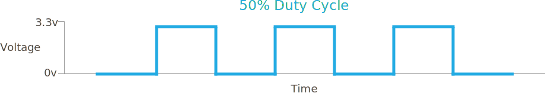

## Info

Pulse-Width-Modulation is a way of controlling voltage digitally to emulate an analog signal.

Although PWM is a modulation technique that can be used for communication, Netduino users are most likely to encounter this in three scenarios:

- Limiting the voltage being supplied to a device
- Dimming LEDs
- [Servo control](/Hardware/Reference/Peripherals/Servos)

A PWM signal generated by a Netduino is a square wave.  The two key parameters under the control of the developer are the _frequency_ and the _duty cycle_.

{:standalone}

In the above diagram, the time where the signal is high is the same as the time where the signal is low.  The percentage of time the signal is on (high) is called the duty cycle.  So, in the above, the signal is high 50% of the one cycle and so the duty cycle is 50%.

{:standalone}

In the above diagram, the frequency is the same in both cases (note how the rising edges of the signal are aligned to the same point in time).  However, the lower signal is high for only 25% of the time compared to 50% for the upper trace.

So the frequency is the same but the duty cycle is different.

PWM signals can be generated by hardware and software.  The most efficient and reliable is hardware generated PWM.

## Netduino PWM Pins

There are 6 hardware PWM pins on the Netduino:

{:standalone}

Note that the onboard LED can also be configured as a PWM channel.

## Practical Examples

As noted, there are three main uses for PWM that are most frequently encountered:

- Power Control
- LED Brightness
- [Servo Control](/Hardware/Reference/Peripherals/Servos)

### Power Control

The output voltage on a Netduino digital output pin is 3.3V.  Creating a digital output pin (_OutputPort_) and turning the pin on will show 3.3V on a multimeter.

Changing the output port to a _PWM_ port and setting the duty cycle to 10% will change the reading on the multimeter.  Consider the following application:

```csharp
using System.Threading;
using Microsoft.SPOT.Hardware;
using SecretLabs.NETMF.Hardware.NetduinoPlus;
using Microsoft.SPOT;

namespace PWMExample
{
	public class Program
	{
		public static void Main()
		{
            Debug.Print("Application starting...");
            PWM led1 = new PWM(PWMChannels.PWM_PIN_D9, 100d, 0.1d, false);
			led1.Start();
            Thread.Sleep(Timeout.Infinite);
		}
	}
}
```

Running this results in the following output on a multimeter and oscilloscope:

{:standalone}

The multimeter shows the average reading is 0.332V (10% of the output voltage of a pin on the Netduino).  The oscilloscope is showing the actual waveform and the measurements, 100Hz signal with a 10% duty cycle and an output voltage of 3.32V.

### Changing the Brightness of an LED

One of the most visible uses of PWM is to [control the brightness of an LED](/Hardware/Reference/Components/LEDs/Driving_w_PWM/).  A low duty cycle results in a dim LED, a higher duty cycle produces a brighter LED.

## Controlling a Servo

The next section of this guide demonstrates how to [control the position of a servo using PWM](/Hardware/Reference/Peripherals/Servos).

## Further Reading

* [PWM on Wikipedia](https://en.wikipedia.org/wiki/Pulse-width_modulation)
* [NETMF PWM Reference](https://msdn.microsoft.com/en-us/library/microsoft.spot.hardware.pwm(v=vs.102).aspx)
