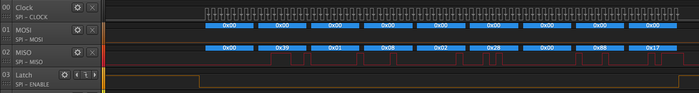

## SPI Reading

### Info

This guide demonstrates how to read data from an SPI device using the `WriteRead` method of the `SPI` class.

### Hardware

The [Sparkfun DeadOn RTC Breakout - DS3234](https://www.sparkfun.com/products/10160) board hosts a small Real Time Clock (RTC) chip, the DS3234 along with a battery holder and some supporting discrete components.  The DS3224 is a highly accurate RTC that keeps track fo the date and time even over leap years.  The chip also provides a number of other features:

* Two programmable alarms
* Temperature controlled oscillator
* Programmable square wave output
* 256 bytes of battery backed SRAM

In this guide the date and time function will be the only feature considered.

The Netduino and DeadOn RTC breakout board are connected as follows:

{:standalone}

The DS3234 chip will start to increment the time as soon as it is connected to power or a battery is inserted into the board.

### Software

The DS3234 stores the current date and time in a series of registers on the chip.  The first 8 of these byte registers contain the date and time encoded in [Binary Coded Decimal](https://en.wikipedia.org/wiki/Binary-coded_decimal).

In order to read the registers the Netduino must issue a read command to the DS3234.  This command will tell the DS3234 which of the registers should be read first.  Subsequent reads will return the next register in the chip incrementing the register pointer after each read.

  ```csharp
  SPI.Configuration spiConfig = new SPI.Configuration(
                  ChipSelect_Port: Pins.GPIO_PIN_D7,      // Chip select is digital IO 7.
                  ChipSelect_ActiveState: false,          // Chip select is active low.
                  ChipSelect_SetupTime: 0,                // Amount of time between selection and the clock starting
                  ChipSelect_HoldTime: 0,                 // Amount of time the device must be active after the data has been read.
                  Clock_Edge: false,                      // Sample on the falling edge.
                  Clock_IdleState: false,                 // Clock is idle when low.
                  Clock_RateKHz: 10,                      // 10KHz clock speed.
                  SPI_mod: SPI_Devices.SPI1               // Use SPI1
              );

  SPI spi = new SPI(spiConfig);
  int count = 0;
  while (true)
  {
      byte[] dataOut = new byte[] { 0 };
      byte[] dataIn = new byte[REG_SIZE];
      spi.WriteRead(dataOut, dataIn, 1);
      count++;
      string message = "Read " + count.ToString() + ":";
      for (int index = 0; index < dataIn.Length; index++)
      {
          message += " " + Hexadecimal(dataIn[index]);
      }
      Debug.Print(message);
      Debug.Print(DecodeTime(dataIn));
      Thread.Sleep(2000);
  }
  ```

### Key Points

#### SPI Configuration

The SPI bus is configured as follows:

```csharp
SPI.Configuration spiConfig = new SPI.Configuration(
                ChipSelect_Port: Pins.GPIO_PIN_D7,      // Chip select is digital IO 7.
                ChipSelect_ActiveState: false,          // Chip select is active low.
                ChipSelect_SetupTime: 0,                // Amount of time between selection and the clock starting
                ChipSelect_HoldTime: 0,                 // Amount of time the device must be active after the data has been read.
                Clock_Edge: false,                      // Sample on the falling edge.
                Clock_IdleState: false,                 // Clock is idle when low.
                Clock_RateKHz: 10,                      // 10KHz clock speed.
                SPI_mod: SPI_Devices.SPI1               // Use SPI1
            );

SPI spi = new SPI(spiConfig);
```

The clock is set to be low when idle and the data is read on the training edge of the clock pulse.

#### Data Buffers

Two data buffers are defined:

<figure markdown="1">
```csharp
byte[] dataOut = new byte[] { 0 };
byte[] dataIn = new byte[REG_SIZE];
```
</figure>

`dataOut` holds the command to inform the DS3234 that the Netduino wishes to read data from the chip starting at register 0.

`dataIn` is the data store for the contents of the registers as they are read from the DS3234.  `REG_SIZE` defines the number of bytes that will be read.

#### Reading the Data

The read command and the data in the registers are read using a single statement:

<figure markdown="1">
```csharp
spi.WriteRead(dataOut, dataIn, 1);
```
</figure>

`WriteRead` is an overloaded method that writes the contents of the `dataOut` buffer to the SPI bus (MOSI).  At the same time it starts to populate the `dataIn` buffer with data from the SPI bus (MISO).

The third parameter is an offset for the read operation and is better understood by examining the output from the chip using a logic analyzer.

##### Logic Analyzer Output

The above application generated the following trace:

{:standalone}

Starting from the left, the value 0 is output on the MOSI line by the Netduino.  At the same time, the MISO line is also set to 0.  This is done by the DS3234.

At this point, the Netduino has sent all of the data in the `dataOut` buffer and has received a response, 0, from the DS3234.  In the context of the read operation from the DS3234, this byte has no meaning.  Two options are possible:

* Store the byte in `dataIn`
* Ignore the first byte

The simplest form of the `WriteRead` method is `spi.WriteRead(dataOut, dataIn)`.  In this form the Netduino will store the first byte in `dataIn`.  This would then require that `dataIn` should contain enough space for the extra byte at the start as well as the data registers.

There is however a better option, tell the Netduino to ignore the first byte and only store the register data. `spi.WriteRead(dataOut, dataIn, 1)` does exactly this.  The third parameter is the number of bytes in the input stream (MISO) that should be ignored before the Netduino starts to populate the `dataIn` buffer.

### Debug Output

Successful deployment of the application should result in debug output similar to the following:

```
Read 1: 0x11 0x28 0x08 0x02 0x28 0x00 0x88 0x17
Current time: 8:28:11 Date: 28-8-2017
The thread '<No Name>' (0x4) has exited with code 0 (0x0).
Read 2: 0x14 0x28 0x08 0x02 0x28 0x00 0x88 0x17
Current time: 8:28:14 Date: 28-8-2017
Read 3: 0x16 0x28 0x08 0x02 0x28 0x00 0x88 0x17
Current time: 8:28:16 Date: 28-8-2017
```

The first line shows the bytes in the `dataIn` buffer, the second line shows the decoded date and time in _hour:minute:second day-month-year_ format.

Comparing the contents of the `dataIn` buffer with the logic analyzer output above it can be seen that the first byte in the input stream (MISO) has been rejected by the `WriteRead` method.

### Further Reading

* [SPI Overview](/Netduino/Input_Output/Digital/SPI/)
* [Writing to SPI](/Netduino/Input_Output/Digital/SPI/Writing/) - Review writing data to an SPI device (16x2 LCD)
* [Serial Peripheral Interface Bus](https://en.wikipedia.org/wiki/Serial_Peripheral_Interface_Bus) on Wikipedia
* [Sparkfun DeadOn RTC Breakout - DS3234](https://www.sparkfun.com/products/10160)
